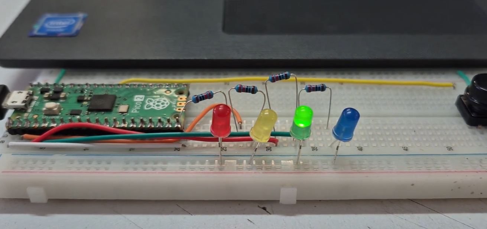
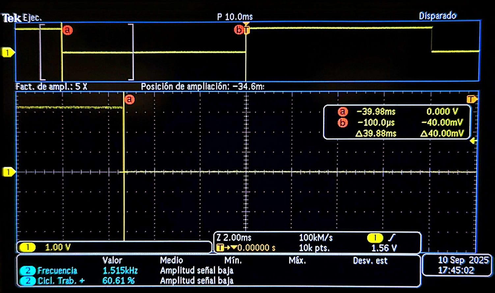
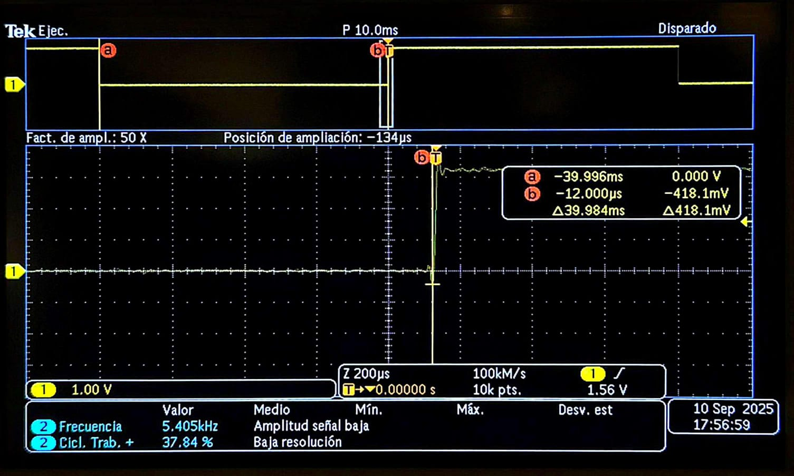
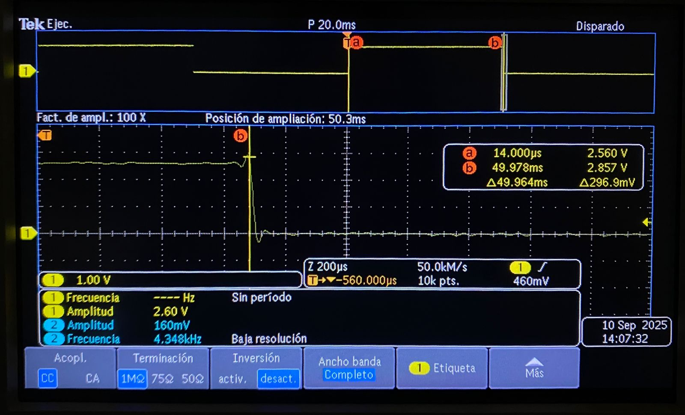

# Session 2 — Register-level blink and pulse-width measurement

**Goal (one sentence):** Blink the on-board LED writing directly to the SIO registers and measure the real ON time on the scope.

**Prediction — written *before* running anything:**
`sleep_ms(500)` on and off → period 1000 ms, ON time 500 ms, 50 % duty. I expect a few µs of extra ON time because the write to `gpio_clr` happens after `sleep_ms` returns, but nothing visible at 500 ms. Frequency = 1/1.000 s = 1.00 Hz.

---

## Setup

- Pin map: on-board LED = `PICO_DEFAULT_LED_PIN` (GP25 on Pico 2, non-W); scope CH1 probe on GP25 (pin 30 on the header is not exposed, so I probed the LED's series resistor pad on the board), GND clip on pin 38.
- Photo: 
- Non-default: nothing. Default 150 MHz clk_sys, no pulls touched.

## What I did

1. New project from "Blink" template in the VS Code Pico extension, board = Pico 2.
2. Replaced `gpio_put` calls with `sio_hw->gpio_set = bit;` / `sio_hw->gpio_clr = bit;` (see Code).
3. Compile → drag `blink.uf2` to RPI-RP2 drive.
4. Scope: CH1 1 V/div, 200 ms/div, trigger rising edge 1.5 V. Cursors on rising → falling edge.

## Evidence

| # | File | What it shows | Cursor/measured value |
|---|------|---------------|-----------------------|
| E1 |  | 3 full periods, cursors on one ON pulse | ΔT = 500.06 ms |
| E2 |  | Cursors rising → next rising | ΔT = 1000.1 ms, freq readout 0.9999 Hz |
| E3 |  | Zoom on rising edge, 200 ns/div | rise time ≈ 4.8 ns (10–90 %) |

## Predicted vs measured

| Quantity | Predicted | Measured (evidence #) | Error % | Why the difference? |
|----------|-----------|-----------------------|---------|---------------------|
| ON time | 500.00 ms | 500.06 ms (E1) | +0.012 % | `sleep_ms` overhead + loop instructions, tens of µs; also scope cursor resolution ≈ 40 µs at 200 ms/div |
| Period | 1000.0 ms | 1000.1 ms (E2) | +0.01 % | same as above, twice |
| Rise time | not predicted | 4.8 ns (E3) | — | didn't think about it; pad drive strength is default 4 mA, so this seems plausible, want to test 12 mA next |

## What went wrong

- First flash: nothing blinked. Serial said nothing because I hadn't enabled stdio. Reason: I wrote `sio_hw->gpio_oe = bit;` thinking OE was a "set" register — it is the whole direction register, so it worked, but I had also forgotten `gpio_init(pin)`, so the pin was still on function NULL and the SIO output never reached the pad. Found it by comparing with the SDK version of `gpio_init` in `gpio.c` (it calls `gpio_set_function(pin, GPIO_FUNC_SIO)`). Adding `gpio_init(PICO_DEFAULT_LED_PIN)` fixed it.
- Second issue: scope showed a 3.3 V flat line — trigger level was at 5 V from a previous lab. Lowered to 1.5 V.

## Code

```c
gpio_init(PICO_DEFAULT_LED_PIN);          // without this: pin stays on FUNC_NULL, no output
sio_hw->gpio_oe_set = bit;                // atomic: only my bit goes to output
while (true) {
    sio_hw->gpio_set = bit;  sleep_ms(500);
    sio_hw->gpio_clr = bit;  sleep_ms(500);
}
```
Full file at commit `3f9c2a1`, `src/blink_sio.c`.

## Open question

If I use `gpio_oe_set` instead of writing `gpio_oe`, does anything actually change on a fresh boot where all other bits are 0? I think not, but I want to see a case where the difference matters (two pins controlled from an ISR?).

## Disclosure

- Asked ChatGPT "why doesn't sio_hw->gpio_set do anything on RP2350" — its answer mentioned function select, which pointed me to `gpio_init`. Wrote everything else myself.
- Borrowed the scope probe from team B-03 (mine had a broken ground clip).