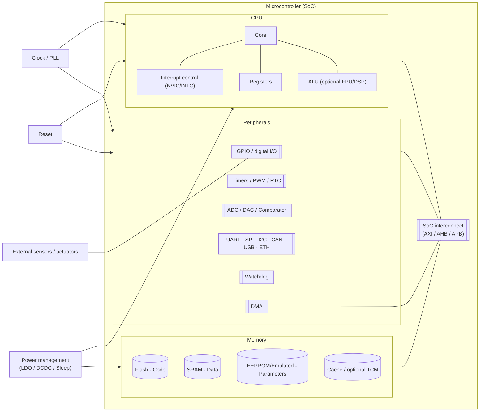
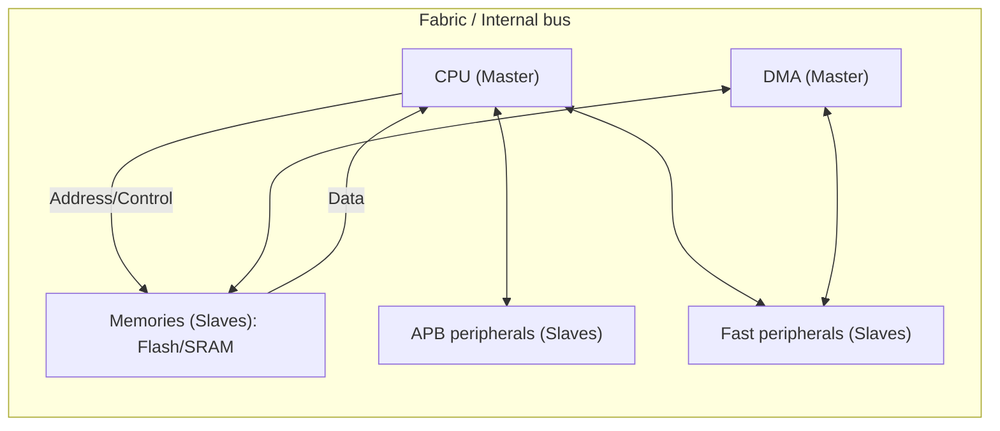
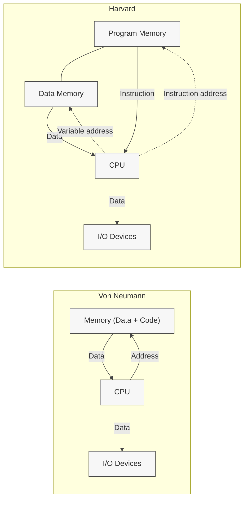

# What is an embedded system?

## Definition

An **embedded system** is a computing system **designed to perform specific functions** within a larger product, interacting with the physical world through sensors and actuators.

!!! important "Important"
    It must be a final product, not a standalone PC.

### Defining traits

- **Specific purpose**: performs one task or a bounded set of tasks.
- **Physical-digital interaction**: acquires variables (sensors) and acts on the world (actuators).
- **Hard constraints**: power consumption, memory, processing, cost, size.
- **Reliability and availability**: long life cycles, continuous operation.
- **Real time (often)**: responses within defined time limits.
- **HW/SW co-design**: electronics, firmware, and software are decided together.
- **Safety and cybersecurity**: protection of the user and the environment (functional and digital).

### PC vs Embedded System comparison

| Criterion                    | General-purpose PC                | Embedded system                                    |
| ---------------------------- | --------------------------------- | -------------------------------------------------- |
| Functional scope             | Broad, multitasking               | Application-specific                               |
| User interface               | Keyboard, mouse, display          | May lack a UI; LEDs, buttons, dedicated HMI        |
| Resources (CPU/RAM/storage)  | Abundant                          | Limited by cost/power/space                        |
| OS                           | Desktop Windows/macOS/Linux       | Bare-metal/RTOS/embedded Linux                     |
| Real time                    | Non-deterministic                 | Frequently deterministic                           |
| Power                        | Mains power                       | Battery/ultra-low power                            |
| Robustness/environmental     | Moderate                          | High (temperature, vibration, EMI)                 |
| Life cycle                   | Short/medium                      | Long (years or decades)                            |
| Functional cybersecurity     | Important                         | Critical (physical safety + information security)  |

### What is *not* an embedded system?

- A desktop PC used as-is (not integrated into a product).
- A generic general-purpose server.
- A laptop script reading a USB sensor (unless the laptop is part of the final product).

### Use cases

| Domain       | Product/Function          | Key requirement                    | Real time |
| ------------ | ------------------------- | ---------------------------------- | --------- |
| Automotive   | Brake ECU (ABS/ESP)       | Latency and functional safety      | Hard      |
| Medical      | Pacemaker                 | Reliability and biocompatibility   | Hard      |
| Industrial   | Inline motor control      | Determinism and robustness         | Hard      |
| Consumer     | Smart thermostat          | Connectivity and efficiency        | Soft      |
| Wearable IoT | Wearable (smartwatch)     | Low power and UX                   | Soft      |
| Home automation | Smart lock             | Security/encryption                | Variable  |


_**Hard real time**_: missing a deadline means system failure (e.g., ABS braking).
_**Soft real time**_: delays degrade quality but do not mean failure (e.g., audio).
---

## Typical structure of an embedded system

- **MCU (Microcontroller)**: CPU + memory + peripherals on a single chip, optimized for real-time I/O control.

- **MPU (Microprocessor)**: CPU "alone" (external memory and peripherals). SoC: umbrella term that may include GPU, radios, etc.

### Key components:


***Diagram 1 — High-level view***



| Component             | Main function                               | Design points / typical risks                                              |
|-----------------------|---------------------------------------------|----------------------------------------------------------------------------|
| ALU / FPU / DSP       | Integer, floating-point, signal computation | Latency, precision, power; is an FPU justified?                            |
| Control Unit          | Sequencing instructions                     | ISA support                                                                |
| Registers/PC/SP       | Internal state and flow                     | Register bank size, nested calls/ISRs                                      |
| NVIC/INTC             | Interrupt management                        | Priorities, latencies, determinism                                         |
| DMA                   | Transfers without CPU                       | Correct configuration, cache coherency                                     |
| Flash                 | Firmware storage                            | Endurance, program/read timing                                             |
| SRAM                  | Runtime data                                | Size/cost, initialization and protection                                   |
| EEPROM                | Persistent parameters                       | Write cycles, wear leveling                                                |
| GPIO                  | Digital I/O                                 | Pull-ups, debounce, ESD protection                                         |
| Timers/PWM/RTC        | Time, capture/compare, control              | Resolution, jitter, ADC synchronization                                    |
| ADC/DAC/Comp.         | Analog interfaces                           | Noise, reference, sample rate, linearity                                   |
| UART/SPI/I²C/CAN…     | Communications                              | Speed, errors, EMC, higher-level protocols                                 |
| Clock/PLL             | Time base                                   | Stability, startup, power                                                  |
| Reset/Watchdog        | Fault recovery                              | Windows, false triggers, fault coverage                                    |
| Power Mgmt            | Sleep/standby modes                         | Wake-up latencies, state retention                                         |


### Interconnect buses

Inside an embedded system, functional blocks communicate with each other through interconnect buses. These buses carry data, addresses, and control signals between the different components of the system. There are several types of buses, each with its own characteristics and purposes:

!!! note "Note"
    A bus is the set of physical connections that allow communication between the different components of a system.

1. **Data bus**: Carries the information between components.
2. **Address bus**: Carries the memory addresses being accessed.
3. **Control bus**: Carries the control signals that coordinate the system's operations.

We can also distinguish:

- **Masters/Initiators** (AMBA: Initiator): Devices that initiate data transfers (e.g., CPU, DMA).
- **Slaves/Targets** (AMBA: Target): Devices that respond to master requests (e.g., memory, peripherals).




## Memories: types and uses

In an embedded system we choose memories based on **volatility**, **latency/bandwidth**, **endurance** (write cycles), **size**, and **cost/power**. Here's a practical map.

### Volatile (fast, lost on power-off)

| Type             | Volatile | Read/Write | Approx. endurance | Typical size in MCUs | Typical use                                 | Risks / design |
|------------------|:------:|-------------------|------------------:|-----------------------:|---------------------------------------------|------------------|
| **SRAM**         |  Yes   | Very fast / fast  | Unlimited (logic) | 2–512 KiB              | Runtime variables, buffers                  | Sleep-mode power; limited size |
| **TCM (ITCM/DTCM)** | Yes | **Very fast** (near 1-cycle) | Unlimited | 16–512 KiB | Critical code or real-time ISR data          | Small size; requires linker script |
| **Cache (I/D)**  |  Yes   | Transparent (acceleration) | — | — | Accelerating Flash/external access          | Invalidation/coherency with DMA |
| **PSRAM**        |  Yes   | Medium / medium   | Unlimited        | 2–16 MiB (external)    | Framebuffers, UI, light ML                  | Higher latency than SRAM; power |
| **SDRAM/DDR**    |  Yes   | High BW / medium latency | Unlimited | 16–1024 MiB (MPU/SoC) | Linux/GUI, vision/ML, large buffers         | Complex controller; refresh, EMC |

### Non-volatile (persist without power)

| Type                 | Volatile | Read/Write                | Approx. endurance | Typical size | Typical use                                       | Risks / design |
|----------------------|:------:|---------------------------|------------------:|--------------:|---------------------------------------------------|------------------|
| **Internal Flash (NOR)** | No | Fast read; **page/block write/erase** | 10³–10⁵ cycles | 64 KiB–2 MiB | **Firmware**, constants, sometimes logs           | Page size; wait states; **wear leveling** for logs |
| **External QSPI NOR** | No    | Fast read; XIP possible   | 10³–10⁵          | 4–256 MiB     | XIP code, assets (UI), small models               | Latency > internal; QSPI lines; protection/secure firmware |
| **NAND (eMMC/SD)**   | No     | High sequential BW; slow random | 10³–10⁵     | 4–256 GiB     | Bulk data: files, audio/video, databases          | File system, **wear leveling**, integrity (journaling) |
| **EEPROM**           | No     | Byte/page writes (simple) | 10⁵–10⁶          | 512 B–256 KiB | Calibration/configuration **parameters**          | Endurance: distribute writes; write time |
| **FRAM**             | No     | **Near-SRAM** (fast) read/write | 10¹²–10¹⁴  | 4–1024 KiB    | Frequent logs, counters, critical state           | Cost/KB; availability |
| **MRAM** *(opt.)*    | No     | Fast; non-volatile        | 10¹²+            | 128 KiB–16 MiB | Power-fail-safe state                             | Cost; limited supply |
| **OTP / eFuse**      | No     | One-time programming      | 1                | Tens–hundreds of bits | IDs, keys, boot configuration             | **Irreversible**; plan fields carefully |

!!! tip "Quick rules"
    - **Code**: internal Flash; if it doesn't fit or you want **XIP**, external QSPI NOR.
    - **Real-time data** (ISR queues, filters): SRAM/TCM.
    - **Parameters** that rarely change: EEPROM / FRAM (if they change a lot).
    - **Frequent logs**: FRAM or a wear-leveling strategy on Flash.
    - **Large assets** (images, audio): QSPI NOR or SD/eMMC.
    - **Linux/GUI/heavy ML**: SDRAM/DDR + mass storage.

!!! note "What is XIP (Execute-In-Place)?"
    Executing code **directly** from an external memory (e.g., QSPI NOR) without copying it to SRAM. Saves SRAM at the cost of latency; ideal for non-critical code.


### Memory checklist
- **Firmware** size (Flash) and **runtime data** (SRAM/TCM).
- Do you need **XIP**? What latency can your critical loop tolerate?
- Expected **endurance** (parameters/logs) and **wear leveling** strategy.
- DMA and cache? Coherency/invalidation plan.
- **Sleep/retention** power and **wake-up** times.
- Integrity/security: **signed firmware**, read/write protection.


## Memory models

Embedded systems use different memory models to manage data storage and access.

This is done through instructions and data stored in different types of memory.

- Instructions: The operations the CPU must perform, stored in program memory.
- Data: The information the CPU operates on, stored in data memory.

Some of the most common models are:

1. **Von Neumann memory model**: The CPU uses a single memory for instructions and data, which simplifies the design but limits performance because it cannot access both at the same time.

2. **Harvard memory model**: This model uses separate memories for instructions and data, allowing simultaneous accesses and improving performance. However, it is more complex to implement.



## "Architecture size"

The "architecture size" usually refers to the CPU's word width (the number of bits of its general registers and ALU: 8, 16, 32, 64 bits). However, when choosing hardware you also care about:

- **Address bus width** (how many distinct addresses the CPU/DMA can issue).
- **Data bus width** (how many bits can be transferred in parallel).
- **Pointer size** (how many bits are used to represent a memory address).

!!! note "Note"
    Combinations exist — e.g., a 32-bit CPU with 24 address bits, or 8/16-bit data buses toward peripherals.

#### Effects of size:

1. The address width limits the maximum memory.
2. More bits allow arithmetic and memory operations in fewer cycles.
3. Smaller architectures can save power and cost.

| **Address width** | **Maximum addressable** |
| -----------------------: | -----------------------: |
|                    8 bit |                    256 B |
|                   16 bit |                   64 KiB |
|                   24 bit |                   16 MiB |
|                   32 bit |                    4 GiB |
|                   40 bit |                    1 TiB |
|                   48 bit |                  256 TiB |
|                   64 bit |         16 EiB (theoretical) |


#### Comparison between sizes

| Criterion                               | **8/16 bits**                                                                            | **32 bits (MCU/MPU)**                                                                                                                                          | **64 bits (SoC)**                                                                                                                                                            |
| --------------------------------------- | ---------------------------------------------------------------------------------------- | -------------------------------------------------------------------------------------------------------------------------------------------------------------- | ---------------------------------------------------------------------------------------------------------------------------------------------------------------------------- |
| **HW complexity / cost**                | Very low                                                                                 | Low–medium                                                                                                                                                     | Medium–high                                                                                                                                                                  |
| **Power consumption**                   | Very low (modest frequencies)                                                            | Low with good performance/Hz                                                                                                                                   | Higher on average                                                                                                                                                            |
| **Addressable space (approx.)**         | 8–16 b: 256 B–64 KiB                                                                     | Up to 4 GiB (theoretical)                                                                                                                                      | Up to 16 EiB (theoretical)                                                                                                                                                   |
| **Typical pointer size (C/C++)**        | 16 b                                                                                     | 32 b                                                                                                                                                           | 64 b                                                                                                                                                                         |
| **Integer/32-bit performance**          | Limited (multi-cycle)                                                                    | Very good (native)                                                                                                                                             | Excellent                                                                                                                                                                    |
| **FPU/DSP / Cryptography**              | Rare / external                                                                          | Common (M4/M7/RV32-F/D; AES/SHA accelerators)                                                                                                                  | Common / advanced (SIMD, AES-NI, etc.)                                                                                                                                       |
| **RTOS / Real time**                    | Possible, with limits                                                                    | Very good (determinism + modern peripherals)                                                                                                                   | Less deterministic on complex SoCs                                                                                                                                           |
| **Viable OS**                           | Bare-metal/RTOS                                                                          | Bare-metal/RTOS; 32-bit Linux with **MMU** (Cortex-A, etc.)                                                                                                    | Full-fledged Linux/Unix                                                                                                                                                      |
| **Modern connectivity (TLS/OTA)**       | Limited                                                                                  | Solid (Wi-Fi/BLE/Cell + TLS)                                                                                                                                   | Complete (networking, containers, etc.)                                                                                                                                      |
| **Timers (resolution/range)**           | Good resolution, short range                                                             | Excellent balance (32-bit timers)                                                                                                                              | SoC-dependent; not the main focus                                                                                                                                            |
| **Time-to-market (ecosystem)**          | Smaller current offering                                                                 | Very high (toolchains, HALs, stacks, RTOS)                                                                                                                     | High, but greater complexity                                                                                                                                                 |
| **Typical cases**                       | Simple control, legacy, ultra-low cost                                                   | IoT, motor control, basic audio, light gateways, simple HMI                                                                                                    | Linux, complex UI, vision/light ML, RAM > 1–2 GiB                                                                                                                            |
| **Risks**                               | Memory ceiling, limited software                                                         | Over-/under-speccing                                                                                                                                           | Power, cost, complex integration                                                                                                                                             |
| **Commercial examples**                 | *Microchip PIC16/PIC18*, *AVR ATmega328P/ATmega32U4*, *TI MSP430* (16 b), *Renesas RL78* | *ST STM32* (F0/G0/F4/H7…), *NXP LPC55Sxx / Kinetis*, *Microchip SAMD21/SAMC21/SAME5x*, *Nordic nRF52/nRF53*, *Espressif ESP32/ESP32-C3*, *Raspberry Pi RP2040* | *Broadcom BCM2711 (Raspberry Pi 4, Cortex-A72)*, *NXP i.MX 8M (Cortex-A53)*, *TI Sitara AM64x (Cortex-A53)*, *Rockchip RK3566/68 (Cortex-A55)*, *Allwinner A64 (Cortex-A53)* |


## Application examples

### Same word size (32 bits), Von Neumann vs. Harvard

Assume the following program operation:

```c
uint32_t sum = 0;
for (size_t i = 0; i < N; i++) {
    sum += A[i];
}
```

For this code we make the following assumptions:

- 32-bit load = 1 data access.
- ADD = 1 ALU cycle.
- Branch/loop end = 1 instruction (its fetch is counted).
- No cache, no memory wait states, simple pipeline.
- Von Neumann has a single bus (instructions and data compete).
- Harvard has two buses (instructions and data in parallel).

| Concept                        | Von Neumann (single bus) |              Harvard (I/D buses) |
| ------------------------------ | ----------------------: | -------------------------------: |
| Fetch `LDR` (read instruction) |                 1 cycle |                  1 cycle (I-bus) |
| Read `A[i]` (32-bit data)      |                 1 cycle | 1 cycle (D-bus, **in parallel**) |
| Fetch `ADD`                    |                 1 cycle |                  1 cycle (I-bus) |
| Fetch `BNE`/loop end           |                 1 cycle |                  1 cycle (I-bus) |
| **Total per iteration**        |          **≈ 4 cycles** |                   **≈ 3 cycles** |

```mermaid
%%{init: {'gantt': {'axisFormat': '%Q'}} }%%
gantt
  dateFormat  x
  title Von Neumann 32-bit (cycles per iteration)
  section Single bus
  Fetch LDR             :a1, 0, 1
  Data fetch (A[i])     :a2, 1, 1
  Fetch ADD             :a3, 2, 1
  Fetch BNE/loop        :a4, 3, 1

```

```mermaid
%%{init: {'gantt': {'axisFormat': '%Q'}} }%%
gantt
  dateFormat  x
  title Harvard 32-bit (cycles per iteration)
  section I-bus (instructions)
  Fetch LDR        :i1, 0, 1
  Fetch ADD        :i2, 1, 1
  Fetch BNE/loop   :i3, 2, 1
  section D-bus (data)
  Read A[i]        :d1, 0, 1

```





### Same architecture (Harvard), different word size

```c
uint32_t sum = 0;
for (size_t i = 0; i < N; i++) {
    sum += A[i];
}
```

We take the following assumptions, where w is the word size:

- Loads: 32 / w data accesses
- Add: 32 / w ALU operations
- Branch: ≈ 1 instruction
Cycles ≈ 2·(32/w) + 1

| Word size **w** | Loads (32/w) | Adds (32/w) | Branch | **Approx. total** |
| ----------------------: | ------------: | -----------: | -----: | ---------------: |
|              **8 bits** |             4 |            4 |      1 |          **≈ 9** |
|             **16 bits** |             2 |            2 |      1 |          **≈ 5** |
|             **32 bits** |             1 |            1 |      1 |          **≈ 3** |


!!! note "Note"
    In practice, **modified Harvard** designs abound (I/D separation with crossover paths or shared regions to ease DMA/bootloader).

---

## ISA and microarchitecture: RISC vs CISC for embedded

- ISA (Instruction Set Architecture) is the set of instructions a processor can understand and execute, as well as its exception/interrupt handling.
- A microarchitecture is the way an instruction set architecture (ISA) is physically implemented in a processor; they mainly fall into two categories:
  - RISC (Reduced Instruction Set Computer).
  - CISC (Complex Instruction Set Computer).

### RISC (Reduced Instruction Set Computer)

The main idea is to simplify the hardware by using an instruction set made of a few basic steps for load, evaluate, and store operations — for example, a load command (LOAD) or a store command (STORE).

Its main characteristics are:

- Simpler instructions, therefore simple instruction decoding.
- Instructions fit within one word or less.
- Instructions allow a short pipeline; ideally ~1 instruction/cycle.
- More general-purpose registers.
- Simple addressing modes.
- Fewer data types.
- Pipelining is feasible.

### CISC (Complex Instruction Set Computer)

The main idea is that a single instruction performs all the load, evaluate, and store operations — e.g., a multiply command loads data, evaluates it, and stores it — and is therefore complex.

Its main characteristics are:

- Complex instructions, therefore complex instruction decoding.
- Instructions are larger than one word.
- An instruction can take more than one clock cycle to execute.
- Historically fewer general-purpose registers, since operations are performed in memory itself.
- Complex addressing modes.
- More data types.

### RISC vs CISC comparison


| Category                          | RISC                                                                 | CISC                                                                                 |
|-----------------------------------|----------------------------------------------------------------------|--------------------------------------------------------------------------------------|
| **Code size**                     | Larger (more instructions required).                                 | Smaller (complex instructions reduce lines of code).                                |
| **Execution speed**               | Faster (simple instructions, easy decoding).                         | Slower (complex instructions, longer decoding time).                                |
| **Power consumption**             | Lower (an advantage for portable/embedded devices).                  | Higher (instruction set complexity).                                                 |
| **Program memory usage**          | Higher (more instructions for complex tasks).                        | Lower / more efficient (fewer instructions for complex tasks).                       |
| **Design/ISA complexity**         | Lower (smaller, more regular set).                                   | Higher (broad, heterogeneous set; more complex design and fabrication).             |
| **Number of instructions**        | More instructions needed for complex tasks.                          | Fewer instructions for the same task (each instruction does more).                  |
| **Development/fabrication cost**  | Can be higher.                                                       | Can be lower relative to RISC.                                                       |
| **Example ISAs/families and typical uses** | **ARM** (Cortex-M/A/R): STMicro (STM32), NXP, TI, Microchip (SAM), Nordic, Renesas, Samsung Exynos, Qualcomm Snapdragon, Broadcom (Raspberry Pi), Apple M-series; **RISC-V**: SiFive, Espressif (ESP32-C3/C6/H2), Kendryte K210, Bouffalo Lab BL602/604, StarFive; **MIPS** (hist.): Microchip PIC32, Loongson (GP); **Power/PowerPC**: NXP MPC5xxx (automotive), IBM (server); **SPARC** (LEON in aerospace); **SuperH** (Renesas SH); **AVR** (Atmel/Microchip 8-bit); **MSP430** (TI 16-bit); **ARC** (Synopsys); **Xtensa** (Cadence, e.g. "classic" ESP32 LX6/LX7); **OpenRISC**; **Nios II** (Intel FPGA), **MicroBlaze** (Xilinx FPGA). | **x86/x86-64**: Intel (Core/Atom), AMD (Ryzen/EPYC); **Motorola 68000/ColdFire** (hist./classic embedded), **VAX** (hist.); **Z80** (Zilog, classic/retro/simple embedded), **6502** (WDC 65C02/65C816, retro/industrial), **8051** (MCS-51, multiple vendors such as Nuvoton/Silicon Labs), **Renesas RX/RL78** (32/16-bit CISC), **68HC11/HC12** (classics). |

## Checklist for choosing an MCU

**Quick MCU selection checklist**

- Real-time requirements (hard/soft) and I/O latency
- Power/energy budget and sleep modes
- Key peripherals (ADC, PWM, DMA, comms)
- Required memory (Flash/SRAM) + safety (WDT, MPUs)
- Ecosystem (HAL, RTOS, toolchain, community)
- Cost and availability (product lifetime)
