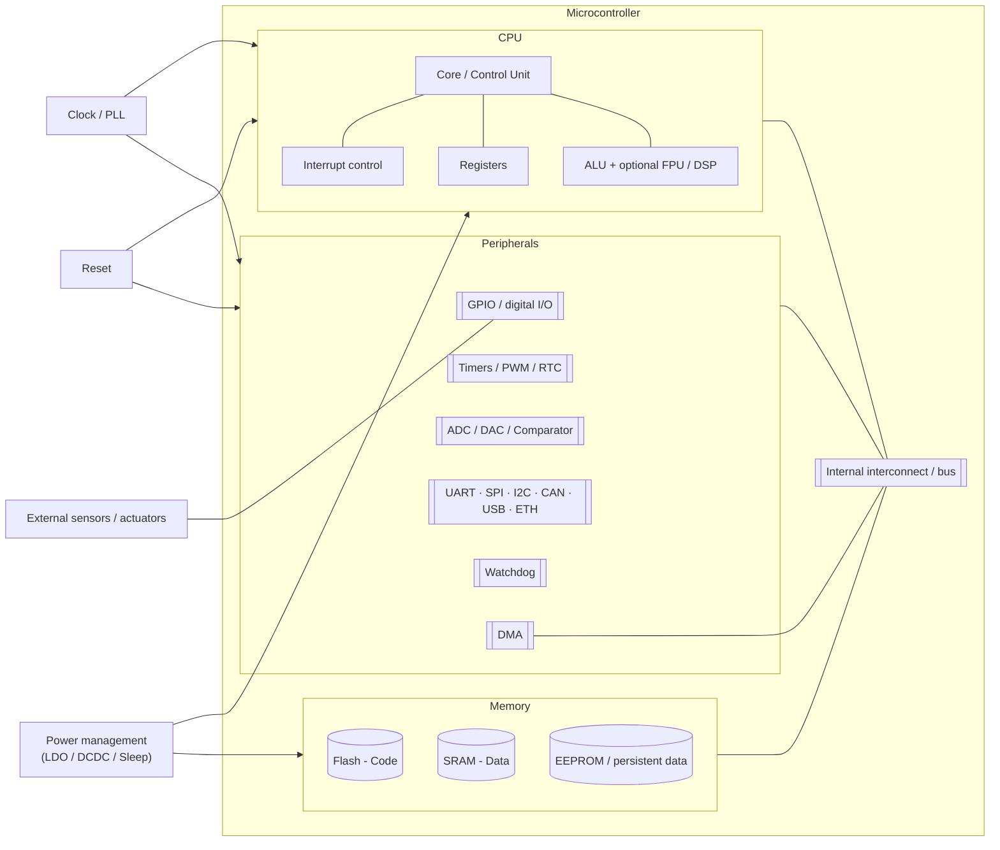
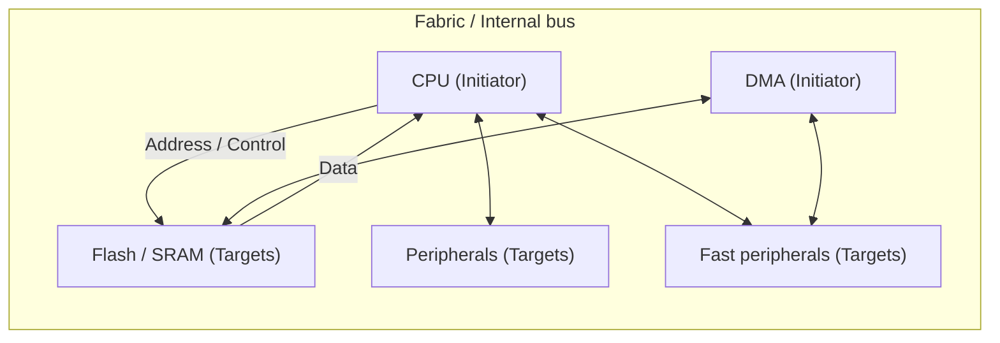
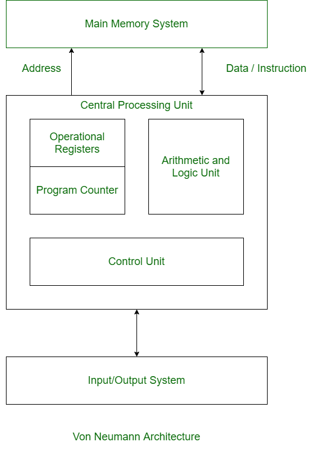
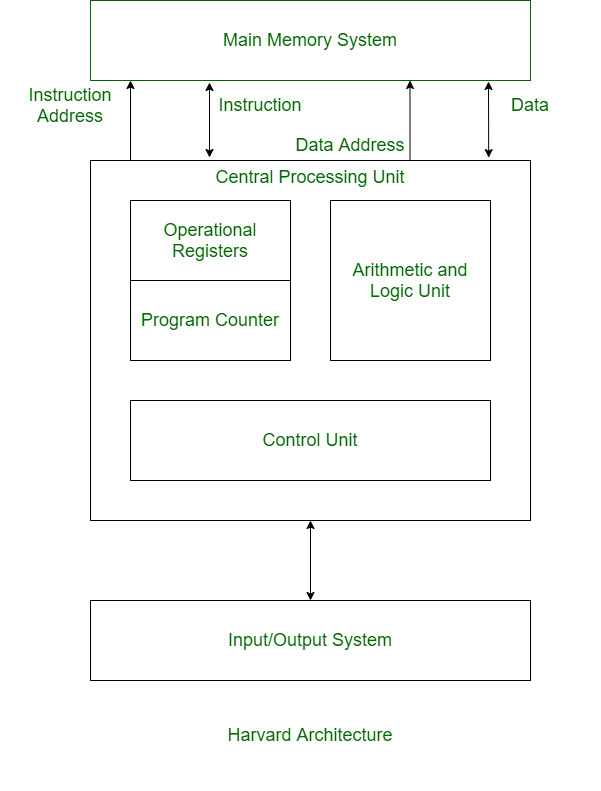

# What is an embedded system?

## Definition

An **embedded system** is a computing system **designed to fulfill a specific final purpose within a product or larger system**, usually interacting with the physical world through sensors and actuators.

!!! important "Important"
    An embedded system is intended to become part of the final product or system, rather than remain a general-purpose computer used only as a development tool.

### Defining traits

- **Specific purpose**: performs one task or a bounded set of tasks.
- **Physical-digital interaction**: acquires variables through sensors and acts on the world through actuators.
- **Hard constraints**: power consumption, memory, processing capability, cost, and size.
- **Reliability and availability**: designed for dependable operation, often over long life cycles.
- **Real time (often)**: responses may need to occur within defined time limits.
- **HW/SW co-design**: electronics, firmware, and software are designed together.
- **Safety and cybersecurity**: protection of the user, the system, and its information.

### PC vs Embedded System comparison

| Criterion | General-purpose PC | Embedded system |
|---|---|---|
| Functional scope | Broad, multitasking | Application-specific |
| User interface | Keyboard, mouse, display | May lack a UI; LEDs, buttons, dedicated HMI |
| Resources (CPU/RAM/storage) | Abundant | Limited by cost, power, and space |
| OS | Desktop Windows/macOS/Linux | Bare-metal, RTOS, or embedded Linux |
| Real time | Usually non-deterministic | Frequently deterministic |
| Power | Commonly mains powered | Frequently power-constrained or battery powered |
| Robustness/environmental | Moderate | May require tolerance to temperature, vibration, EMI, etc. |
| Life cycle | Short/medium | Can remain in service for years or decades |
| Functional cybersecurity | Important | Can be critical because software may affect physical behavior |

### What is *not* an embedded system?

- A desktop PC used as-is and not integrated into a product.
- A generic general-purpose server.
- A laptop script reading a USB sensor, unless the laptop itself is part of the final system.

### Use cases

| Domain | Product / Function | Key requirement | Real time |
|---|---|---|---|
| Automotive | Brake ECU (ABS/ESP) | Latency and functional safety | Hard |
| Medical | Pacemaker | Reliability and biocompatibility | Hard |
| Industrial | Inline motor control | Determinism and robustness | Hard |
| Consumer | Smart thermostat | Connectivity and efficiency | Soft |
| Wearable IoT | Smartwatch | Low power and UX | Soft |
| Home automation | Smart lock | Security/encryption | Variable |

**Hard real time**: missing a deadline means system failure, for example an ABS braking controller.

**Soft real time**: delays degrade quality or performance but do not necessarily mean system failure, for example audio playback.

---

## Typical structure of an embedded system

- **MCU (Microcontroller)**: CPU + memory + peripherals integrated on a single chip, optimized for direct control of hardware and I/O.
- **MPU (Microprocessor)**: a processor intended for higher-complexity systems, typically relying on external RAM/storage and often capable of running a full operating system. It may still integrate many peripherals.
- **SoC (System on Chip)**: a broader term for a highly integrated device that may combine CPU cores, memory controllers, accelerators, GPUs, radios, and peripherals.

### Key components

**Diagram 1 — High-level view**



| Component | Main function | Design points / typical risks |
|---|---|---|
| ALU / FPU / DSP | Integer, floating-point, signal computation | Latency, precision, power |
| Control Unit | Sequencing and decoding instructions | ISA support, timing |
| Registers / PC / SP | Internal CPU state and program flow | Register availability, nested calls/ISRs |
| Interrupt control | Interrupt management | Priorities, latency, determinism |
| DMA | Transfers data without continuous CPU intervention | Correct configuration, buffer ownership |
| Flash | Firmware storage | Capacity, endurance, program/read timing |
| SRAM | Runtime data | Capacity, cost, stack/heap usage |
| EEPROM | Persistent parameters | Write endurance, update frequency |
| GPIO | Digital I/O | Pull-ups, debounce, ESD protection |
| Timers / PWM / RTC | Time, capture/compare, control | Resolution, jitter, synchronization |
| ADC / DAC / Comparator | Analog interfaces | Noise, reference, sample rate, linearity |
| UART / SPI / I²C / CAN… | Communications | Speed, errors, EMC, higher-level protocols |
| Clock / PLL | Time base | Stability, startup, power |
| Reset / Watchdog | Startup and fault recovery | False triggers, fault coverage |
| Power management | Sleep/standby modes | Wake-up latency, state retention |

### Interconnect buses

Inside an embedded system, functional blocks communicate through **interconnect buses**. These carry information, addresses, and control signals between the different parts of the system.

1. **Data bus**: carries the information being transferred.
2. **Address bus**: identifies the memory or peripheral location being accessed.
3. **Control bus**: carries signals that coordinate the transfer and system operation.

We can also distinguish between:

- **Masters / Initiators**: devices that initiate transfers, such as a CPU or DMA controller.
- **Slaves / Targets**: devices that respond to transfers, such as memories and peripherals.



---

## Memories: types and uses

Microcontrollers use different types of memory because no single technology is ideal for every purpose.

When selecting memory, some of the most important characteristics are:

- **Volatility**: Is the information lost when power is removed?
- **Speed**: How quickly can the processor read or write the memory?
- **Endurance**: How many times can the memory be written or erased before it begins to wear out?
- **Capacity and cost**: How much memory can economically fit in the system?

For now, we will focus on **SRAM**, **Flash**, and memories used for persistent data.

### Main memory types

| Memory | Volatile? | Speed | Endurance | Relative cost / density | Typical use |
|---|:---:|---|---|---|---|
| **SRAM** | Yes | Very fast | Practically unlimited writes | Expensive / low density | Variables, stack, heap, buffers |
| **Flash** | No | Fast reads, slower writes | Limited write/erase cycles | Cheap / high density | Firmware and constants |
| **EEPROM** | No | Slower writes | Limited, usually higher than Flash | Higher cost / lower density | Configuration and calibration |
| **External RAM** | Yes | Usually slower than internal SRAM | Practically unlimited writes | Lower cost/bit than internal SRAM; high density | Large buffers, images, complex applications |


### SRAM

**SRAM (Static Random-Access Memory)** is the main working memory of a microcontroller.

It is **volatile**, meaning that its contents are lost when power is removed.

During program execution, SRAM typically stores:

- global and local variables;
- the **stack**, used for function calls and local variables;
- the **heap**, used for dynamic memory allocation;
- communication and sensor buffers.

For example:

```c
uint8_t buffer[1024];
```

This array requires approximately **1 KiB of SRAM** while the program is running.

### Flash memory

**Flash memory** is **non-volatile**, meaning that its contents remain stored when the system is powered off.

Its main purpose in a microcontroller system is to store the **firmware**.

```text
Flash
├── Program instructions
└── Constant data
```

Flash is much denser than SRAM, allowing manufacturers to provide significantly more storage at a lower cost per bit.

However, there is an important tradeoff:

> **Flash memory wears out when it is repeatedly erased and rewritten.**

Flash cannot normally overwrite individual bytes directly. Before new data can be written, an area of memory must first be **erased**, typically in blocks or sectors.

### EEPROM and persistent data

Embedded systems often need to preserve small amounts of information even after power is removed, such as:

- calibration parameters;
- user settings;
- counters;
- device configuration.

Traditionally, this information can be stored in **EEPROM (Electrically Erasable Programmable Read-Only Memory)**.

Some modern microcontrollers do not contain dedicated EEPROM. Instead, they use Flash together with software techniques such as **NVS (Non-Volatile Storage)**.

EEPROM and Flash both have **limited write endurance**, although EEPROM is generally designed to tolerate more frequent updates.

This means that a program should avoid writing persistent memory unnecessarily.

### Internal and external RAM

Most microcontrollers contain SRAM directly inside the chip.

Some systems also include **external RAM** when more memory is required.

```text
Microcontroller
│
├── Internal SRAM
│   └── Fast, limited capacity
│
└── External RAM
    └── Larger capacity, usually slower
```

External RAM may use technologies such as **PSRAM** or **SDRAM**.

It can be useful for applications requiring large amounts of temporary data, such as:

- image frame buffers;
- graphical interfaces;
- audio processing;
- networking buffers;
- machine-learning applications.

For many basic microcontroller applications, however, internal SRAM is sufficient.

!!! tip "Quick rules"
    - **Program code** → Flash
    - **Variables and temporary data** → SRAM
    - **Configuration that must survive power-off** → EEPROM / NVS
    - **Frequently changing data** → avoid Flash when possible
    - **Very large temporary data** → external RAM, when available

### The fundamental tradeoff

A simplified way to think about MCU memory is:

```text
                    SRAM              Flash
                    ────              ─────
Fast                  ✓                 —
Keeps data off        ✗                 ✓
Many writes           ✓                 ✗
High density          ✗                 ✓
Cheap per bit         ✗                 ✓
```

This is why a microcontroller may contain **much more Flash than SRAM**.

Flash provides inexpensive, dense storage for the program, while SRAM provides the fast working memory required while that program is running.

When designing an embedded application, two basic questions should always be considered:

- **Will the firmware fit in Flash?**
- **Will the program's runtime data fit in SRAM?**

And whenever non-volatile memory is written during normal operation:

- **How frequently will it be written?**
- **Will its endurance be sufficient for the expected lifetime of the system?**

---

## Memory models

Embedded systems store two main types of information:

- **Instructions**: the operations the CPU must perform, stored in program memory.
- **Data**: the information the CPU operates on, stored in data memory.

The way instructions and data are organized gives rise to different memory models.

1. **Von Neumann memory model**: instructions and data share the same memory and the same access path. In the strict model, the CPU cannot fetch an instruction and access data at the same time through that path.

    {width=60%}

2. **Harvard memory model**: instructions and data use separate memories and separate access paths. This allows the CPU to access instructions and data simultaneously.

    {width=60%}

3. **Modified Harvard architecture**: many modern microcontrollers combine characteristics of both models. They may provide separate internal paths for instructions and data while still exposing a unified address space to the programmer.

!!! note
    Von Neumann and Harvard are useful **ideal models**. Real processors may introduce caches, multiple buses, or other mechanisms that modify their practical behavior.

---

## Architecture size

When we say that a processor is **8-bit, 16-bit, 32-bit, or 64-bit**, we usually refer to the natural width of its CPU registers and arithmetic logic unit (**ALU**).

For example, a 32-bit processor is designed to operate efficiently on 32-bit values.

However, several different widths can exist inside the same processor.

| Concept | Meaning |
|---|---|
| **CPU / word width** | Natural size of arithmetic and register operations |
| **Address width** | Number of bits used to identify memory locations |
| **Data bus width** | Number of bits that can be transferred in parallel |
| **Pointer size** | Number of bits used by a program to represent an address |

These values are related, but they do not have to be identical.

### Example: ATmega328P

The ATmega328P is called an **8-bit microcontroller**, but several different sizes exist inside it.

| Characteristic | ATmega328P |
|---|---:|
| **CPU / ALU** | 8 bit |
| **General-purpose registers** | 32 × 8 bit |
| **Data bus** | 8 bit |
| **Address pointers (X, Y, Z)** | 16 bit |
| **Program counter** | 14 bit |
| **Flash** | 32 KiB |
| **SRAM** | 2 KiB |
| **EEPROM** | 1 KiB |

The AVR CPU performs its normal operations using **8-bit registers** and an **8-bit data bus**. However, six of these registers can be combined in pairs to create the 16-bit `X`, `Y`, and `Z` pointers used to address data memory.

```text
              ATmega328P

CPU / ALU ─────────────── 8 bit
Data bus ──────────────── 8 bit

X, Y, Z pointers ─────── 16 bit
Program Counter ───────── 14 bit

Flash ────────────────── 32 KiB
SRAM ──────────────────── 2 KiB
EEPROM ────────────────── 1 KiB
```

Its program memory provides another example. The ATmega328P contains **32 KiB of Flash**, organized as **16K × 16-bit words**. Because there are 16K program locations, the program counter requires **14 bits** to select one of them.


### Physical memory vs address space

An **address space** represents the locations that the processor is capable of identifying. It does not mean that every possible address corresponds to physical RAM.

For example, the ATmega328P data-memory map contains not only SRAM but also CPU registers and peripheral registers. Its internal SRAM occupies only part of that data address space.

A simplified memory map can look like:

```text
Memory address space
│
├── CPU registers
├── Peripheral registers
├── SRAM
├── Reserved addresses
└── Other memory or peripherals
```

This is common in microcontrollers: memory and hardware peripherals are assigned particular addresses so that the CPU can access them using memory operations.

---

## ISA and microarchitecture: RISC vs CISC

A processor can be described at different levels.

### Instruction Set Architecture (ISA)

The **Instruction Set Architecture (ISA)** defines the interface between software and the processor.

It specifies things such as:

- available instructions;
- registers;
- supported data types;
- addressing modes;
- interrupt and exception behavior.

Examples of ISAs include:

- **AVR**;
- **Arm**;
- **RISC-V**;
- **x86**.

The ISA defines **what the processor can do**, but not exactly how it does it internally.

### Microarchitecture

The **microarchitecture** is the internal implementation of an ISA.

It includes elements such as:

- pipelines;
- execution units;
- caches;
- instruction decoding;
- branch handling.

Two processors can implement the same ISA but use different microarchitectures.

!!! tip "Key idea"
    **ISA = what instructions the processor understands.**

    **Microarchitecture = how the processor executes those instructions.**

### RISC

**RISC (Reduced Instruction Set Computer)** refers to an ISA design philosophy based on relatively simple and regular instructions.

A common characteristic is the **load/store model**:

- data is loaded from memory into registers;
- operations are performed mainly on registers;
- results are stored back into memory when necessary.

For example:

```text
LOAD  R1, A
LOAD  R2, B
ADD   R3, R1, R2
STORE C, R3
```

Typical RISC characteristics include:

- relatively simple and regular instructions;
- many operations performed on registers;
- explicit load and store instructions for memory access;
- relatively simple addressing modes;
- instruction formats that are generally easier to decode and pipeline.

Common embedded RISC architectures include:

- **AVR** — used by the ATmega328P;
- **Arm** — used by many Cortex-M microcontrollers;
- **RISC-V** — used by devices such as the ESP32-C3 and ESP32-C6;
- **Xtensa** — used by several ESP32 families.

### CISC

**CISC (Complex Instruction Set Computer)** refers to an ISA design philosophy that provides richer instructions and addressing modes.

A single instruction may perform more work or combine operations that would require several instructions in a simpler ISA.

Typical characteristics include:

- more expressive instructions;
- instructions that may operate directly on memory;
- more addressing modes;
- more complex instruction decoding;
- instruction lengths that may vary.

Examples include:

- **x86 / x86-64**;
- **8051**;
- **Renesas RX**.

### Conceptual comparison

A complex task can be represented either as several simpler instructions or as fewer, more expressive instructions.

```text
RISC-style approach

LOAD
LOAD
OPERATE
STORE
```

```text
CISC-style approach

COMPLEX OPERATION
```

In both cases, the processor must still perform the required physical work.

The difference is mainly in **how that work is represented in the instruction set**.

!!! important
    RISC does **not** automatically mean faster, cheaper, or lower power.

    CISC does **not** automatically mean slower or higher power.

    Actual performance depends on the processor's microarchitecture, clock frequency, memory system, compiler, and application.

!!! tip "Key ideas"
    - The **ISA** defines the instructions visible to software.
    - The **microarchitecture** defines how those instructions are implemented.
    - **RISC** favors simpler and more regular instructions.
    - **CISC** favors richer and more expressive instructions.
    - RISC and CISC alone do not determine processor performance.

---

## Checklist for choosing an MCU

**Quick MCU selection checklist**

- Real-time requirements (hard/soft) and I/O latency.
- Power/energy budget and sleep modes.
- Key peripherals (ADC, PWM, DMA, communications).
- Required memory (Flash/SRAM) and protection/recovery features (watchdog, brownout, memory protection).
- Ecosystem (HAL, RTOS, toolchain, community).
- Cost and availability over the expected product lifetime.
