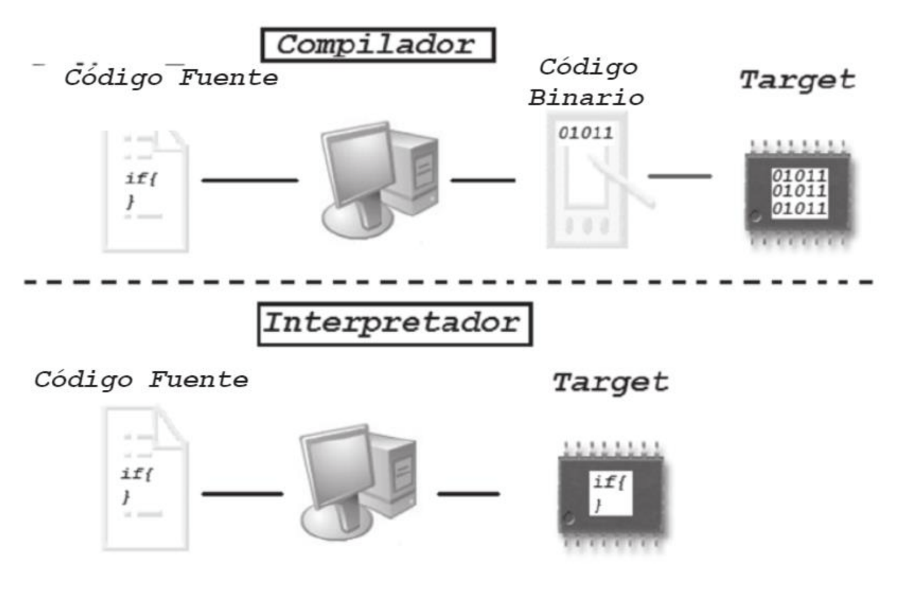
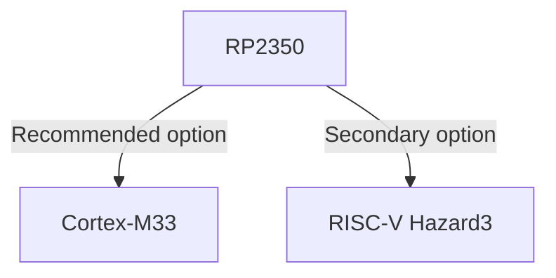
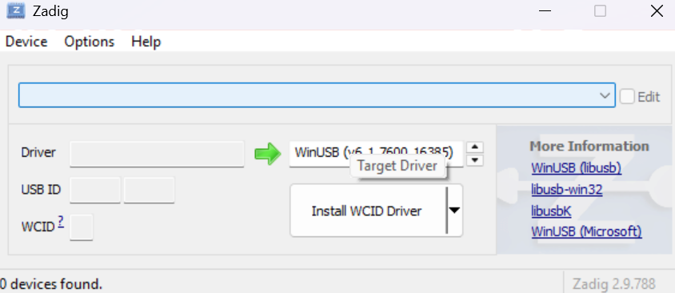

# Environment and Toolchain

## Core concepts

### High-, low-, and mid-level languages

- **Low level**: close to the hardware, little abstraction. E.g.: assembly. Fine-grained control of registers and memory; maximum architecture dependence.
- **High level**: lots of abstraction (complex types, automatic memory management, rich libraries). E.g.: Python, Java, C#.
- **Mid level** (also called middle level): a balance between hardware control and abstraction. C traditionally sits here (it allows direct memory access alongside portable structures and functions).

### Compiling vs Interpreting

- Compiling: translating source code to native machine code (or to assembly/intermediate object code) before execution. The result is a binary for a specific architecture/ABI. It may include linking, optimization, and debug symbols.
- Interpreting: executing the program by reading instructions from the source code (or from bytecode) and performing actions during execution, without producing a complete native binary in advance.
- JIT (Just-In-Time): a middle ground. The interpreter compiles the "hot" fragments to native code at runtime to speed things up.

{loading=lazy}


| Aspect                | Compiled (Ahead of Time, AOT) | Interpreted                         | JIT                            |
| --------------------- | ------------------------ | ----------------------------------- | ------------------------------ |
| Translation time      | Before running           | During execution                    | During, in pieces              |
| Native binary         | Yes                      | No (or partial)                     | Partial/temporary              |
| Typical performance   | High and stable          | Lower, interpreter-dependent        | Improves as it warms up        |
| Portability           | Lower (per architecture) | High (one interpreter per platform) | High, at the cost of complexity |
| Startup time          | Fast                     | Fast (if not compiling)             | May take time to "warm up"     |
| Debugging             | With symbols and GDB/LLDB | Often with REPL and traces         | Mix: profiler + debugger       |

### From code to silicon

***Compiled (Ahead of Time, AOT)***

1. **Preprocessing**: expand #include and macros, strip comments/conditionals, to obtain clean code.
1. **Analysis and parsing**: read tokens, validate syntax, and build an internal AST/IR representation (tree or intermediate representation).
1. **Optimization**: apply architecture-independent improvements (inlining, dead-code elimination, etc.).
1. **Instruction selection and register allocation**: translate the IR into code for the target ISA and assign registers/stack, producing assembly or machine code.
1. **Assembling**: converts the assembly into a relocatable object (.o).
1. **Linking**: combines objects/libraries, resolves symbols, and generates the final binary.
1. **Loading (loader/bootloader)**: place the binary in memory and jump to the entry point to execute.

***Interpreted***

1. **Source analysis and parsing**: read tokens, validate syntax, and prepare a navigable internal form.
2. **Runtime environment initialization**: prepare namespaces, call stack, heap, and load the language's standard libraries.
3. **Interpreter loop (evaluation)**: walk the AST (or equivalent structure) node by node and execute its actions (expressions, statements, control flow).
4. **Function management and external calls (FFI)** — optional: allow interpreted code to invoke native primitives (I/O, time, sockets) through the runtime.
5. **Debugging and tracing**: instrument execution with a REPL, tracebacks, logging, and source-level breakpoints.
6. **Finalization**: release runtime resources and report exit status.

### Common terms

- **IR / AST**: internal representations of the program that ease analysis and optimization.
- **Linker**: joins objects/libraries and resolves symbols → final binary.
- **Loader/bootloader**: places the binary in memory and transfers control to the program.
- **ISA**: the CPU's instruction set (defines how code must be generated).
- **ABI**: binary rules (calling conventions, registers, layout) so that objects/libraries fit together.
- **Relocatable object (.o)**: assembled code without final addresses (pre-linking).
- **Debug symbols**: metadata relating addresses to lines/variables (key for debugging).
- **Toolchain**: the set of tools (compiler, linker, etc.) used to build the software.

## Platform and environment with VS Code

### Target architecture

The Pico 2 carries the RP2350, which lets you choose one of these compilation paths:



!!! note "Note"
    The recommended option (Cortex-M33) offers better performance and support, while the secondary option (RISC-V Hazard3) can be useful for experimentation or compatibility with other projects.

### Installation and configuration

1. Install [VS Code](https://code.visualstudio.com/)

2. Open VS Code, go to extensions, then search for and install "Raspberry Pi Pico".
{loading=lazy}
3. Create a base project.
    1. In the sidebar, select the "Raspberry Pi Pico project" icon
    2. Select New C/C++ Project
    3. Click the button to switch to example templates
    4. Select the "Blink" template
    5. Select your board type
    6. Click "Create Project"
{loading=lazy}
4. Compile and load the program onto the board.
    1. In the left sidebar, select the main file blink.c.
    2. Click the "Compile" button.
    3. Wait for the compilation to finish without errors, and verify that a UF2 target file was created.
    4. Connect your board and verify it appears as an RPI-RP2 USB device. To program it, drag the UF2 onto the corresponding drive or click the "Run" button.
{loading=lazy}

??? warning "Upload error"
    If the error `No accessible RP2040/RP2350 devices in BOOTSEL mode were found.` appears, accompanied by `Device at bus 1, address 7 appears to be a RP2040 device in BOOTSEL mode, but picotool was unable to connect`, download and run [zadig](https://zadig.akeo.ie/), select `RP2 Boot (Interface 1)`, choose `WinUSB`, and click install driver.
    {loading=lazy}

## First code

Minimal blink code

```c
#include "pico/stdlib.h"

int main(void) {
    const uint led = PICO_DEFAULT_LED_PIN;
    gpio_init(led);
    gpio_set_dir(led, GPIO_OUT);
    while (true) {
        gpio_put(led, 1);
        sleep_ms(250);
        gpio_put(led, 0);
        sleep_ms(250);
    }
}
```

### Breakdown of the parts

- `#include "pico/stdlib.h"`: Includes the Pico standard library, which provides functions for interacting with the hardware.
- `int main(void)`: Entry point of the application. In embedded systems, the startup code initializes memory and calls `main`.
- `const uint led = PICO_DEFAULT_LED_PIN;`:
    - `const` protects against accidental reassignment.
    - `uint`: unsigned integer (a GPIO is never negative). Fixed-width alternative: uint32_t.
    - `PICO_DEFAULT_LED_PIN`: constant representing the board's default LED pin.
- `while(true)`: Infinite loop that keeps the program running.
