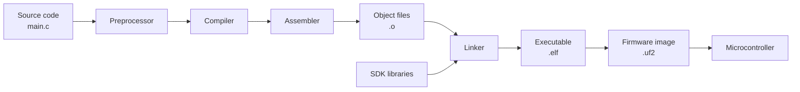
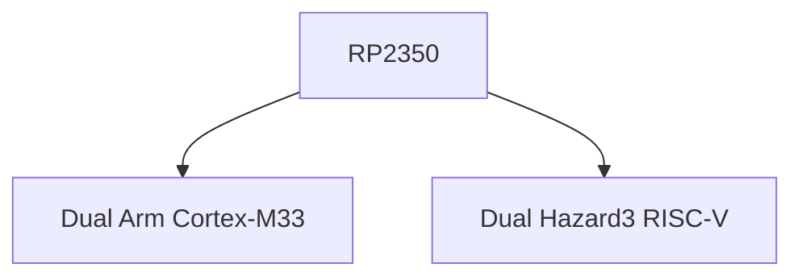

# Environment and Toolchain

## Learning objectives

By the end of this session, you should be able to:

- distinguish **source code** from the machine instructions executed by a microcontroller;
- explain the idea of **cross-compilation** using a host computer and a target MCU;
- identify the basic tools used to build embedded firmware;
- understand, at a high level, the role of **CMake** and the Pico SDK;
- compile a C program for the Raspberry Pi Pico 2;
- identify common build outputs such as `.elf` and `.uf2`;
- if hardware is available, load the firmware and verify that it runs.

---

## From source code to firmware

A microcontroller does not directly understand C code.

The CPU executes **machine instructions defined by its ISA**. A development toolchain converts the source code written by the programmer into those instructions.

```text
Human-readable code
        ↓
     Toolchain
        ↓
Machine instructions
        ↓
       MCU
```

### Programming-language levels

Programming languages provide different levels of abstraction from the hardware.

- **Low-level languages** are closely related to the processor architecture.  
  Example: **Assembly**.

- **High-level languages** provide more abstraction from hardware details.  
  Examples: **Python, Java, C#**.

- **C** is often described as a **middle-level language** because it combines structured programming with direct access to memory, registers, and hardware.

For embedded systems, C remains especially useful because it gives the programmer significant hardware control while still providing higher-level structures such as functions, loops, and data types.

---

## Compiled vs interpreted languages

Programs can be executed in different ways.

| Compiled | Interpreted |
|---|---|
| Source code is translated before execution | Code is processed by a runtime during execution |
| Produces machine code for a target platform | Requires an interpreter/runtime on the target |
| Example: **C / C++** | Example: **Python** |

In this course we will focus primarily on **compiled C/C++ firmware**.

{loading=lazy width=70%}


---

## Cross-compilation

On a desktop computer, the processor running the development tools is usually different from the processor inside the microcontroller.

For example:

```text
HOST COMPUTER                         TARGET

PC                                    Raspberry Pi Pico 2
x86-64 processor                      RP2350
        │                             Arm Cortex-M33
        │
        │  C source code
        ▼
 Cross-compiler
        │
        │  Arm machine code
        └───────────────────────────► MCU
```

The computer where we compile the program is called the **host**.

The processor where the final program will run is called the **target**.

> **Cross-compilation** means compiling a program on one platform so that it can run on a different processor architecture.

This is why the compiler must know the target architecture: machine instructions generated for an x86-64 computer cannot be directly executed by an Arm Cortex-M33.

---

## The embedded build process

The complete compiler internally performs many operations, but for this course we can describe the build process using a few main stages.



### Main stages

1. **Preprocessor**  
   Processes directives such as `#include` and macros before compilation.

2. **Compiler**  
   Translates C/C++ into instructions for the selected target architecture.

3. **Assembler**  
   Converts assembly instructions into machine-code object files.

4. **Linker**  
   Combines our object files with the required libraries and assigns their final memory locations.

5. **Firmware output**  
   The linked program can be converted into a format suitable for programming the microcontroller.

---

## Common terms

| Term | Meaning |
|---|---|
| **Compiler** | Converts source code into instructions for the target CPU |
| **Assembler** | Converts assembly into machine code |
| **Linker** | Combines compiled code and libraries into the final executable |
| **Toolchain** | Collection of tools used to build the firmware |
| **SDK** | Libraries, headers, examples, and tools provided for a platform |
| **Build system** | Organizes how the source files and libraries are compiled and linked |
| **ELF** | Linked executable containing program code and useful metadata |
| **UF2** | Firmware format commonly used to program Pico boards over USB |

---

## CMake and the Pico SDK

The Raspberry Pi Pico SDK uses **CMake** to describe how a project should be built.

You do **not** need to learn CMake in detail yet.

For now, think of `CMakeLists.txt` as the file that answers questions such as:

- Which source files belong to the program?
- Which SDK libraries does the program need?
- Which output files should be generated?

A simplified part of a Pico project may look like:

```cmake
add_executable(blink
    blink.c
)

target_link_libraries(blink
    pico_stdlib
)

pico_add_extra_outputs(blink)
```

For now, read these commands as:

```text
add_executable(...)
        ↓
Which source code belongs to this program?

target_link_libraries(...)
        ↓
Which libraries does the program use?

pico_add_extra_outputs(...)
        ↓
Generate additional firmware formats such as UF2
```

!!! note
    A real `CMakeLists.txt` may contain additional configuration. We will return to CMake later when our projects contain multiple source files or require additional libraries.

---

## Platform: Raspberry Pi Pico 2

The Raspberry Pi Pico 2 uses the **RP2350** microcontroller.

One unusual feature of the RP2350 is that it can execute using either of two processor architectures:



In this course we will compile for the **Arm Cortex-M33** so that everyone uses the same target architecture.

!!! note
    The RISC-V cores are an alternative architecture available in the RP2350 and can be explored separately. They are not required for the exercises in this course.

---

# Development environment with VS Code

We will use:

- **Visual Studio Code** as the development environment;
- the **Raspberry Pi Pico** VS Code extension;
- the **Pico C/C++ SDK**;
- the Arm cross-compilation toolchain.

The Pico extension can install and configure the SDK and toolchain for us.

## Installation and configuration

### 1. Install Visual Studio Code

Install [Visual Studio Code](https://code.visualstudio.com/).

### 2. Install the Raspberry Pi Pico extension

Open VS Code:

1. Select **Extensions**.
2. Search for **Raspberry Pi Pico**.
3. Install the official extension.

{loading=lazy}

### 3. Create the Blink example

In the VS Code sidebar:

1. Select the **Raspberry Pi Pico Project** icon.
2. Select **New Project from Examples**.
3. Search for the `blink` example.
4. Select the board that matches your device, for this course **Pico 2**.
5. Select the destination folder.
6. Click **Create**.

!!! note
    The first project may require the extension to download and configure the SDK and cross-compilation toolchain.

{loading=lazy}

---

## Compile the project

Open `blink.c` and select **Compile**.

A successful build should finish without errors and produce several files in the build directory.

Typical outputs include:

| File | Purpose |
|---|---|
| `.elf` | Main linked executable, including program information and debug symbols |
| `.uf2` | Firmware image designed for loading onto Pico boards over USB |
| `.bin` / `.hex` | Alternative representations of the firmware |
| `.map` | Shows where program sections and symbols were placed in memory |
| `.dis` | Disassembly showing the generated processor instructions |

The important result for today is:

> **If the project produces the ELF/UF2 firmware successfully, your embedded development environment is working.**

!!! success "No board yet?"
    If you do not have your Pico 2 yet, **stop here**.

    You have already completed the main objective of this session: converting C source code into firmware for the RP2350.

---

## Loading the firmware

If you already have your Pico 2, you can also test the firmware.

### BOOTSEL method

1. Disconnect the Pico 2.
2. Hold the **BOOTSEL** button.
3. Connect the board through USB.
4. Release **BOOTSEL**.
5. The Pico 2 should appear as a USB mass-storage device named **RP2350**.
6. Copy the generated `.uf2` file to the device.

The board will reboot and begin executing the new firmware.

You can also use the programming/debugging options provided by the VS Code Pico extension when the board is correctly detected.

{loading=lazy}

??? warning "Windows upload problem"
    If Windows detects a Pico in BOOTSEL mode but the development tools cannot access it, a USB-driver configuration issue may be present.

    If you encounter the error:

    ```text
    No accessible RP2040/RP2350 devices in BOOTSEL mode were found.
    ```

    ask the instructor before changing USB drivers. If required, the driver can be inspected or changed using [Zadig](https://zadig.akeo.ie/).

---

# First firmware: Blink

The traditional first embedded program is to blink an LED.

```c
#include "pico/stdlib.h"

int main(void) {
    const uint led = PICO_DEFAULT_LED_PIN;

    gpio_init(led);
    gpio_set_dir(led, GPIO_OUT);

    while (true) {
        gpio_put(led, 1);
        sleep_ms(250);

        gpio_put(led, 0);
        sleep_ms(250);
    }
}
```

## Breakdown

### Include the SDK library

```c
#include "pico/stdlib.h"
```

Makes common Pico SDK functions and definitions available to the program.

### Program entry point

```c
int main(void)
```

`main()` is the main entry point of our application after the embedded startup code has prepared the system.

### Select the LED pin

```c
const uint led = PICO_DEFAULT_LED_PIN;
```

`PICO_DEFAULT_LED_PIN` represents the GPIO connected to the default LED for the selected board.

Using the board definition instead of writing a pin number directly makes the example easier to reuse across compatible boards.

### Initialize the GPIO

```c
gpio_init(led);
gpio_set_dir(led, GPIO_OUT);
```

The pin is initialized and configured as a **digital output**.

### The main loop

```c
while (true)
```

Embedded firmware often contains a loop that continues for as long as the device is powered.

### Change the output

```c
gpio_put(led, 1);
gpio_put(led, 0);
```

These instructions change the digital output between HIGH and LOW.

### Delay

```c
sleep_ms(250);
```

Pauses execution for approximately 250 milliseconds.

---

## Build challenge

Change:

```c
sleep_ms(250);
```

to:

```c
sleep_ms(1000);
```

Then compile the program again.

### Questions

1. Does changing the delay affect whether the project compiles?
2. Which output file would you use to load the program using BOOTSEL?
3. Is the firmware being compiled for your computer or for the RP2350?
4. What is the difference between the **SDK**, the **toolchain**, and **CMake**?
5. Why can you compile this program even if the Pico 2 is not connected?
