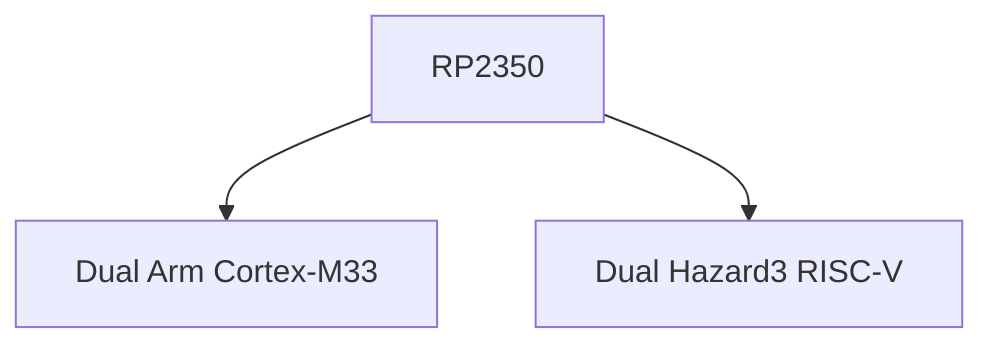
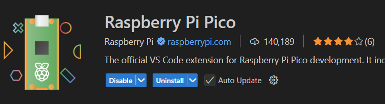
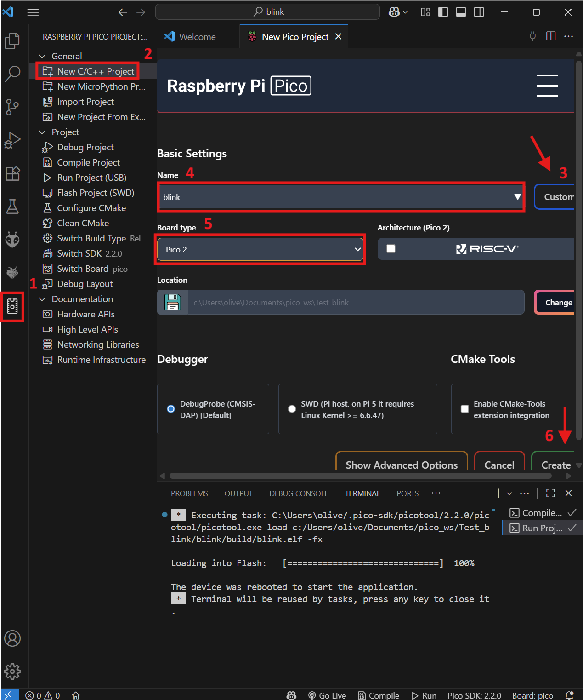
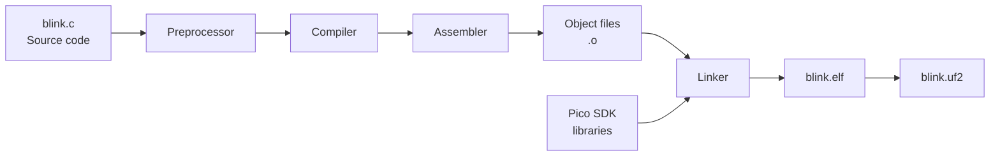
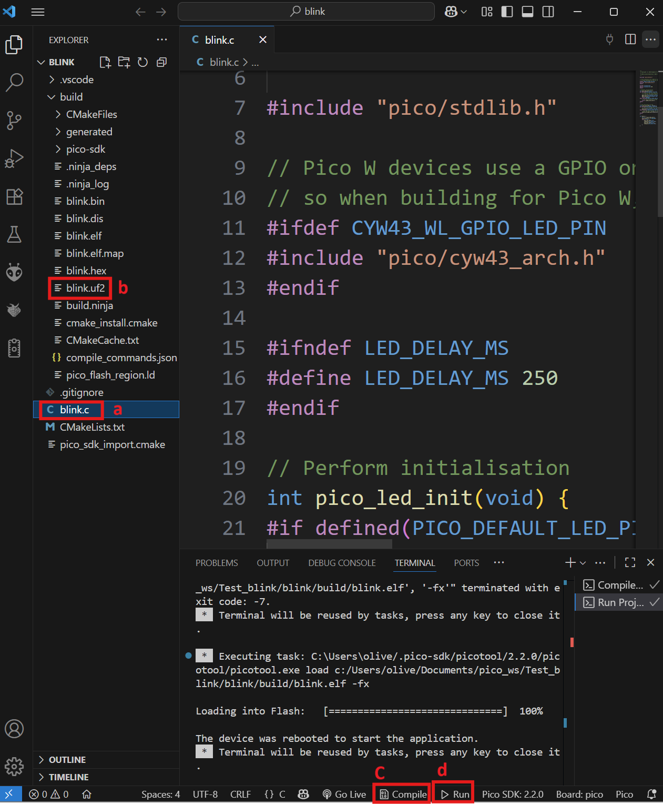
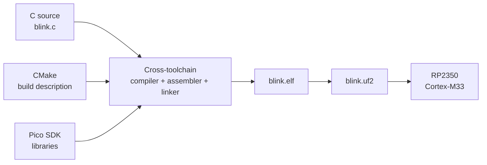

# Environment and Toolchain

## Learning objectives

By the end of this session, you should be able to:

- distinguish **source code** from the machine instructions executed by a microcontroller;
- explain **cross-compilation** using a host computer and a target MCU;
- identify the main tools involved in building embedded firmware;
- understand, at a high level, the role of **CMake** and the Pico SDK;
- compile a C program for the Raspberry Pi Pico 2;
- identify common build outputs such as `.elf` and `.uf2`;
- if hardware is available, load the firmware and verify that it runs.


---

## From source code to firmware

A microcontroller does not directly understand C code.

The CPU executes **machine instructions defined by its ISA**. A development toolchain converts the source code written by the programmer into those instructions.

```text
Human-readable code
        ↓
     Toolchain
        ↓
Machine instructions
        ↓
       MCU
```

### Programming-language levels

Programming languages provide different levels of abstraction from the hardware.

- **Low-level languages** are closely related to the processor architecture.  
  Example: **Assembly**.

- **High-level languages** provide more abstraction from hardware details.  
  Examples: **Python, Java, C#**.

- **C** is often described as a **middle-level language** because it combines structured programming with direct access to memory, registers, and hardware.

For embedded systems, C remains especially useful because it gives the programmer significant hardware control while still providing higher-level structures such as functions, loops, and data types.

---

## Compiled vs interpreted languages

Programs can be executed in different ways.

| Compiled | Interpreted |
|---|---|
| Source code is translated before execution | Code is processed by a runtime during execution |
| Produces machine code for a target platform | Requires an interpreter/runtime on the target |
| Example: **C / C++** | Example: **Python** |

In this course we will focus primarily on **compiled C/C++ firmware**.

---

## Cross-compilation

On a desktop computer, the processor running the development tools is usually different from the processor inside the microcontroller.

```text
HOST COMPUTER                         TARGET

PC                                    Raspberry Pi Pico 2
x86-64 processor                      RP2350
        │                             Arm Cortex-M33
        │
        │  C source code
        ▼
 Cross-compiler
        │
        │  Arm machine code
        └───────────────────────────► MCU
```

The computer where we compile the program is called the **host**.

The processor where the final program will run is called the **target**.

This is why the compiler must know our target: instructions generated for an x86-64 computer cannot be directly executed by an Arm Cortex-M33.

---

### Our target: Raspberry Pi Pico 2

The Raspberry Pi Pico 2 uses the **RP2350** microcontroller.

The RP2350 contains two possible processor architectures:



In this course we will compile for the **Arm Cortex-M33** so that everyone uses the same target architecture.

---

## Building our first firmware


Our objective is:

```text
blink.c
   ↓
Build tools
   ↓
Firmware for the RP2350
   ↓
blink.uf2
   ↓ (If you have a Pico 2)
Load onto the Pico 2
    ↓
Pico 2 executes it
```

---

### Step 1 — Prepare the development tools

We will use:

- **Visual Studio Code** as the development environment;
- the **Raspberry Pi Pico** VS Code extension;
- the **Pico C/C++ SDK**;
- the Arm cross-compilation **toolchain**;
- **CMake** as part of the build system.

#### Install Visual Studio Code

Install [Visual Studio Code](https://code.visualstudio.com/).

#### Install the Raspberry Pi Pico extension

Open VS Code:

1. Select **Extensions**.
2. Search for **Raspberry Pi Pico**.
3. Install the official extension.

{loading=lazy}

!!! info "What did we just install?"
    The extension helps configure several tools that work together:

    - the **compiler** translates C/C++ for the target CPU;
    - the **assembler** converts assembly into machine code;
    - the **linker** combines compiled code and libraries;
    - the **Pico SDK** provides libraries, headers, and board support;
    - **CMake** describes how the project should be built.

    Together, the compiler, assembler, linker, and related programs are commonly called a **toolchain**.

---

### Step 2 — Create the Blink project

In the VS Code sidebar:

1. Select the **Raspberry Pi Pico Project** icon.
2. Select **New Project from Examples**.
3. Search for the `blink` example.
4. Select **Pico 2** as the board.
5. Select the destination folder.
6. Click **Create**.

!!! note
    The first project may require the extension to download and configure the SDK and cross-compilation toolchain.

{loading=lazy}

Before compiling anything, look at the project files.

Two files are especially important for us:

```text
Project
│
├── blink.c
│      └── What should the MCU do?
│
└── CMakeLists.txt
       └── How should this project be built?
```

---

### Step 3 — Look at the build instructions

The Pico SDK uses **CMake** to describe how a project should be built.

You do **not** need to learn CMake in detail yet.

For now, think of `CMakeLists.txt` as the file that connects our source code to the build tools.

A simplified part of the project looks like:

```cmake
add_executable(blink
    blink.c
)

target_link_libraries(blink
    pico_stdlib
)

pico_add_extra_outputs(blink)
```

Read it as:


- `add_executable(...)` Use blink.c to build this program
- `target_link_libraries(...)` Use the Pico standard library
- `pico_add_extra_outputs(...)` Generate firmware files such as UF2

---

### Step 4 — Look at the source code

Open `blink.c`.

```c
#include "pico/stdlib.h"

int main(void) {
    const uint led = PICO_DEFAULT_LED_PIN;

    gpio_init(led);
    gpio_set_dir(led, GPIO_OUT);

    while (true) {
        gpio_put(led, 1);
        sleep_ms(250);

        gpio_put(led, 0);
        sleep_ms(250);
    }
}
```


At this moment we have **C source code**, not firmware that the CPU can execute directly.

#### What does the program do?

```c
#include "pico/stdlib.h"
```

Makes common Pico SDK functions and definitions available to the program.

```c
int main(void)
```

Defines the main entry point of our application after the startup code has prepared the system.

```c
const uint led = PICO_DEFAULT_LED_PIN;
```

Selects the GPIO connected to the default LED for the selected board.

```c
gpio_init(led);
gpio_set_dir(led, GPIO_OUT);
```

Initializes the pin and configures it as a **digital output**.

```c
while (true)
```

Creates a loop that runs continuously while the system is powered.

```c
gpio_put(led, 1);
gpio_put(led, 0);
```

Changes the digital output between HIGH and LOW.

```c
sleep_ms(250);
```

Pauses execution for approximately 250 milliseconds.


Equivalent in AVR

```c
#include <avr/io.h>

int main(void) {
    DDRB |= (1 << DDB5); // Set pin 13 as output

    while (1) {
        PORTB |= (1 << PORTB5); // Turn on LED
        _delay_ms(250);

        PORTB &= ~(1 << PORTB5); // Turn off LED
        _delay_ms(250);
    }
}
```

---

### Step 5 — Compile the project

Select **Compile** in the Pico extension.

Several stages occur automatically:



### What just happened?

1. **Preprocessor**, Processes directives such as `#include "pico/stdlib.h"` and prepares the source code for compilation.
2. **Compiler**, Translates our C code into instructions for the selected **Arm Cortex-M33 target**. This is the **cross-compilation** step.
3. **Assembler**, Converts assembly instructions into machine-code **object files** such as `.o` files.
4. **Linker**, Combines: `compiled code + Pico SDK libraries` into a single executable file. It also assigns the final locations of code and data in the MCU's memory map.
5. **Firmware outputs**, The executable is converted into formats that can be inspected, debugged, or loaded onto the board.

---

### Step 6 — Inspect what the build produced

After a successful build, locate the build directory.

You should find several generated files.

| File | What it tells us |
|---|---|
| `.elf` | The linked executable containing the program and debugging information |
| `.uf2` | The firmware file we can load onto the Pico over USB |
| `.bin` / `.hex` | Other representations of the firmware |
| `.map` | Where code, data, and symbols were placed in memory |
| `.dis` | The generated processor instructions in disassembled form |

These files connect several concepts from the previous class.

#### `.dis` — from C to ISA

Open the generated `.dis` file.

Our original program contained C:

```c
#include "pico/stdlib.h"

int main(void) {
    const uint led = PICO_DEFAULT_LED_PIN;

    gpio_init(led);
    gpio_set_dir(led, GPIO_OUT);

    while (true) {
        gpio_put(led, 1);
        sleep_ms(250);

        gpio_put(led, 0);
        sleep_ms(250);
    }
}
```

The disassembly shows instructions intended for the processor.

``` asm
100001e0 <main>:
100001e0:	b570      	push	{r4, r5, r6, lr}
100001e2:	2019      	movs	r0, #25          ; r0 = 25  (PICO_DEFAULT_LED_PIN)
100001e4:	f000 f814 	bl	10000210 <gpio_init>   ; gpio_init(led)

100001e8:	f04f 0501 	mov.w	r5, #1            ; r5 = 1  (constant "true"/high)
100001ec:	2319      	movs	r3, #25           ; r3 = 25 (pin number again)
100001ee:	ec45 3044 	gpioc_bit_oe_put r3, r5   ; gpio_set_dir(led, GPIO_OUT)

100001f2:	f04f 0600 	mov.w	r6, #0            ; r6 = 0  (constant "false"/low)
100001f6:	2419      	movs	r4, #25           ; r4 = 25 (pin number, loop-invariant)

; ---- top of while(true) loop ----
100001f8:	ec45 4040 	gpioc_bit_out_put r4, r5  ; gpio_put(led, 1)
100001fc:	20fa      	movs	r0, #250          ; r0 = 250
100001fe:	f000 fbeb 	bl	100009d8 <sleep_ms>   ; sleep_ms(250)

10000202:	ec46 4040 	gpioc_bit_out_put r4, r6  ; gpio_put(led, 0)
10000206:	20fa      	movs	r0, #250          ; r0 = 250
10000208:	f000 fbe6 	bl	100009d8 <sleep_ms>   ; sleep_ms(250)

1000020c:	e7f3      	b.n	100001f6 <main+0x16>  ; jump back to top of loop
```

This is the connection between the **ISA** discussed previously and the compiler we are using today.

#### `.map` — from program to memory

The `.map` file shows where the linker placed different parts of the program.

This connects to the memory concepts discussed previously:

```text
Program
├── Code
├── Constants
├── Variables
└── Other sections
        ↓
Assigned to regions in the MCU memory map
```

You do not need to understand the complete `.map` file yet. For now, recognize that the **linker decides where the program will live in memory**.

#### `.uf2` — from executable to device

The `.uf2` file is the firmware image we will use to load the program onto the Pico.

```text
blink.c
   ↓
Toolchain
   ↓
blink.elf
   ↓
blink.uf2
   ↓
Pico 2
```

---

### Step 7 — Modify and rebuild

Change:

```c
sleep_ms(250);
```

to:

```c
sleep_ms(1000);
```

Compile the project again.

You have now repeated the development cycle:

```text
Edit
 ↓
Build
 ↓
Inspect
 ↓
Repeat
```

---

### Step 8 — Load the firmware onto the Pico 2

If you already have your Pico 2, you can now test the firmware.

#### BOOTSEL method

1. Disconnect the Pico 2.
2. Hold the **BOOTSEL** button.
3. Connect the board through USB.
4. Release **BOOTSEL**.
5. The Pico 2 should appear as a USB mass-storage device named **RP2350**.
6. Compile and load the program onto the board.
    1. In the left sidebar, select the main file blink.c.
    2. Click the "Compile" button.
    3. Wait for the compilation to finish without errors, and verify that a UF2 target file was created.
    4. To program it, drag the UF2 onto the corresponding drive or click the "Run" button.

The board will reboot and begin executing the firmware.

{loading=lazy}

??? warning "Windows upload problem"
    If Windows detects a Pico in BOOTSEL mode but the development tools cannot access it, a USB-driver configuration issue may be present.

    If you encounter:

    ```text
    No accessible RP2040/RP2350 devices in BOOTSEL mode were found.
    ```

    ask the instructor before changing USB drivers. If required, the driver can be inspected or changed using [Zadig](https://zadig.akeo.ie/).

---

## Summary

We start with a C file:

```text
blink.c
```

and ended with firmware that can run on another processor:



### Key terms

| Term | Meaning in today's project |
|---|---|
| **Host** | The computer where we build the project |
| **Target** | The RP2350 where the firmware will run |
| **Cross-compiler** | Compiler running on the host but generating code for the target |
| **Toolchain** | Compiler, assembler, linker, and related build tools |
| **SDK** | Libraries and support code for the Pico platform |
| **CMake** | Describes what should be built and which libraries are required |
| **ELF** | Linked executable produced by the build |
| **UF2** | Firmware image that can be loaded onto the Pico |

!!! tip "Main idea"
    Clicking **Compile** is not a mysterious operation.

    It is a sequence of tools that transforms:

    **our source code → target machine instructions → a linked executable → firmware that the microcontroller can run.**
