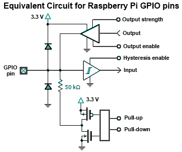
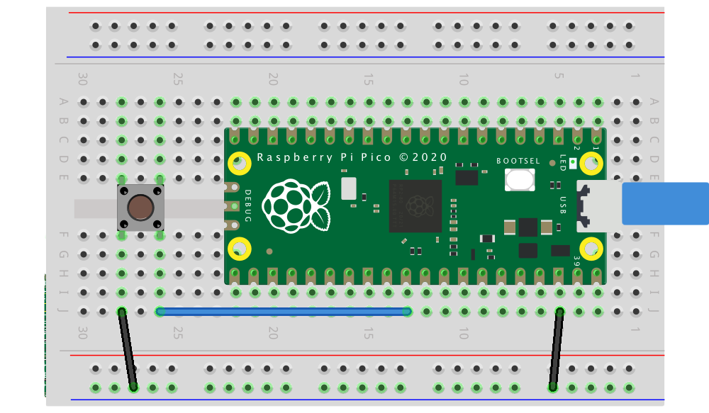

# GPIO Control

This tutorial goes from register manipulation to modern abstractions (SDKs, HALs) for controlling GPIO on microcontrollers.

---

## 1. What is register-level control?

A register is a small internal memory in the microcontroller, usually 8, 16, or 32 bits wide. Each bit of a register controls or reflects the state of some hardware function: enabling an output, indicating an input, selecting a mode, etc.

When programming at the register level, you read and write directly to the memory addresses where those registers live, without high-level library functions. Peripherals (GPIO, UART, Timers…) expose bit fields for direction, data, pulls, etc.

Many MCUs offer atomic "Write-1-to-Set/Clear/XOR" (SET/CLR/XOR) writes to affect only the indicated bits, avoiding race conditions.

Examples across families:

* ATmega328P (Arduino Uno):

  * `DDRB` → data direction (input/output)
  * `PORTB` → output values
  * `PINB` → input reads
* RP2350 (Pico 2):

  * `sio_hw->gpio_oe` → configuring pins as outputs
  * `sio_hw->gpio_out` → output values
  * `sio_hw->gpio_in` → input reads

The underlying idea is the same everywhere: reading and writing bits in registers.

---

## 2. GPIO from the inside

{loading=lazy}

Key ideas:

- "IOMUX/AF": selects the pin's function (GPIO, UART, SPI…).
- "DIR/OE": enables the pin's output driver.
- "OUT/DATA": sets the logic level.
- "IN": reads the pin's state.
- "PULL-UP/DOWN": internal resistors to define the level when configured as input.

## 3. Numeric representation

| Expression |       Binary |    Hex | Decimal |
| --------- | -----------: | -----: | ------: |
| `1u << 0` | `0b00000001` | `0x01` |       1 |
| `1u << 2` | `0b00000100` | `0x04` |       4 |
| `1u << 5` | `0b00100000` | `0x20` |      32 |
| `1u << 7` | `0b10000000` | `0x80` |     128 |

!!! note "Note"
    Why use shifts (<<): it's a compact way to "set bit n to 1" without writing long binary/hex literals. You can use binary, hex, or decimal interchangeably (they are equivalent).

## 4. Bitwise operators in C

Bitwise operators are used to manipulate registers:

| Operator           | Use                    | Example             | Explanation                                |                                                   |
| ------------------ | ---------------------- | ------------------- | ------------------------------------------ | ------------------------------------------------- |
| ` | ` (OR)      | Set bits to 1          | `reg |= (1u << n);`                             | Forces bit *n* to 1 without affecting other bits at 0 |
| `&` (AND)          | Keep certain bits      | `reg &= mask;`      | Keeps 1 **only** where `mask` has 1        |                                                   |
| `~` (NOT)          | Invert bits            | `~(1u << n)`        | Mask with all 1s **except** bit *n*        |                                                   |
| `^` (XOR)          | Toggle                 | `reg ^= (1u << n);` | Flips bit *n* between 0↔1                  |                                                   |
| `<<`, `>>` (shift) | Shift                  | `(1u << 5)`         | Produces a value with bit 5 set to 1       |                                                   |

Examples per operator

**AND &**:

`0b11001010 & 0b11110000 = 0b11000000`

`0x5A & 0x0F = 0x0A (90 & 15 = 10)`

**OR |**:

`0b01010000 | 0b00000110 = 0b01010110`

`0x20 | 0x04 = 0x24`

**XOR ^**:

`0b00001111 ^ 0b00000101 = 0b00001010`

`0xAA ^ 0xFF = 0x55`

**NOT ~**:

`~0b00001111 = 0b11110000` (in 8 bits)

`~0x00 = 0xFF`

**Shifts**:

`1u << 2 = 0b00000100 = 0x04`

`0b10000000 >> 3 = 0b00010000 = 0x10`

---

## 5. The SIO (Single-Cycle I/O) block on the RP2350

SIO is the RP2350's unit for fast GPIO access. It provides direct read/write registers with atomic bitwise operations.

### Main SIO registers

* `gpio_oe` → direction state (1 = output, 0 = input)
* `gpio_oe_set` → sets bits to 1 (output)
* `gpio_oe_clr` → sets bits to 0 (input)
* `gpio_oe_togl` → toggles bits (input ↔ output)
* `gpio_out` → current output state
* `gpio_set` → drives pins high (1), atomic multi-pin
* `gpio_clr` → drives pins low (0), atomic multi-pin
* `gpio_togl` → toggles pins, atomic multi-pin
* `gpio_in` → input reads

Each bit corresponds to one GPIO (bit 2 controls GPIO2, etc.).

---
### From registers to SDKs and HALs (command catalog)

***Pico SDK (C, control/portability balance)***

- Initialization: `gpio_init(pin)`, `gpio_init_mask(mask)`
- Direction: `gpio_set_dir(pin, bool)`, `gpio_set_dir_out_masked(mask)`, `gpio_set_dir_in_masked(mask)`
- Per-pin writes: `gpio_put(pin, 0/1)`
- Atomic multi-pin writes: `gpio_set_mask(mask)`, `gpio_clr_mask(mask)`, `gpio_xor_mask(mask)`, `gpio_put_masked(mask, value)`
- Reads and pulls: `gpio_get(pin)`, `gpio_pull_up(pin)`, `gpio_pull_down(pin)`, `gpio_disable_pulls(pin)`

***Arduino (very portable, higher level)***

- Direction: `pinMode(pin, INPUT/OUTPUT/INPUT_PULLUP/INPUT_PULLDOWN)`
- Digital I/O: `digitalWrite(pin, HIGH/LOW), digitalRead(pin)`

***MicroPython/CircuitPython (rapid prototyping)***

- `from machine import Pin`
- `Pin(n, Pin.OUT/Pin.IN, pull=Pin.PULL_UP/PULL_DOWN)`
- `p.on()`, `p.off()`, `p.value()`

## 6. First Blink code


```c title="sio_blink.c"
#include "pico/stdlib.h"
#include "hardware/structs/sio.h"

int main() {
    const uint32_t bit = 1u << PICO_DEFAULT_LED_PIN;

    gpio_init(PICO_DEFAULT_LED_PIN);           // sets SIO function and enables I/O
    sio_hw->gpio_oe_set = bit;    // output (OE=1), atomic

    while (true) {
        sio_hw->gpio_set = bit;   // high (uses the SDK field)
        sleep_ms(500);
        sio_hw->gpio_clr = bit;   // low
        sleep_ms(500);
    }
}
```

```c title="sdk_blink.c"
// File: sdk_blink.c
#include "pico/stdlib.h"
#include "hardware/gpio.h"


int main() {
    // stdio_init_all(); // OPTIONAL: only for printf

    gpio_init(PICO_DEFAULT_LED_PIN);            // routes the pin to GPIO/SIO
    gpio_set_dir(PICO_DEFAULT_LED_PIN, true);   // output

    while (true) {
        gpio_put(PICO_DEFAULT_LED_PIN, 1);      // ON
        sleep_ms(500);
        gpio_put(PICO_DEFAULT_LED_PIN, 0);      // OFF
        sleep_ms(500);
    }
}
```

---

```c title="sio_toggle_xor.c"
#include "pico/stdlib.h"
#include "hardware/structs/sio.h"

int main() {
    const uint32_t bit = 1u << PICO_DEFAULT_LED_PIN;

    gpio_init(PICO_DEFAULT_LED_PIN);            // ensures SIO function
    sio_hw->gpio_oe_set = bit;     // output

    while (true) {
        sio_hw->gpio_togl = bit;   // atomic toggle (not gpio_out_xor)
        sleep_ms(500);
    }
}
```

```c title="sdk_toggle_xor.c"
#include "pico/stdlib.h"
#include "hardware/gpio.h"


int main() {
    gpio_init(PICO_DEFAULT_LED_PIN);
    gpio_set_dir(PICO_DEFAULT_LED_PIN, true);

    const uint32_t bit = (1u << PICO_DEFAULT_LED_PIN);
    while (true) {
        gpio_xor_mask(bit); // toggle ONLY that pin
        sleep_ms(500);
    }
}
```

---

## 7. Masks

A mask is a bit pattern used to select, modify, or check specific bits within a register or a data set. Masks are commonly used in bit-manipulation operations, such as configuring GPIO pins, where a mask lets you affect only a subset of pins instead of all of them.

```yaml
 ... 0000 0000 0000 0000 0000 0101 0100
                              ^ ^  ^
                              | |  └─ selects GPIO 2
                              | └─── selects GPIO 4
                              └───── selects GPIO 6
```
If that mask is `MASK = (1u<<2) | (1u<<4) | (1u<<6)`, then a single write to the SIO SET/CLR/XOR registers can turn on, turn off, or toggle all those pins at once.

### Building masks

- A single pin: `1u << PIN`
- Several pins: `((1u << PIN1) | (1u << PIN2) | (1u << PIN3))`
- Contiguous range ("bus"): `MASK_N_BITS = ((1u << N) - 1u) << SHIFT`
        - for 3 bits on GPIO 10..12 -> `MASK = ((1u << 3) - 1u) << 10`

### Applied mask examples

```c title="SIO-atomic"
#include "pico/stdlib.h"
#include "hardware/structs/sio.h"

#define PIN_A 2
#define PIN_B 4
#define PIN_C 6

int main() {
    // 1) Mask with several pins
    const uint32_t MASK = (1u<<PIN_A) | (1u<<PIN_B) | (1u<<PIN_C);

    // 2) Ensure SIO function on each pin (needed only once)
    gpio_init(PIN_A);
    gpio_init(PIN_B);
    gpio_init(PIN_C);

    // 3) Direction: output (OE=1) for ALL pins with ONE single instruction
    sio_hw->gpio_oe_set = MASK;

    while (true) {
        // 4) SET: drives ALL mask pins high in a single operation
        sio_hw->gpio_set = MASK;
        sleep_ms(500);

        // 5) CLR: drives ALL mask pins low in a single operation
        sio_hw->gpio_clr = MASK;
        sleep_ms(500);

        // 6) TOGL (XOR): toggles ALL mask pins in a single operation
        sio_hw->gpio_togl = MASK;
        sleep_ms(500);
    }
}
```

In the SDK the typical commands are:

- `gpio_set_mask(MASK);` → drives the MASK pins high
- `gpio_clr_mask(MASK);` → drives the MASK pins low
- `gpio_xor_mask(MASK);` → toggles the MASK pins
- `gpio_put_masked(MASK, VALUE);` → drives the MASK pins high/low according to VALUE

Example
```c title="SDK"

#include "pico/stdlib.h"
#include "hardware/gpio.h"

#define PIN_A 2
#define PIN_B 4
#define PIN_C 6

int main() {
    // 1) Mask with several pins
    const uint32_t MASK = (1u<<2) | (1u<<4) | (1u<<6);

    // 2) Ensure SIO function on each pin (needed only once)
    gpio_init(2);
    gpio_init(4);
    gpio_init(6);

    // 3) Direction: output (OE=1) for ALL pins with ONE single instruction
    gpio_set_dir_out_masked(MASK);

    while (true) {
        gpio_set_mask(MASK);            // high on 2,4,6
        sleep_ms(200);
        gpio_clr_mask(MASK);            // low on 2,4,6
        sleep_ms(200);
        gpio_xor_mask(MASK);            // toggle on 2,4,6
    }
}
```

```c title="EXAMPLE1"
#include "pico/stdlib.h"
#include "hardware/gpio.h"

#define A   0
#define B   1
#define C   2

int main() {
    const uint32_t MASK = (1u<<A) | (1u<<B) | (1u<<C);
    const uint32_t PATTERN = (1u<<C) | (1u<<A);

    gpio_init_mask(MASK);
    gpio_put_masked(MASK, PATTERN);
    gpio_set_dir_masked(MASK, MASK);

    while (true) {
        sleep_ms(500);
        gpio_xor_mask(MASK);
    }
}
```

```c title="EXAMPLE2"
#include "pico/stdlib.h"
#include "hardware/gpio.h"

#define A   0
#define B   1
#define C   2

int main() {
    const uint32_t MASK = (1u<<0) | (1u<<1) | (1u<<2);
    gpio_init(0); gpio_init(1); gpio_init(2);
    sio_hw->gpio_oe_set = MASK;                 // outputs
    sio_hw->gpio_clr    = MASK;                 // clear first
    sio_hw->gpio_set    = (1u<<2) | (1u<<0);    // load 101

    while (true) {
        sleep_ms(500);
        sio_hw->gpio_togl = MASK;
    }
}
```


## 8. Reference

### Pico 2 Pinout


### Reset wiring



### ATOMIC single-cycle

!!! note "Required to use it"
        `#include "hardware/structs/sio.h"`
        First connect each pin to SIO with `gpio_init(pin);`


| Purpose                   | Register / Field               | What it does                                                                |
| ------------------------- | ------------------------------ | -------------------------------------------------------------------------- |
| Read inputs (all)         | `sio_hw->gpio_in`              | Reads levels of all GPIOs; mask to keep the ones you care about.            |
| Output: **SET**           | `sio_hw->gpio_set = mask;`     | Drives the `mask` pins **high** (atomic).                                   |
| Output: **CLR**           | `sio_hw->gpio_clr = mask;`     | Drives the `mask` pins **low** (atomic).                                    |
| Output: **TOGGLE**        | `sio_hw->gpio_togl = mask;`    | Toggles the `mask` pins (atomic XOR).                                       |
| Output: direct write      | `sio_hw->gpio_out = value;`    | Overwrites the whole output register (not atomic).                          |
| Direction: **OUT**        | `sio_hw->gpio_oe_set = mask;`  | Switches the `mask` pins to **output** (atomic).                            |
| Direction: **IN**         | `sio_hw->gpio_oe_clr = mask;`  | Switches the `mask` pins to **input** (atomic).                             |
| Direction: toggle         | `sio_hw->gpio_oe_togl = mask;` | Toggles IN/OUT (atomic).                                                    |

### SDK - high level

!!! note "Required to use it"
        `#include "hardware/gpio.h"`
        First connect each pin to SIO with `gpio_init(pin);`

| Purpose             | Call                               | What it does                                             |
| ------------------- | ---------------------------------- | -------------------------------------------------------- |
| Route to SIO        | `gpio_init(pin);`                  | Selects `GPIO_FUNC_SIO` and enables the input buffer.    |
| Init several pins   | `gpio_init_mask(mask);`            | Same, but for multiple pins.                             |
| Enable input        | `gpio_set_input_enabled(pin, en);` | Controls the input buffer.                               |
| Set direction (one) | `gpio_set_dir(pin, out);`           | `true`=output, `false`=input.       |
| Masked direction    | `gpio_set_dir_masked(mask, value);` | In `mask`: 1→output, 0→input.       |
| All output          | `gpio_set_dir_out_masked(mask);`    | Switches the `mask` pins to output. |
| All input           | `gpio_set_dir_in_masked(mask);`     | Switches the `mask` pins to input.  |
| Write one pin              | `gpio_put(pin, value);`         | High/Low on one pin.                    |
| Write masked pattern       | `gpio_put_masked(mask, value);` | Updates **only** the `mask` bits.       |
| SET on mask                | `gpio_set_mask(mask);`          | Drives all `mask` bits high.            |
| CLR on mask                | `gpio_clr_mask(mask);`          | Drives all `mask` bits low.             |
| TOGGLE on mask             | `gpio_xor_mask(mask);`          | Toggles all `mask` bits.                |
