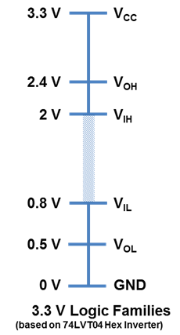
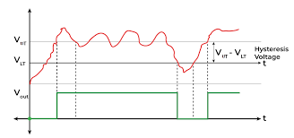
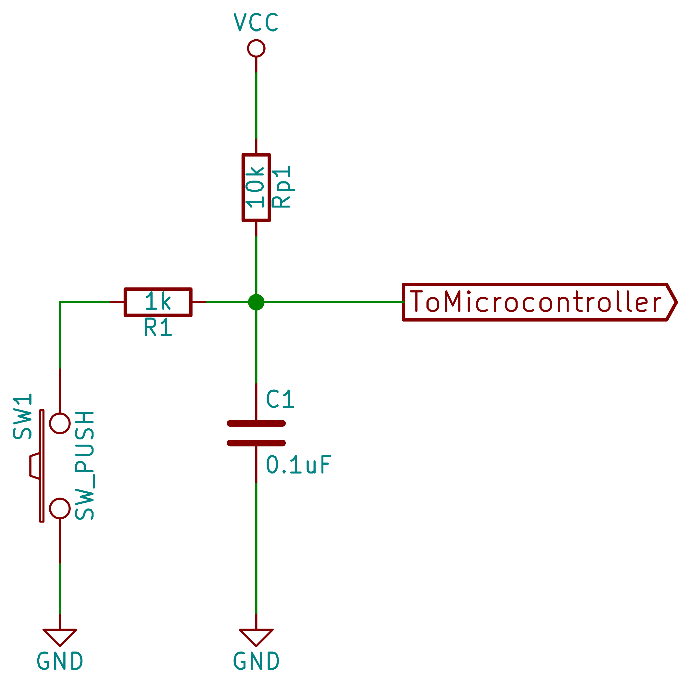

# Digital inputs

## What is a digital input

A **digital input** is a GPIO configured to **read** a logic level: **high (1)** or **low (0)**. Unlike an output, it does **not drive** a voltage; it only observes the one arriving from a button, digital sensor, or external logic.

### Possible states

* **High (1):** voltage read as a "1".
* **Low (0):** voltage read as a "0".
* **Floating (Z):** no reference; may read random values (avoid it).

### Logic levels and thresholds

In practice, the internal comparator decides 1/0 by **thresholds**:

* Typical **1**: ≥ \~2.0–2.4 VDD
* Typical **0**: ≤ \~0.5–0.8 VDD
  Between them lies an **uncertain zone** → avoid operating there.



---

## Pull-ups / Pull-downs (avoiding "floating")

**Pulls** are resistors to **VDD** (pull-up) or **GND** (pull-down) that establish a default state when the line could float.
On the Pi Pico 2 you can use **internal** or **external pulls**.

**Internal pulls (≈ 50–80 kΩ, typ. \~50 kΩ)**

* **Useful for:** quick prototypes, nearby buttons (short wires), slow/clean signals.
* **Limitations:** they are **weak**; with long wires or high capacitance the edges rise slowly and noise creeps in. Not suitable for buses like **I²C/1-Wire**.

**External pulls (1 kΩ–100 kΩ)**

* **Useful for:** open-drain buses (I²C), long wires/noisy environments, precise **RC** control (debounce), or tuning **power/rise times**.
* **Trade-off:** low R → more current and fast edges; high R → less current and slow, noise-sensitive edges.

**Quick selection guide**

* **Local button:** internal or 10 kΩ external.
* **Long/noisy cable:** 4.7–10 kΩ external (+ Schmitt).
* **I²C (open-drain):** 4.7–10 kΩ, tuned to capacitance/frequency.

---

## Typical problems and mitigation

### Bounce

A mechanical button generates multiple transitions over 1–20 ms when pressed/released.
**Mitigate** with **debounce** in **hardware (RC + Schmitt)**, in **software**, or both.

### Noise (EMI, wires, Z)

Floating inputs or long wires pick up interference.
**Mitigate** with:

* Proper pull-ups/downs.
* **RC** + **Schmitt trigger**.
* A **100–330 Ω series** resistor to limit spikes.
* **TVS** in hostile environments (industrial/automotive).



---

## Practical sizing

**Current when pressed** (active-low with pull-up): $I \approx \dfrac{V}{R}$

* 3.3 V / 10 kΩ ≈ **0.33 mA**
* 3.3 V / 4.7 kΩ ≈ **0.7 mA**

**RC for debounce (hardware):** $\tau = R \cdot C$

* Starting point: **2–10 ms** (e.g., 10 kΩ + 220 nF → 2.2 ms).

**Open-drain buses (I²C):**

* Start with **4.7–10 kΩ** and adjust for **capacitance** and **frequency**.

> **RP2350 note – I/O currents:** the **per-pin current** figures (2/4/8/12 mA) and the **\~50 mA total limit** apply to **outputs**. On **inputs**, the current is dominated by the pull resistors and pad leakage.

---

## Implementation

### Low level (PADS/SIO)

```c
#include "pico/stdlib.h"
#include "hardware/structs/sio.h"

#define button_pin 16

int main(void) {
    const uint32_t LED_BIT = 1u << PICO_DEFAULT_LED_PIN; // LED (e.g. 25 on Pico/Pico2)
    const uint32_t BTN_BIT = 1u << button_pin;                    // Button on GPIO16

    // Ensure GPIO function
    gpio_init(PICO_DEFAULT_LED_PIN);
    gpio_init(button_pin);

    // LED as output; button as input
    sio_hw->gpio_oe_set = LED_BIT; // output
    sio_hw->gpio_oe_clr = BTN_BIT; // input

    // IMPORTANT: external pull-up -> disable internal pulls
    gpio_disable_pulls(button_pin);

    while (true) {
        // With an (external) pull-up, pressed = 0 (low level)
        if ((sio_hw->gpio_in & BTN_BIT)) {
            sio_hw->gpio_set = LED_BIT;   // LED ON
        } else {
            sio_hw->gpio_clr = LED_BIT;   // LED OFF
        }

        // Brief rest / minimal debounce
        sleep_ms(1);
    }
}
```

### High level (Pico SDK)

```c
#include "pico/stdlib.h"

int main(void) {
    const uint LED = PICO_DEFAULT_LED_PIN; // Usually 25 on Pico/Pico 2
    const uint BTN = 16;

    // LED output
    gpio_init(LED);
    gpio_set_dir(LED, 1);

    // Button input with pull-up (pressed = 0)
    gpio_init(BTN);
    gpio_set_dir(BTN, 0);

    while (true) {
        if (gpio_get(BTN) == 0) {
            gpio_put(LED, 1);   // ON
        } else {
            gpio_put(LED, 0);   // OFF
        }
        sleep_ms(1); // minimal debounce / rest
    }
}
```

---

## Debounce (hardware and software)

### Hardware (RC + Schmitt)



* Filters bounce with a **2–10 ms** time constant.
* Enable **Schmitt** for hysteresis.

### Software (three patterns)

1. **Fixed delay (blocking)**
   After detecting a change, wait **10–20 ms** and read again. Simple, but blocking (uses `sleep_ms`).

2. **Integrator / sliding window (non-blocking)**
   Sample at regular intervals; accept the change once you accumulate **N consistent readings**. Useful with several buttons.

3. **State machine**
   States: `stable_0 → maybe_1 → stable_1 → maybe_0 → ...`
   Only confirm a transition if the new value holds for a certain time/number of readings.
