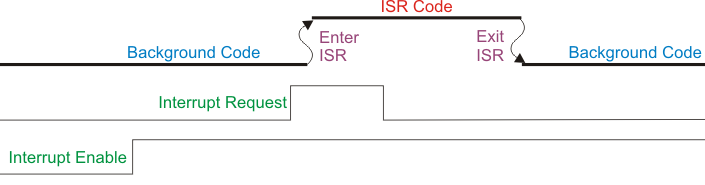

# Interrupts

---

## What is an interrupt? (definition + acronyms)

An **interrupt** is an asynchronous event that **preempts** the normal flow of execution to run a short, high-priority routine called an **ISR**. Interrupts are used to react **immediately** to hardware or software events (timer, UART RX, DMA done, PIO, GPIO, etc.) without *busy-waiting*.

**Acronyms and concepts:**
- **ISR** — *Interrupt Service Routine*.
- **IRQ** — *Interrupt ReQuest* (the line/event).
- **NVIC** — *Nested Vectored Interrupt Controller* (priorities, dispatch, nesting).
- **Vector table** — array of ISR addresses.
- **Masking** — *Interrupt Masking* (temporary blocking).
- **Priority** — *Interrupt Priority* (lower number = more urgent on Cortex-M).
- **Edge vs Level** — *Edge-triggered vs Level-triggered*.
- **Polarity** — Rising/Falling, Active-High/Active-Low.
- **NMI** — *Non-Maskable Interrupt* (maximum priority, cannot be blocked).

---

## Control flow during an interrupt (with diagram)



**Reading the diagram (bottom to top):**

1. **Interrupt Enable** (global/line enable)
   If **LOW**, the CPU **ignores** the request. When it goes **HIGH**, the CPU can service the **IRQ** (*Interrupt ReQuest*).

2. **Interrupt Request** (event)
   This is the **trigger** (edge or level). With the line enabled, the **NVIC** marks the IRQ as **pending** and compares **priorities**.

3. **Background Code → Enter ISR**
   The CPU interrupts the background thread and **auto-stacks** registers (R0–R3, R12, LR, PC, xPSR).
   It loads the **ISR** address from the **Vector Table**.
   **Interrupt latency** = time from the IRQ becoming valid until the **first instruction** of the ISR.

4. **ISR Code**
   **Golden rule**: **ack/clear early** (clear the source) and do **minimal** work.
   **Service time** = time spent inside the ISR (profile it with a trace pin).

5. **Exit ISR → Background Code**
   **Exception return**: the CPU **unstacks** the context and resumes at the exact point where it was interrupted.
   **Return overhead**: fixed cost of the wind-down.

**Details (Cortex-M33):**
- **Preemption**: a **higher-priority** IRQ (lower number) can interrupt an ISR in progress.
- **Tail-chaining**: if one ISR ends and another is pending with a valid priority, the core **chains** into it without restoring/saving everything again → less overhead.
- **Late arrival**: if a more urgent IRQ arrives **during** entry into another, the NVIC can redirect to the higher-priority one before executing the first.

**Practical measurement (trace):** raise a **GPIO** on ISR entry and lower it on exit.
- **Pulse width** = service time.
- **Distance** between the event and the rising edge = **latency**.

---

## Common interrupt types (not just GPIO)

| Class | Typical reason | IRQ lines (examples) | Clear pattern (*ack/clear*) |
|---|---|---|---|
| **Timer/Alarm** | periodic tick, scheduling | `TIMER_IRQ_0..3` | W1C in `timer_hw->intr`; program the next `alarm[i]` |
| **UART** | RX data arrived; TX has room | `UART0_IRQ`, `UART1_IRQ` | Drain FIFO / read status (IRQ drops when the condition clears) |
| **DMA** | transfer complete / error | `DMA_IRQ_0`, `DMA_IRQ_1` | W1C in the channel's status/IRQ |
| **PIO** | SM IRQs, FIFO thresholds | `PIO0_IRQ_0/1`, `PIO1_IRQ_0/1` | Read/clear flags or drain FIFO |
| **PWM** | wrap, compare | `PWM_IRQ_WRAP` | W1C in the PWM IRQ bit |
| **I²C/SPI** | transfer end, FIFOs, errors | `I2C0_IRQ/I2C1_IRQ`, `SPI0_IRQ/SPI1_IRQ` | Read status/clear flags |
| **SysTick** (core) | core timebase | SysTick exception | Managed via SysTick registers |

---

## Edge-triggered vs Level-triggered and polarity

- **Edge-triggered**: fires on a transition (e.g., internal timer edge or GPIO rising/falling).
  **Pro**: doesn't re-fire while the level holds; ideal for discrete events.
  **Con**: if the edge is missed, the event is lost.

- **Level-triggered**: stays pending as long as the **condition** remains active (e.g., RX FIFO not empty).
  **Pro**: hard to "lose" sustained events.
  **Con**: you **must** remove the cause (read FIFO, clear flag) or it re-enters.

**Polarity:**
- On GPIO: `Rising/Falling` edges or `Active-High/Active-Low` levels.
- On peripherals: think **"what condition activates it, and how do I remove it?"**.

---

## ISR vectors and **NVIC priorities on Cortex-M33 (16 levels)**

**Key idea:** on Cortex-M, a **lower priority number means higher priority**.

On the M33, the effective number of levels is `2^(__NVIC_PRIO_BITS)`. Many M33 parts have **4 bits → 16 levels (0–15)**.

<!-- ```c
// Handy macro to program priorities correctly (scales to the 8-bit register)
#define NVIC_PRIO(level) ((uint8_t)((level) << (8 - __NVIC_PRIO_BITS)))
``` -->


**Suggested assignment:**

| Level (0 = highest) | Typical use | Reason |
|---|---|---|
| 0–1 | Ultra-critical capture/timing, hard deadlines | Guaranteed preemption |
| 2–3 | **DMA done** feeding pipelines | Minimizes refill latency |
| 4–5 | **Timer/Alarm** timebase/scheduler | Reasonably low jitter |
| 6–7 | **UART RX** with heavy traffic | Avoid FIFO overflow |
| 8–10 | **PIO/PWM/I²C/SPI** as appropriate | Regular work |
| 11–13 | GPIO and non-critical tasks |  |
| 14–15 | Telemetry/debugging | Lowest priority |

**Timers (2 instances × 4 alarms)**

- `TIMER0_IRQ_0..3`, `TIMER1_IRQ_0..3`.


**PWM**

- `PWM_IRQ_WRAP_0`, `PWM_IRQ_WRAP_1`.


**DMA**

- `DMA_IRQ_0`, `DMA_IRQ_1`, `DMA_IRQ_2`, `DMA_IRQ_3`.


**USB**

- `USBCTRL_IRQ`.

**PIO (3 blocks, 2 IRQs each)**

- `PIO0_IRQ_0`, `PIO0_IRQ_1`, `PIO1_IRQ_0`, `PIO1_IRQ_1`, `PIO2_IRQ_0`, `PIO2_IRQ_1`.


**GPIO / IO Banks**

- `IO_IRQ_BANK0` ("regular" GPIOs)

- `IO_IRQ_BANK0_NS` (Non-Secure version for TrustZone)

- `IO_IRQ_QSPI` (Bank 1: QSPI/USB)

- `IO_IRQ_QSPI_NS` (Non-Secure)


**SIO (core-local)**

- `SIO_IRQ_FIFO`, `SIO_IRQ_BELL`, `SIO_IRQ_FIFO_NS`, `SIO_IRQ_BELL_NS`, `SIO_IRQ_MTIMECMP`.


**Clocks / buses / peripherals**

- `CLOCKS_IRQ`, `SPI0_IRQ`, `SPI1_IRQ`, `UART0_IRQ`, `UART1_IRQ`, `ADC_IRQ_FIFO`, `I2C0_IRQ`, `I2C1_IRQ`, `OTP_IRQ`, `TRNG_IRQ`, `PROC0_IRQ_CTI`, `PROC1_IRQ_CTI`, `PLL_SYS_IRQ`, `PLL_USB_IRQ`, `POWMAN_IRQ_POW`, `POWMAN_IRQ_TIMER`.


??? Note "Interrupt tips"
    - An ISR can only be preempted by another one with a lower priority number (more urgent).
    - Same priority ≠ preemption. They queue up; the NVIC optimizes with tail-chaining (exiting one ISR and entering the next without returning to the thread).
    - If a more urgent IRQ arrives while an ISR is running, late arrival may apply: the NVIC jumps straight to the more urgent one.


**Interrupt masks on Cortex-M33:**

These are **global registers** inside the core that control which interrupts can fire:

- PRIMASK: 1 = blocks all configurable ("normal") IRQs. Does not block NMI or HardFault.
- BASEPRI: value ≠ 0 = blocks IRQs whose numeric priority is ≥ the threshold; lets the more urgent ones through (lower numbers).
- FAULTMASK: 1 = blocks everything except NMI. It even holds off HardFault. The "hardest" one.

These are not per-bit masks for each IRQ. They are global gates: PRIMASK and FAULTMASK turn "everything" off (with exceptions), and BASEPRI sets a priority threshold.

```c title="Mask glossary"
// PRIMASK: everything OFF (except NMI/HardFault) → Use very rarely and very briefly.
__disable_irq();         // PRIMASK = 1
// ... ultra-short section ...
__enable_irq();          // PRIMASK = 0

// BASEPRI: threshold (recommended for "RTOS-friendly" critical sections)
uint32_t old = __get_BASEPRI();
__set_BASEPRI(NVIC_PRIO(8));  // blocks 8..15; lets 0..7 through
__DSB(); __ISB();              // guarantee immediate effect
// ... critical section with urgent IRQs still enabled ...
__set_BASEPRI(old);

// Raise the threshold only (never lower it accidentally)
__set_BASEPRI_MAX(NVIC_PRIO(6));

// FAULTMASK: extreme; almost never in a normal app
__set_FAULTMASK(1);     // blocks everything except NMI
// ... emergency code ...
__set_FAULTMASK(0);
```


## Programming IRQs

**Basic commands**

- `gpio_set_irq_enabled_with_callback(gpio, events, enabled, callback)`
    - Enables/disables an IRQ on a pin and registers a callback
    - Events:
        - `GPIO_IRQ_EDGE_FALL`
        - `GPIO_IRQ_EDGE_RISE`
        - `GPIO_IRQ_LEVEL_HIGH`
        - `GPIO_IRQ_LEVEL_LOW`
    - A callback is a function that gets called when the interrupt event occurs.
    - Usage example:
    ```c
    gpio_set_irq_enabled_with_callback(16, GPIO_IRQ_EDGE_FALL, true, &isr);
    ```
- `gpio_set_irq_enabled(gpio, events, enabled)`
    - Enables/disables an IRQ on a pin without a callback
    - Usage example:
    ```c
    gpio_set_irq_enabled(16, GPIO_IRQ_EDGE_FALL, true);
    ```
- `gpio_acknowledge_irq(gpio, event_mask)`
    - Clears the latched event flag inside the ISR (otherwise it keeps firing).
    - Usage example:
    ```c
    void isr(uint gpio, uint32_t events) {
        if (events & GPIO_IRQ_EDGE_FALL) { /* ... */ }
        gpio_acknowledge_irq(gpio, events);
    }
    ```
- `gpio_get_irq_event_mask(gpio)`
    - Reads which event(s) triggered the IRQ (useful to decide logic).
    - Usage example:
    ```c
    if (gpio_get_irq_event_mask(16) & GPIO_IRQ_EDGE_FALL) { /* ... */ }
    ```

```c title="Basic usage example"
#include "pico/stdlib.h"
#include "hardware/gpio.h"

#define LED_PIN PICO_DEFAULT_LED_PIN  // onboard LED (Pico 2)
#define BTN_PIN 16   // button with external pull-up to 3V3, switch to GND

static void button_isr(uint gpio, uint32_t events) {
    if (gpio == BTN_PIN && (events & GPIO_IRQ_EDGE_RISE)) {
        gpio_xor_mask(1u << LED_PIN);
    }
    gpio_acknowledge_irq(gpio, events);  // clears the IRQ flag
}

int main(void) {
    stdio_init_all();

    // LED
    gpio_init(LED_PIN);
    gpio_set_dir(LED_PIN, GPIO_OUT);
    gpio_put(LED_PIN, 0);

    // Button: input without internal pulls (uses the hardware's external pull-up)
    gpio_init(BTN_PIN);
    gpio_set_dir(BTN_PIN, GPIO_IN);
    gpio_disable_pulls(BTN_PIN);   // important: don't mix with an internal pull

    // Interrupt on rising edge
    gpio_set_irq_enabled_with_callback(BTN_PIN,
                                       GPIO_IRQ_EDGE_RISE,
                                       true,
                                       &button_isr);

    while (true) {
        tight_loop_contents();
    }
}

```

``` c title="Chained usage example"
#include "pico/stdlib.h"
#include "hardware/gpio.h"
#include "hardware/irq.h"

#define LED_A_PIN   0    // LED for button A (external)
#define LED_B_PIN   PICO_DEFAULT_LED_PIN   // LED for button B (onboard Pico 2)

#define BTN_A_PIN   16   // Button A with external pull-up, to GND (FALL on press)
#define BTN_B_PIN   17   // Button B with external pull-up, to GND (FALL on press)

// Prototype of the global GPIO callback (only one per core)
static void gpio_isr(uint pin, uint32_t event_mask);

// Blocking blink (ONLY for demonstration inside an ISR; avoid in production)
static void blink_blocking(uint led_pin, int times, int ms_delay) {
    for (int i = 0; i < times; ++i) {
        gpio_xor_mask(1u << led_pin);
        busy_wait_ms(ms_delay);   // intentional blocking to make the "busyness" noticeable
        gpio_xor_mask(1u << led_pin);
        busy_wait_ms(ms_delay);
    }
}

int main(void) {
    stdio_init_all();

    // LEDs
    gpio_init(LED_A_PIN);
    gpio_set_dir(LED_A_PIN, GPIO_OUT);
    gpio_put(LED_A_PIN, 0);

    gpio_init(LED_B_PIN);
    gpio_set_dir(LED_B_PIN, GPIO_OUT);
    gpio_put(LED_B_PIN, 0);

    gpio_init(BTN_A_PIN);
    gpio_set_dir(BTN_A_PIN, GPIO_IN);
    gpio_disable_pulls(BTN_A_PIN);

    gpio_init(BTN_B_PIN);
    gpio_set_dir(BTN_B_PIN, GPIO_IN);
    gpio_disable_pulls(BTN_B_PIN);

    // Enable FALLING-edge IRQ on both pins
    gpio_set_irq_enabled_with_callback(BTN_A_PIN,
                                       GPIO_IRQ_EDGE_FALL,
                                       true,
                                       &gpio_isr);
    // The second pin uses the SAME callback:
    gpio_set_irq_enabled(BTN_B_PIN, GPIO_IRQ_EDGE_FALL, true);

    irq_set_priority(IO_IRQ_BANK0, 0x80);   // any value (no other line to compete with)
    irq_set_enabled(IO_IRQ_BANK0, true);

    while (true) {
        tight_loop_contents();
    }
}

// Callback
static void gpio_isr(uint pin, uint32_t event_mask) {
    if (event_mask & GPIO_IRQ_EDGE_FALL) {
        if (pin == BTN_A_PIN) {
            // Each button has ITS own "blink_blocking"
            blink_blocking(LED_A_PIN, 4, 1000);  // 4 times, 1 s
        } else if (pin == BTN_B_PIN) {
            blink_blocking(LED_B_PIN, 4, 1000);  // 4 times, 1 s
        }
    }
    gpio_acknowledge_irq(pin, event_mask);
}
```
