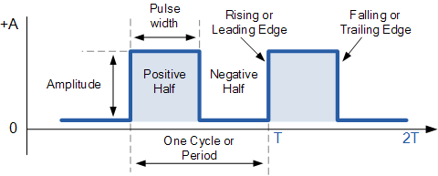

# Timers

**Terminology**

{ style="display:block; margin:auto;" width="80%"}

- **Period (T)**: time between repeating events (seconds).
- **Frequency (f)**: events per second (Hz). Relationship: $$ f = \frac{1}{T} $$.
- **Tick**: the timer's discrete unit of time $$ \Delta t = \frac{1}{f_{\text{timer}}} $$.
- **Resolution**: the smallest time step you can represent $$ \text{Resolution} \approx \frac{1}{f_{\text{timer}}} $$.
- **Jitter**: unwanted variation of the actual instant with respect to the ideal one.
- **Prescaler**: divider of the clock feeding the timer (reduces f_timer). Note: the RP2350 system timer does not use a classic prescaler; it selects the tick source (µs or clk_sys cycles).
- **Overflow / wrap**: when the counter reaches its limit and "wraps around".
- **One-shot vs periodic**: fires once vs re-arms automatically.

**System clocks and domains**

- **CPU clock (f_core/f_sys)**: executes instructions.
- **Peripheral clock (f_periph)**: some peripherals use their own clock.
- **PLL/DFS**: multipliers/dividers that alter f_core and f_periph.
- **Stability**: if you change clocks at runtime, recompute timing configurations.

**Timer modes**

- **Timer**: advances with a known clock (measures time).
- **Counter**: advances with external events (measures occurrences).
- **Common modes**: up, down, up/down, one-shot, periodic, compare, capture.
- **Outputs**: flags, interrupts, compare-match, pin toggles, DMA trigger.

**Time calculation**

- **f_clk**: the timer's input clock (core or peripheral).
- **P**: prescaler value (depending on the vendor it may be N, N-1, or powers of 2).
- **f_timer** = f_clk / (P_effective)
- **Reload**: reload value (N bits wide)

$$
T \approx \frac{\mathrm{Reload}+1}{f_{\mathrm{timer}}}
$$

$$
\Delta t = \frac{1}{f_{\mathrm{timer}}} = \frac{P_{\mathrm{effective}}}{f_{\mathrm{clk}}}
$$

$$
T_{\max} \approx \frac{2^{N}}{f_{\mathrm{timer}}}
$$

**RP2350**

**64-bit counter** advancing with a selectable **tick**:

- **µs mode:** \(\Delta t = 1~\mu s\).
- **Cycle mode:** \(\Delta t = \frac{1}{f_{\text{sys}}}\) *(e.g., \(1/150~\text{MHz} \approx 6.67~\text{ns}\)).*

**Compare-based alarms** against the counter (several alarms available).

The alarms compare the **lower 32 bits** of the counter ⇒ the **maximum programmable time** into the future is:

\[
T_{\max}^{\text{alarm}} \approx 2^{32} \cdot \Delta t
\]

- E.g.: at **1 µs/tick** → \(\approx 71.6~\text{min}\)
- In **cycles @ 150 MHz** → \(\approx 28.6~\text{s}\)

Use **absolute deadlines** and **cumulative re-arming**:

\[
\text{interval\_ticks}=\frac{T_{\text{desired}}}{\Delta t},
\qquad
\text{next} \leftarrow \text{now} + \text{interval_ticks}
\]

In the ISR:

\[
\text{next} \leftarrow \text{next} + \text{interval_ticks}
\]

*(This prevents the ISR's latency from accumulating phase error.)*

---

**Example calculations:**

**10 µs period (100 kHz)**
- **µs mode:** \(\text{interval\_ticks}=10\)
- **Cycle mode @ 150 MHz:** \(\text{interval\_ticks}=1500\)

**3.3 µs period**
- **µs mode:** not exact (integer µs only).
- **Cycle mode @ 150 MHz:** \(3.3 \cdot 150 = 495\) cycles → **exact**.


## Functions

```c
static inline bool add_repeating_timer_ms(int32_t delay_ms, repeating_timer_callback_t callback, void *user_data, repeating_timer_t *out) {
    return alarm_pool_add_repeating_timer_us(alarm_pool_get_default(), delay_ms * (int64_t)1000, callback, user_data, out);
}
```

- `int32_t delay_ms`: the repeat delay in milliseconds; if > 0, this is the time between one callback ending and the next starting; if < 0, it is the negative of the time between callback starts. A value of 0 is treated as 1 microsecond.
- `repeating_timer_callback_t callback`: the repeating timer's callback function.
- `void *user_data`: user data that will be passed along and stored in the `repeating_timer` structure, for use by the callback.
- `repeating_timer_t *out`: pointer to the user-owned structure where the repeating timer's information will be stored.

`irq_set_exclusive_handler(ALARM_IRQ, on_alarm_irq);`

- **What it does:** registers your `on_alarm_irq` function as the **sole** handler for the `ALARM_IRQ` interrupt line in the NVIC (the M33's interrupt vector).

`hw_set_bits(&timer_hw->inte, 1u << ALARM_NUM);`

- **What it does:** enables, **inside the TIMER peripheral**, the interrupt **source** for alarm `ALARM_NUM`.
- **Other params**
    - `intr` = raw flag state (who requested an interrupt).
    - `inte` = enables (who has permission to request).
    - `ints` = masked state (intr & inte).

`irq_set_enabled(ALARM_IRQ, true);`

- **What it does:** enables the `ALARM_IRQ` interrupt line in the NVIC (the core's interrupt controller).
- **Optional:** you can adjust the priority:
`irq_set_priority(ALARM_IRQ, priority); // 0 = highest, 255 = lowest`

## Examples

**Basic Blink without delay**

```c
// Blink with a timer (high-level SDK): change BLINK_MS to adjust
#include "pico/stdlib.h"
#include "pico/time.h"

#define LED_PIN PICO_DEFAULT_LED_PIN
static const int BLINK_MS = 250;  // <-- set your period here

bool blink_cb(repeating_timer_t *t) {
    static bool on = false;
    gpio_put(LED_PIN, on = !on);
    return true; // keep the alarm repeating
}

int main() {
    stdio_init_all();

    gpio_init(LED_PIN);
    gpio_set_dir(LED_PIN, true);

    repeating_timer_t timer;
    // Schedule a periodic interrupt every BLINK_MS:
    add_repeating_timer_ms(BLINK_MS, blink_cb, NULL, &timer);

    while (true) {
        // The "heavy" work should go here (not in the ISR).
        tight_loop_contents();
    }
}
```

**Blink with a configurable alarm**

```c
// Blink with the system timer (low level): programming ALARM0 and its IRQ
#include "pico/stdlib.h"
#include "hardware/irq.h"
#include "hardware/structs/timer.h"

#define LED_PIN       PICO_DEFAULT_LED_PIN
#define ALARM_NUM     0  // we'll use alarm 0

// Compute the IRQ number for that alarm
#define ALARM_IRQ     timer_hardware_alarm_get_irq_num(timer_hw, ALARM_NUM)

static volatile uint32_t next_deadline;   // next instant (in µs) in the lower 32 bits
// By default the timer counts µs (we don't change the source).
static volatile uint32_t interval_us = 1000000u;    // period in microseconds

void on_alarm_irq(void) {
    // 1) Clear the alarm flag
    hw_clear_bits(&timer_hw->intr, 1u << ALARM_NUM);

    // 2) Do the work: toggle the LED
    sio_hw->gpio_togl = 1u << LED_PIN;

    // 3) Re-arm the next alarm with a "cumulative deadline"
    next_deadline += interval_us;
    timer_hw->alarm[ALARM_NUM] = next_deadline;
}

int main() {
    stdio_init_all();

    // Configure the LED
    gpio_init(LED_PIN);
    gpio_set_dir(LED_PIN, true);

    // "now" = lower 32 bits of the counter (time in µs)
    uint32_t now_us = timer_hw->timerawl;          // 32-bit (low) read of the counter
    next_deadline = now_us + interval_us;          // first deadline

    // Program the alarm
    timer_hw->alarm[ALARM_NUM] = next_deadline;

    // Register an exclusive handler linking the callback to the alarm's IRQ
    irq_set_exclusive_handler(ALARM_IRQ, on_alarm_irq);
    // Enable, inside the TIMER peripheral, the interrupt source for alarm ALARM_NUM (inte = interrupt enable)
    hw_set_bits(&timer_hw->inte, 1u << ALARM_NUM);
    // Enable the IRQ in the NVIC (the core's interrupt controller)
    irq_set_enabled(ALARM_IRQ, true);

    while (true) {
        // Keep the main loop free; heavy work goes here, not in the ISR
        tight_loop_contents();
    }
}
```

**Multiple Blinks**

```c
// Two LEDs with multiple system-timer alarms (RP2350 / Pico 2) in µs mode
// - ALARM0 drives the "default" LED (PICO_DEFAULT_LED_PIN).
// - ALARM1 drives an external LED on GPIO 0.
// Change LED0_MS and LED1_MS to adjust each LED's blink rate.

#include "pico/stdlib.h"
#include "hardware/irq.h"
#include "hardware/structs/timer.h"
#include "hardware/gpio.h"

#define LED0_PIN     PICO_DEFAULT_LED_PIN   // built-in LED
#define LED1_PIN     0                      // external LED on GPIO 0

#define ALARM0_NUM   0
#define ALARM1_NUM   1

#define ALARM0_IRQ   timer_hardware_alarm_get_irq_num(timer_hw, ALARM0_NUM)
#define ALARM1_IRQ   timer_hardware_alarm_get_irq_num(timer_hw, ALARM1_NUM)


// Next "deadlines" (lower 32 bits, in µs) and their intervals in µs
static volatile uint32_t next0_us, next1_us;
static const uint32_t INTERVAL0_US = 250000u;
static const uint32_t INTERVAL1_US = 400000u;

// ISR for ALARM0
static void on_alarm0_irq(void) {
    hw_clear_bits(&timer_hw->intr, 1u << ALARM0_NUM);
    sio_hw->gpio_togl = 1u << LED0_PIN;
    next0_us += INTERVAL0_US;
    timer_hw->alarm[ALARM0_NUM] = next0_us;
}

// ISR for ALARM1
static void on_alarm1_irq(void) {
    hw_clear_bits(&timer_hw->intr, 1u << ALARM1_NUM);
    sio_hw->gpio_togl = 1u << LED1_PIN;
    next1_us += INTERVAL1_US;
    timer_hw->alarm[ALARM1_NUM] = next1_us;
}

int main() {

    gpio_init(LED0_PIN);
    gpio_set_dir(LED0_PIN, GPIO_OUT);
    gpio_put(LED0_PIN, 0);

    gpio_init(LED1_PIN);
    gpio_set_dir(LED1_PIN, GPIO_OUT);
    gpio_put(LED1_PIN, 0);

    // System timer in microseconds (default source = 0)
    timer_hw->source = 0u;

    uint32_t now_us = timer_hw->timerawl;

    // First deadlines
    next0_us = now_us + INTERVAL0_US;
    next1_us = now_us + INTERVAL1_US;

    // Program both alarms
    timer_hw->alarm[ALARM0_NUM] = next0_us;
    timer_hw->alarm[ALARM1_NUM] = next1_us;

    // Clear pending flags before enabling
    hw_clear_bits(&timer_hw->intr, (1u << ALARM0_NUM) | (1u << ALARM1_NUM));

    // Register exclusive handlers for each alarm
    irq_set_exclusive_handler(ALARM0_IRQ, on_alarm0_irq);
    irq_set_exclusive_handler(ALARM1_IRQ, on_alarm1_irq);

    // Enable interrupt sources in the TIMER peripheral
    hw_set_bits(&timer_hw->inte, (1u << ALARM0_NUM) | (1u << ALARM1_NUM));

    // Enable both IRQs in the NVIC
    irq_set_enabled(ALARM0_IRQ, true);
    irq_set_enabled(ALARM1_IRQ, true);

    // Main loop: all the blinking happens in the ISRs
    while (true) {
        tight_loop_contents();
    }
}
```
