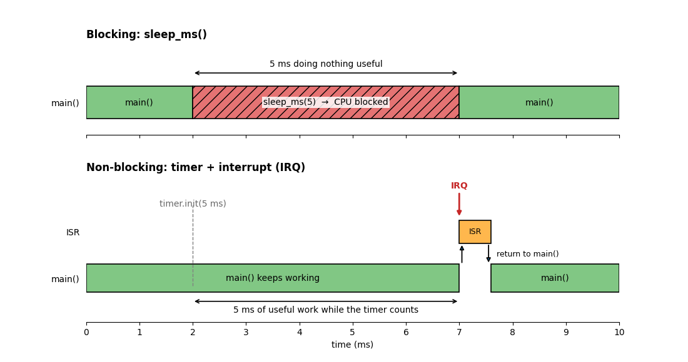
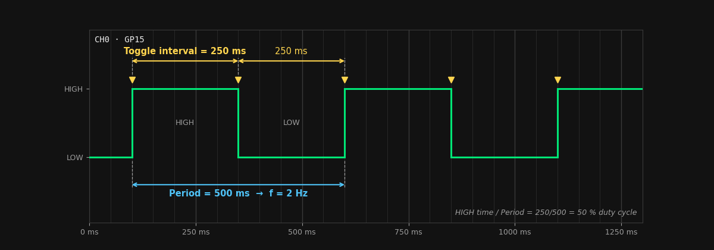
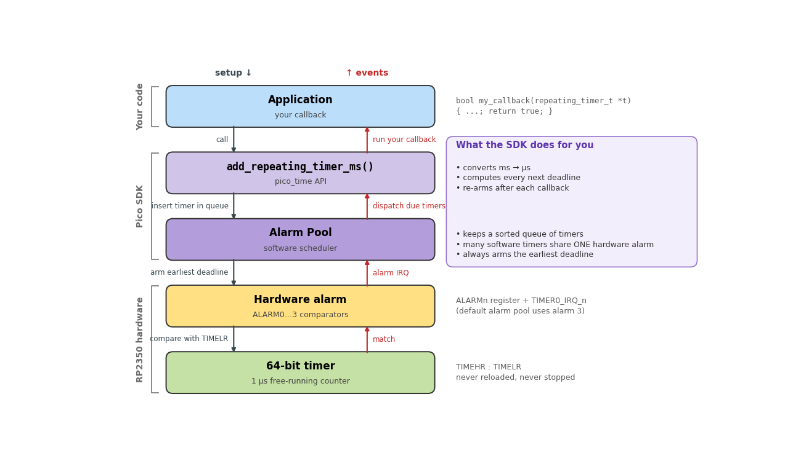
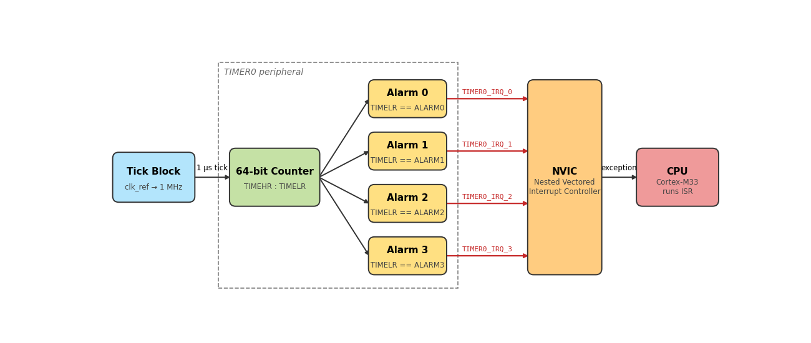
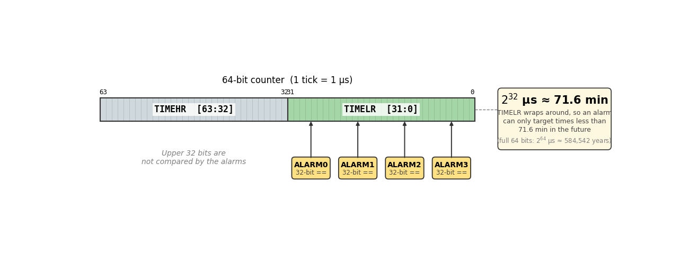
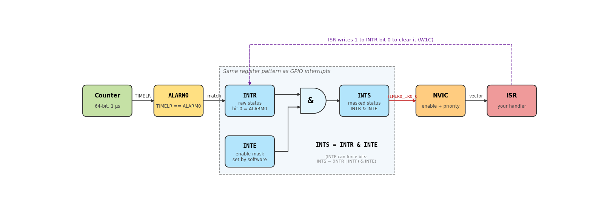
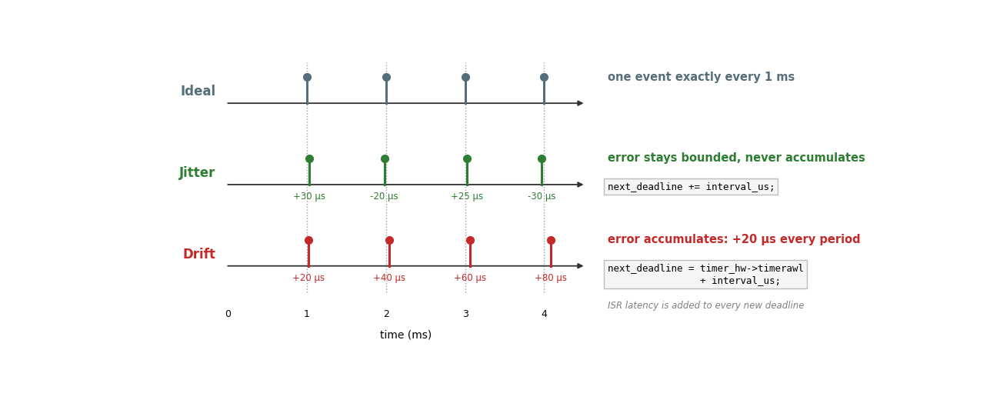

# Timers

Until now, when we wanted to wait before doing something again, we could write code such as:

```c
while (true) {
    gpio_put(LED_PIN, 1);
    sleep_ms(250);
    gpio_put(LED_PIN, 0);
    sleep_ms(250);
}
```

This works, but the **main program flow is blocked while `sleep_ms()` is waiting**. Interrupts can still occur, but the statements after `sleep_ms()` cannot execute until the delay finishes.

What if we want the LED to blink while the microcontroller is also reading buttons, communicating through UART, or performing calculations?

That is one of the main reasons microcontrollers include **hardware timers**.

---

## Learning objectives

By the end of this topic you should be able to:

- Explain the difference between a blocking delay and a timer-based event.
- Relate **period**, **frequency**, **tick**, **resolution**, **latency**, **jitter**, and **drift** to measured waveforms.
- Use a Pico SDK repeating timer and verify its behavior with an oscilloscope.
- Explain the timer and hardware-alarm architecture of the RP2350.
- Configure a hardware alarm and its interrupt using registers.
- Explain why periodic events should normally be scheduled using **absolute/cumulative deadlines**.
- Recognize when a dedicated peripheral such as PWM is more appropriate than repeatedly interrupting the CPU.

---

## 1. Blocking delays vs timer events

A delay and a timer can produce the same visible result, but they organize the CPU very differently.

| Method | Main program flow | Periodic work | Typical use |
|---|---|---|---|
| `sleep_ms()` | Blocked until the delay finishes | Simple | Sequential waits |
| Polling the current time | Continues, but must repeatedly check | Possible | Simple cooperative loops |
| Timer + interrupt | Continues until an event occurs | Very good | Periodic tasks and deadlines |
| Dedicated peripheral | CPU involvement can be minimal | Excellent | PWM, communication, DMA, etc. |




*Figure 1. `sleep_ms()` blocks the sequential flow of `main()`, while a timer can count independently and interrupt the CPU only when the event is due.*

---

## 2. Basic timing terminology

### Period and frequency

The **period** \(T\) is the time between repeating events.

The **frequency** \(f\) is the number of repetitions per second.

\[
f = \frac{1}{T}
\]

For example, an event every 250 ms has:

\[
T = 0.25~s
\]

\[
f = \frac{1}{0.25}=4~Hz
\]

However, be careful with a GPIO that is **toggled** every 250 ms:

```text
HIGH      LOW       HIGH      LOW
|---------|---------|---------|
   250 ms    250 ms    250 ms
```

The GPIO changes state every 250 ms, but one complete HIGH + LOW cycle takes:

\[
T_{signal}=500~ms
\]

so the signal frequency is:

\[
f_{signal}=2~Hz
\]

This distinction will become important when we study **PWM**.



*Figure 2. Toggling a GPIO every 250 ms produces a 500 ms waveform period, or 2 Hz.*

### Tick and resolution

A digital timer does not represent continuous time. It advances in discrete steps called **ticks**.

If one tick represents 1 µs:

```text
0 µs → 1 µs → 2 µs → 3 µs → ...
```

then the timer has a time resolution of approximately 1 µs.

### Latency, jitter, and drift

- **Latency:** delay between the ideal event time and when the CPU actually begins servicing it.
- **Jitter:** variation in that latency from one event to another.
- **Drift:** accumulated timing error that causes repeated events to progressively move away from the intended schedule.

These are different problems. A periodic system can have some jitter without accumulating long-term drift.

### Overflow / wrap-around

A fixed-width counter eventually reaches its maximum value and wraps back to zero.

For an unsigned 32-bit value:

```text
0xFFFFFFFE
0xFFFFFFFF
0x00000000
0x00000001
```

Wrap-around is normal behavior in embedded systems and does not automatically mean the timer failed.

---

## 3. First approach: Pico SDK repeating timers

The Pico SDK provides a high-level timing API. A repeating timer executes a callback periodically without blocking the main loop.

```c
#include "pico/stdlib.h"
#include "pico/time.h"

#define LED_PIN PICO_DEFAULT_LED_PIN
#define TOGGLE_MS 250

static repeating_timer_t blink_timer;

bool blink_callback(repeating_timer_t *rt) {
    static bool led_state = false;

    led_state = !led_state;
    gpio_put(LED_PIN, led_state);

    return true;    // true = continue repeating
}

int main() {
    stdio_init_all();

    gpio_init(LED_PIN);
    gpio_set_dir(LED_PIN, GPIO_OUT);

    // A negative delay schedules the callbacks relative to their start times.
    add_repeating_timer_ms(-TOGGLE_MS, blink_callback, NULL, &blink_timer);

    while (true) {
        // The main program is free to perform other work here.
        tight_loop_contents();
    }
}
```

### What happened?

The important parts are:

```c
add_repeating_timer_ms(-TOGGLE_MS, blink_callback, NULL, &blink_timer);
```

which schedules the event, and:

```c
bool blink_callback(repeating_timer_t *rt)
```

which contains the code executed each time the timer expires.

The callback should normally be **short**. Avoid long calculations, blocking delays, or unnecessary printing inside timing callbacks and ISRs.

### Positive vs negative repeat delay

The SDK gives the sign of the delay a useful meaning:

- `+250 ms`: wait 250 ms **after one callback finishes** before starting the next one.
- `-250 ms`: aim for 250 ms **between callback start times**.

For periodic events, the negative form is often closer to the timing behavior we want.

```text
Positive delay
callback      callback      callback
|---work---|----250 ms----|---work---|----250 ms---->

Negative delay
callback             callback             callback
|----------------250 ms-------------------|
          |----------------250 ms-------------------|
```

The high-level call is convenient because several layers are working underneath it:



*Figure 3. A repeating timer is a software abstraction. The SDK manages alarm pools and ultimately uses a hardware alarm backed by the 64-bit timer.*

---

## 4. In-class laboratory — Make timing visible with an oscilloscope

The goal of this activity is to connect the code you write with a **physical waveform that you can measure**. Instead of only seeing an LED blink, you will predict the timing, measure it with the oscilloscope, change one variable at a time, and explain what changed.

### Equipment and connections

Use two GPIO pins so that the oscilloscope can observe both the timed output and, later, how long the callback is executing.

| Pico 2 signal | Oscilloscope | Purpose |
|---|---|---|
| `GP15` | CH1 | Timed output |
| `GP14` | CH2 | Callback execution marker |
| `GND` | Probe ground | Common reference |

> **Do not connect the oscilloscope ground clip to a GPIO pin.** Connect it only to a Pico GND pin.

### Part A — Predict first, measure second

Start with the following program. The timer toggles `GP15` every 250 ms.

```c
#include "pico/stdlib.h"
#include "pico/time.h"

#define TEST_PIN   15
#define TOGGLE_MS  250

static repeating_timer_t timer;

static bool timer_callback(repeating_timer_t *rt) {
    static bool state = false;

    state = !state;
    gpio_put(TEST_PIN, state);

    return true;
}

int main() {
    gpio_init(TEST_PIN);
    gpio_set_dir(TEST_PIN, GPIO_OUT);
    gpio_put(TEST_PIN, 0);

    add_repeating_timer_ms(-TOGGLE_MS, timer_callback, NULL, &timer);

    while (true) {
        // main() remains available for other work.
        tight_loop_contents();
    }
}
```

Before connecting the oscilloscope, calculate the expected:

1. time between GPIO state changes,
2. HIGH time,
3. LOW time,
4. complete waveform period,
5. frequency,
6. duty cycle.

Then measure CH1. A time base around `100 ms/div` is a reasonable starting point for this first signal.

Record your results:

| Quantity | Predicted | Measured | Difference |
|---|---:|---:|---:|
| Toggle interval | | | |
| HIGH time | | | |
| LOW time | | | |
| Period | | | |
| Frequency | | | |
| Duty cycle | | | |

### Part B — Change only one variable

Change only `TOGGLE_MS` and repeat the measurement.

Suggested values:

```text
250 ms → 100 ms → 50 ms → 10 ms
```

For each value, predict the new frequency **before** running the code.

Observation questions:

1. Does `TOGGLE_MS` represent the waveform period?
2. What mathematical relationship connects `TOGGLE_MS` and the measured signal frequency?
3. Does changing `TOGGLE_MS` change the duty cycle? Why?
4. At what point does observing the signal with an LED become less useful than observing it with an oscilloscope?

You should be able to obtain:

\[
f_{signal}=\frac{1}{2T_{toggle}}
\]

or, when `TOGGLE_MS` is expressed in milliseconds:

\[
f_{signal}=\frac{1000}{2\,TOGGLE\_MS}
\]

### Part C — Can the callback duration change the timing?

Now use CH2 to mark the time spent inside the callback. The callback raises `GP14` when it starts and lowers it immediately before returning.

```c
#include "pico/stdlib.h"
#include "pico/time.h"

#define TEST_PIN            15
#define CALLBACK_MARK_PIN   14
#define TIMER_DELAY_MS      100
#define WORK_US             20000
#define USE_NEGATIVE_DELAY  1

static repeating_timer_t timer;

static bool timer_callback(repeating_timer_t *rt) {
    static bool state = false;

    gpio_put(CALLBACK_MARK_PIN, 1);

    state = !state;
    gpio_put(TEST_PIN, state);

    // Intentional workload for the experiment.
    busy_wait_us_32(WORK_US);

    gpio_put(CALLBACK_MARK_PIN, 0);
    return true;
}

int main() {
    gpio_init(TEST_PIN);
    gpio_set_dir(TEST_PIN, GPIO_OUT);

    gpio_init(CALLBACK_MARK_PIN);
    gpio_set_dir(CALLBACK_MARK_PIN, GPIO_OUT);

    int32_t delay_ms = USE_NEGATIVE_DELAY ? -TIMER_DELAY_MS : TIMER_DELAY_MS;
    add_repeating_timer_ms(delay_ms, timer_callback, NULL, &timer);

    while (true) {
        tight_loop_contents();
    }
}
```

On the oscilloscope:

- CH1 shows the timed output.
- CH2 shows approximately how long the callback occupies the CPU.

Perform these experiments:

| Experiment | `USE_NEGATIVE_DELAY` | `WORK_US` | What to observe |
|---|---:|---:|---|
| C1 | `1` | `0` | Baseline interval |
| C2 | `1` | `20000` | Callback gets longer, intended interval stays referenced to callback start |
| C3 | `0` | `20000` | Callback execution time is added before the next delay begins |
| C4 | `1` | `80000` | Callback occupies most of the available interval |

For C2 and C3, predict the CH1 toggle interval before measuring it.

Observation questions:

1. What does the width of the CH2 pulse represent?
2. What changes when the repeating-timer delay changes from negative to positive?
3. Why should callbacks and ISRs normally be short?
4. What do you expect if the callback takes longer than the requested interval?
5. Does a longer callback necessarily change the HIGH/LOW duty cycle of CH1? Explain from the measured edges rather than from the source code alone.

### Part D — Make `main()` visibly do something else

Keep the timer on GP15, but use `main()` to monitor a push button or perform another independent task. The timer callback must not read the button.

Requirements:

- GP15 must continue changing at the same measured interval.
- `main()` must detect button presses while the timed waveform continues.
- Do not use `sleep_ms()` in the button-handling path.

Use the oscilloscope to verify that interacting with the button does not significantly change the timer waveform.

Think about this before moving on:

> If the timed waveform is being generated without stopping `main()`, what piece of hardware is actually keeping track of the time?

---

## 5. What hardware is underneath the SDK?

The RP2350 contains **two 64-bit timer peripherals**. Each timer has **four hardware alarms**.

By default, the timer receives a tick generated by the RP2350 tick block, normally configured so that:

\[
1~tick = 1~\mu s
\]

The counter continuously increases. It does **not** restart every time an alarm fires.



*Figure 4. The tick block drives the free-running 64-bit timer. Each hardware alarm can raise its own IRQ toward the NVIC and CPU.*

A hardware alarm works approximately like this:

1. Read the current timer value.
2. Calculate a future deadline.
3. Write that deadline into an alarm register.
4. The hardware continues counting independently.
5. When the counter matches the alarm, the hardware raises an interrupt.
6. The ISR clears the interrupt and optionally schedules another deadline.

---

## 6. 64-bit timer, 32-bit alarms

The timer itself is 64 bits wide:



*Figure 5. The timer is 64 bits wide, but each hardware alarm compares against the lower 32 bits.*

The hardware alarms compare against the **lower 32 bits** of the timer.

With the normal 1 µs tick, the maximum directly programmable distance into the future is approximately:

\[
2^{32}~\mu s
\]

\[
\approx 4295~s \approx 71.6~min
\]

This does **not** mean that the 64-bit timer resets after 71.6 minutes. Only the lower 32-bit comparison wraps around.

---

## 7. From the SDK to the registers

The SDK hides several hardware steps. At the register level we must configure the path ourselves:



*Figure 6. A match sets `INTR`; `INTE` determines whether that source is enabled; `INTS` is the masked status that reaches the timer IRQ and NVIC.*

Three timer interrupt registers are especially useful:

| Register | Meaning |
|---|---|
| `intr` | Raw interrupt flags: which alarm fired? |
| `inte` | Interrupt enable: which alarms are allowed to generate an IRQ? |
| `ints` | Masked interrupt status (`intr` after applying `inte`) |

The `intr` alarm bits are **write-one-to-clear (W1C)**.

That means that to clear alarm 0 we write a `1` to bit 0:

```c
timer_hw->intr = 1u << 0;
```

This may feel backwards at first: writing a `1` clears the corresponding interrupt flag because that is how the register is defined by the hardware.

---

## 8. Low-level periodic blink using a hardware alarm

The following example recreates the repeating blink without using `add_repeating_timer_ms()`.

```c
#include "pico/stdlib.h"
#include "hardware/irq.h"
#include "hardware/timer.h"
#include "hardware/structs/timer.h"
#include "hardware/structs/sio.h"

#define LED_PIN       PICO_DEFAULT_LED_PIN
#define ALARM_NUM     0
#define TOGGLE_US     250000u

#define ALARM_IRQ timer_hardware_alarm_get_irq_num(timer_hw, ALARM_NUM)

static volatile uint32_t next_deadline;

static void on_alarm_irq(void) {
    // 1. Clear the interrupt flag.
    // TIMER INTR is write-one-to-clear (W1C).
    timer_hw->intr = 1u << ALARM_NUM;

    // 2. Perform a short timed action.
    sio_hw->gpio_togl = 1u << LED_PIN;

    // 3. Schedule the next event using a cumulative deadline.
    next_deadline += TOGGLE_US;
    timer_hw->alarm[ALARM_NUM] = next_deadline;
}

int main() {
    gpio_init(LED_PIN);
    gpio_set_dir(LED_PIN, GPIO_OUT);
    gpio_put(LED_PIN, 0);

    // Cooperatively reserve hardware alarm 0.
    hardware_alarm_claim(ALARM_NUM);

    // Connect our ISR to this alarm's IRQ.
    irq_set_exclusive_handler(ALARM_IRQ, on_alarm_irq);

    // Clear any old pending flag before enabling the interrupt.
    timer_hw->intr = 1u << ALARM_NUM;

    // Enable this alarm as an interrupt source inside the TIMER peripheral.
    hw_set_bits(&timer_hw->inte, 1u << ALARM_NUM);

    // Enable the IRQ in the NVIC.
    irq_set_enabled(ALARM_IRQ, true);

    // timerawl = lower 32 bits of the running timer.
    uint32_t now_us = timer_hw->timerawl;

    // First absolute deadline.
    next_deadline = now_us + TOGGLE_US;
    timer_hw->alarm[ALARM_NUM] = next_deadline;

    while (true) {
        // Timed blinking occurs in the ISR.
        // main() remains available for other work.
        tight_loop_contents();
    }
}
```

### Follow the interrupt path

When this line executes:

```c
timer_hw->alarm[ALARM_NUM] = next_deadline;
```

the alarm becomes armed.

When the lower 32 bits of the timer reach that value:

```text
Timer counter
     ↓
ALARM compare
     ↓
intr bit becomes 1
     ↓
inte allows the interrupt
     ↓
IRQ reaches the NVIC
     ↓
on_alarm_irq()
```

This is the same interrupt concept used previously with GPIO, but the **interrupt source is now a timer peripheral instead of an input pin**.

---

## 9. Why use cumulative deadlines?

Consider two possible ways of scheduling the next event.

### Method A — schedule from the end of the ISR

```c
next = timer_hw->timerawl + interval_us;
```

Suppose the interrupt should occur every 1000 µs, but the ISR and interrupt latency together introduce 20 µs before the next alarm is programmed.

The events could become:

```text
1000 µs
2020 µs
3040 µs
4060 µs
...
```

The error accumulates. This is **drift**.

### Method B — cumulative deadline

Instead, keep track of the ideal timeline:

```c
next_deadline += interval_us;
```

Now the intended deadlines remain:

```text
1000 µs
2000 µs
3000 µs
4000 µs
...
```

The ISR may still start a few microseconds late because of interrupt latency. That produces **jitter**, but the schedule does not continuously move away from the intended timing.



*Figure 7. Jitter varies around the desired timeline; drift progressively moves the schedule away from that timeline.*

---

## 10. Hardware alarms vs software timers

A common misconception is:

> "If one RP2350 timer has four hardware alarms, can I only create four timers?"

No.

The Pico SDK can manage multiple software alarms and repeating timers using an **alarm pool** backed by a hardware alarm.

The abstraction layers shown earlier in Figure 3 are important here: many software timers can share an alarm pool, while the alarm pool schedules the earliest required deadline on a hardware alarm.

The hardware alarm is used to wake the software at the next required deadline. The SDK then determines which software callback should run and schedules the following deadline.

This is one reason high-level APIs are convenient: they allow many timed software events without manually assigning one hardware alarm to each task.

---

## 11. One-shot vs periodic events

A **one-shot** event executes once:

```text
start ---------------------> event
```

A **periodic** event repeats:

```text
start ------> event ------> event ------> event ------>
```

At the hardware-alarm level, an alarm fires once and must be programmed again for the next deadline.

Therefore, our ISR creates periodic behavior by repeatedly doing:

```c
next_deadline += TOGGLE_US;
timer_hw->alarm[ALARM_NUM] = next_deadline;
```

---

## 12. Advanced: timer source on RP2350

By default, the RP2350 timer uses the normal tick source, typically configured for a 1 µs tick.

The RP2350 can also configure the timer to count `clk_sys` cycles instead. This provides much finer resolution, but the timer values now depend on the system clock frequency.

For example, if:

\[
f_{sys}=150~MHz
\]

then one clock cycle is:

\[
\Delta t = \frac{1}{150\times10^6}\approx6.67~ns
\]

This can be useful for specialized high-resolution measurements.

> **Important:** the Pico SDK timing functions expect the default hardware timer to remain a monotonically increasing microsecond timebase. Do not change the source of the timer used by `pico_time` unless you intentionally isolate your implementation from those SDK timing functions.

For this course, we will normally keep:

\[
1~tick = 1~\mu s
\]

---

## 13. General timer architecture in other microcontrollers

The RP2350 timer is not the only timer architecture you will encounter.

Many microcontrollers use a structure similar to:

```text
Clock → Prescaler → Counter → Compare / TOP / Reload → Event / IRQ
```

For this type of timer:

\[
f_{timer}=\frac{f_{clk}}{P}
\]

and a counter that repeats after `TOP + 1` counts has approximately:

\[
T = \frac{(TOP+1)P}{f_{clk}}
\]

This architecture will become especially useful in the next topic when we study **PWM**.

Do not confuse this generic `prescaler + TOP` model with the RP2350 system timer used in the examples above. The RP2350 system timer is a continuously running 64-bit timebase with compare alarms.

---

For the following exercises connect:

- **GP15 → Oscilloscope CH1**
- **GND → Oscilloscope GND**

The goal is not only to make the LED blink, but to **measure the timing generated by the program**.

---

## Exercises 

### Exercise 1 — Measure a repeating timer

Start with the following code:

```c
#include <stdio.h>
#include "pico/stdlib.h"
#include "pico/time.h"

#define SIGNAL_PIN 15
#define TOGGLE_MS 250

bool timer_callback(repeating_timer_t *rt) {
    static bool state = false;

    state = !state;
    gpio_put(SIGNAL_PIN, state);

    return true;
}

int main() {
    stdio_init_all();

    gpio_init(SIGNAL_PIN);
    gpio_set_dir(SIGNAL_PIN, GPIO_OUT);

    repeating_timer_t timer;

    add_repeating_timer_ms(
        -TOGGLE_MS,
        timer_callback,
        NULL,
        &timer
    );

    while (true) {
        printf("Main is still running\n");
        sleep_ms(1000);
    }
}
```

#### Before measuring

Predict:

- How often does the GPIO change state?
- What will be the **period** of the waveform?
- What will be its **frequency**?
- What duty cycle do you expect?

For:

```c
#define TOGGLE_MS 250
```

calculate:

\[
T = ?
\]

\[
f = ?
\]

---

#### Measure

Using the oscilloscope, measure:

- HIGH time
- LOW time
- Period
- Frequency

Compare the measured values with your calculations.

#### Compare

!!! question
    Is `TOGGLE_MS` the period of the output signal?

---

#### Experiment

Change:

```c
#define TOGGLE_MS 100
```

Before running the program, predict the new:

- Period
- Frequency

Then verify your prediction with the oscilloscope.

Finally try one additional value of your choice.

#### What should you conclude?

For a GPIO that toggles every \(t_{toggle}\):

\[
T = 2t_{toggle}
\]

and therefore:

\[
f = \frac{1}{2t_{toggle}}
\]

---

### Exercise 2 — Does callback execution time matter?

Now we will intentionally make the callback take some time.

Use:

```c
#define SIGNAL_PIN 15
#define TIMER_MS 100
#define WORK_US 20000
```

and modify the callback:

```c
bool timer_callback(repeating_timer_t *rt) {
    static bool state = false;

    state = !state;
    gpio_put(SIGNAL_PIN, state);

    busy_wait_us_32(WORK_US);

    return true;
}
```

First use:

```c
add_repeating_timer_ms(
    -TIMER_MS,
    timer_callback,
    NULL,
    &timer
);
```

#### Observe

Measure the time between GPIO transitions.

Then change only:

```c
-TIMER_MS
```

to:

```c
+TIMER_MS
```

and measure again.

Record:

| Configuration | Expected interval | Measured interval |
|---|---:|---:|
| `-100 ms` | | |
| `+100 ms` | | |

#### Explain

Why are the measurements different?

A **negative delay** schedules callbacks relative to their expected start time:

```text
0 ms        100 ms       200 ms       300 ms
|-------------|-------------|-------------|
callback      callback      callback
```

A **positive delay** waits until the callback finishes before starting the next delay:

```text
callback
|---20 ms---|----100 ms----| callback
```

so the execution time of the callback becomes part of the period.

!!! important
    Periodic real-time behavior normally requires us to schedule events
    relative to a timeline, not relative to when the previous task finished.

---