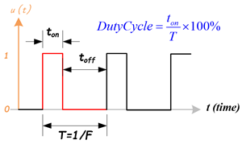
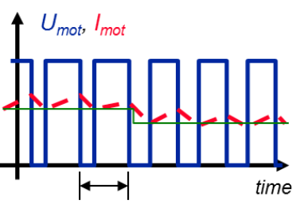
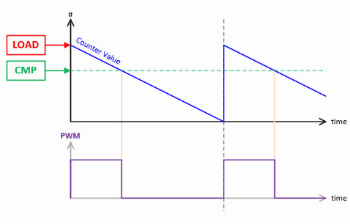
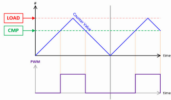
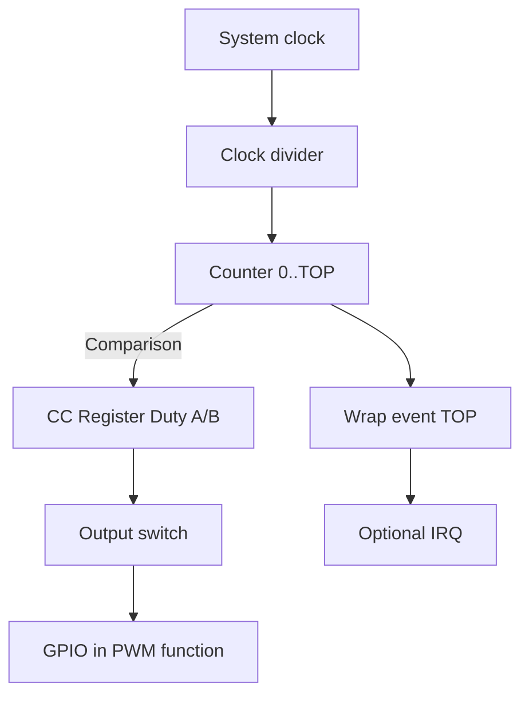

# PWM — Pulse Width Modulation

## 1) Introduction

**Pulse Width Modulation (PWM)** is a digital technique for controlling the **average power** delivered to a load by rapidly switching between ON and OFF.
Adjusting the **duty cycle** produces an effect analogous to varying the voltage.

{loading=lazy}

**Applications:** LED brightness control, DC motors (H-bridge), RC servos, tone generation (buzzer), DAC conversion with an RC filter, etc.

---

## 2) Fundamental PWM concepts

### Average and RMS values
A PWM signal of amplitude \( V_{high} \) and duty \( D \) has an average value of:

\[
V_{avg} = V_{high} \cdot D
\]

In resistive loads, the relevant parameter for power dissipation is the **RMS value**:

\[
V_{rms} = V_{high} \cdot \sqrt{D}
\]

Power in a load \( R \) is computed as:

\[
P = \frac{V_{rms}^2}{R}
\]

⚠️ Note: The formula \( V_{avg} = D \cdot V_{cc} \) holds when the low level = 0V and the high level = \( V_{cc} \).

---

### Ripple

**Ripple** is the periodic variation around the average value caused by the real signal switching ON/OFF.
With an RC filter, the output is not perfectly flat: it oscillates slightly with each PWM cycle.

- Less ripple ⇢ higher PWM frequency or filters with a time constant much larger than the switching period.
- More ripple ⇢ low frequency or a sensitive load.

{loading=lazy}

---

### Choosing the frequency

1. **LEDs:** ≥ 1 kHz for the human eye, 10–20 kHz if cameras are involved, to avoid *banding*.
2. **DC motors:** 15–25 kHz to get out of the human audible range.
3. **RC servos:** 50 Hz with 1–2 ms pulses (a special protocol).
4. **PWM DAC:** the higher \( f_{PWM} \) is relative to the filter, the lower the ripple.

---

## 3) Practical parameters

### TOP and resolution
- **TOP:** maximum value the counter reaches before restarting.
- It defines the PWM's **resolution**:

\[
Resolution\ (bits) = \log_2(TOP+1)
\]

Or more intuitively:

\[
2^{Resolution} = TOP+1
\]

- Example: TOP=255 → 8 bits, TOP=1023 → 10 bits, TOP=4095 → 12 bits.

### Duty vs Level relationship
The duty cycle results from comparing the counter with the CC (level) register:

\[
Duty\ Cycle = \frac{level}{TOP+1} \cdot 100\%
\]

---

### Harmonics

A **harmonic** is a frequency component that appears in a periodic signal and whose frequency is an **integer multiple** of the fundamental.
  - Fundamental: f1 (e.g., 2 kHz).
  - Harmonics: 2f1 (4 kHz), 3f1 (6 kHz), etc.

**Effects of harmonics:**
- Audible noise: if a harmonic falls within 20 Hz–20 kHz, it is heard as a hum.
- Electromagnetic interference (EMI): high harmonics radiate from wires/traces.
- Additional heating: excitation of transistors and coils at high frequencies.
- Visual distortion: in LEDs/displays, harmonics can cause flicker or banding on cameras.

**Edge alignment:**
- **Edge-aligned:** reinforces even harmonics → more EMI noise.
- **Center-aligned:** cancels even harmonics → less audible/EMI noise.

{loading=lazy}
{loading=lazy}

---

## 4) PWM architecture in microcontrollers



1. **System clock (A):** defines the PWM's time base.
2. **Clock divider (B):** adjusts the useful frequency range.
3. **Counter 0..TOP (C):** the heart of the PWM, defines the resolution.
4. **Comparison (C→D):** if counter < CC ⇒ output HIGH; if ≥ CC ⇒ LOW.
5. **Output switch (E):** may include normal/inverted polarity and an idle state (LOW, HIGH, Hi-Z).
6. **GPIO in PWM mode (F):** the physical pin emits the PWM signal.
7. **Wrap event (C→G):** useful for synchronizing processes.
8. **Optional IRQ (H):** lets you run code on every PWM cycle.

---

## 5) PWM on the Raspberry Pi Pico 2

- **Slices:** 8 PWM blocks with 2 channels (A and B) ⇒ 16 outputs.
- **Adjustable TOP:** up to 16 bits.
- **Clock divider:** integer/fractional.

### Frequency–divider–TOP relationship

\[
f_{PWM} = \frac{f_{clk}}{div \cdot (TOP+1)}
\]

where:
- \( f_{clk} \) = system clock frequency (125 MHz on the Pico).
- \( div \) = divider (1–255, fractional).
- \( TOP \) = maximum count value.

---

### Useful functions (SDK)

| API | What does it do? | Notes |
|---|---|---|
| `gpio_set_function(pin, GPIO_FUNC_PWM)` | Puts the pin in PWM mode. | `GPIO_FUNC_PWM` connects the pin to the internal PWM generator. |
| `pwm_gpio_to_slice_num(pin)` | Gets the associated slice. | Each slice drives 2 channels. |
| `pwm_gpio_to_channel(pin)` | Returns A or B. | Needed to set the duty. |
| `pwm_set_wrap(slice, top)` | Sets `TOP`. | Determines the resolution. |
| `pwm_set_clkdiv(slice, div)` | Sets the divider. | Adjusts the frequency. |
| `pwm_set_chan_level(slice, chan, level)` | Sets the duty. | Duty relationship: \( \frac{level}{TOP+1} \). |
| `pwm_set_enabled(slice, bool)` | Enables/disables the slice. | Starts the PWM. |

---

### Example in C (SDK)

```c
// pwm_led.c — Dim an LED with PWM on GPIO 2
#include "pico/stdlib.h"
#include "hardware/pwm.h"
#include "hardware/clocks.h" // only if using

#define LED_PIN 2
#define F_PWM_HZ 2000   // 2 kHz: outside the visible range
#define TOP 1023        // 10 bits of resolution

int main() {
    stdio_init_all();

    gpio_set_function(LED_PIN, GPIO_FUNC_PWM);
    uint slice = pwm_gpio_to_slice_num(LED_PIN);
    uint chan  = pwm_gpio_to_channel(LED_PIN);

    // Compute the divider
    float f_clk = 150000000.0f; // 150 MHz
    // Or
    // float f_clk = clock_get_hz(clk_sys); 
    float div = f_clk / (F_PWM_HZ * (TOP + 1));
    pwm_set_clkdiv(slice, div);
    pwm_set_wrap(slice, TOP);

    pwm_set_chan_level(slice, chan, 0);
    pwm_set_enabled(slice, true);

    // Fade
    int level = 0, step = 8, dir = +step;
    while (true) {
        pwm_set_chan_level(slice, chan, level);
        sleep_ms(5);
        level += dir;
        if (level >= TOP || level <= 0) dir = -dir;
    }
}
```

---
