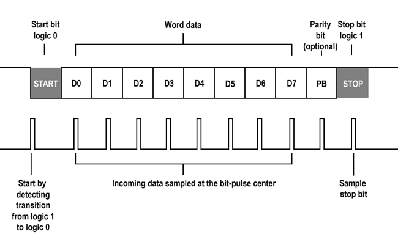
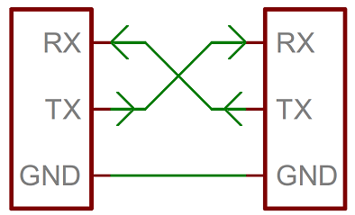

# UART — Serial communication

---

## 2) Concepts

### 2.1 What is UART?

**UART (Universal Asynchronous Receiver/Transmitter)** transmits data bit by bit without a shared clock. Each end configures **baud rate**, **data bits**, **parity**, and **stop bits**. Signals: **TX** (transmit) and **RX** (receive).

**Typical frame:**



* **Start bit:** 0 → marks the beginning of the byte.
* **Data bits:** 5–9 (normally 8).
* **Parity:** None/Even/Odd for simple error detection.
* **Stop bits:** 1 or 2 (high level).

> In 8N1, a byte takes **10 bits** (1 start + 8 data + 1 stop).

### 2.2 bps vs baud

* **bps (bits per second):** actual bit rate (includes start/stop/parity).
* **Baud (symbols/s):** in UART each symbol = 1 bit ⇒ **baud = bps**.
* In modulated systems one symbol can carry several bits (there **baud ≠ bps**).

**Example at 115200 baud:**
`T_bit ≈ 1/115200 ≈ 8.68 µs`. An 8N1 character (10 bits) takes ~**86.8 µs** ⇒ ~**11.5 kB/s**.

**Theoretical maximum speed**

According to the datasheet, it can reach up to **~1.5 Mbaud** without noticeable errors with a short cable and stable hardware.
In practice, the typically stable values are:

- 9600 / 19200 / 38400 / 57600 / 115200 bps (PC standards).
- 1,000,000 bps (sometimes used for MCU-to-MCU communication).

The higher the speed, the greater the error margin and noise; the longer the cable, the higher the probability of errors.

UART can work correctly as long as the error between transmitter and receiver stays below ±3%.


### 2.3 UART vs USART

| Feature        | UART                      | USART                                |
| -------------- | ------------------------- | ------------------------------------ |
| Clock          | No (asynchronous)         | Can be yes (synchronous) or no (asynchronous) |
| Lines          | TX, RX                    | TX, RX, **CLK** (synchronous mode)   |
| Complexity     | Lower                     | Higher, more flexible                |
| Typical use    | Consoles, simple modules  | Modems/links requiring a clock       |


### 2.4 Pi Pico 2 UART hardware

**Hardware UARTs:** **UART0** and **UART1** (can be used simultaneously).

**Default pins:**

* UART0 → TX **GP0**, RX **GP1**
* UART1 → TX **GP8**, RX **GP9**

**Compatible alternative pins:**

| UART  | Possible TX           | Possible RX           |
| ----- | --------------------- | --------------------- |
| UART0 | GP0, GP12, GP16, GP28 | GP1, GP13, GP17, GP29 |
| UART1 | GP4, GP8, GP20        | GP5, GP9, GP21        |




### 2.5 ASCII (American Standard Code for Information Interchange)

The ASCII standard defines 128 symbols (0–127) including:

| Type                  | Example          | Decimal range | Binary example        |
| --------------------- | ---------------- | ------------- | --------------------- |
| **Control**           | `\n`, `\r`, `\t` | 0–31          | `00001010` (LF)       |
| **Digits**            | `0`–`9`          | 48–57         | `00110000`–`00111001` |
| **Uppercase letters** | `A`–`Z`          | 65–90         | `01000001`–`01011010` |
| **Lowercase letters** | `a`–`z`          | 97–122        | `01100001`–`01111010` |
| **Common symbols**    | `, . ; ? !` etc. | 33–47 and others | `00100001` (!)     |

Each character (char) is an 8-bit integer (0–255).

When you do `uart_putc(UART_ID, 'A');`, the value 65 decimal (0x41) is sent.

When you receive a byte (`uart_getc()` returns a char), you can interpret it as a number or a letter:

```makefile
Value: 65, Character: A
```

### 2.6 FIFO (First In First Out)

A FIFO (First In, First Out) is a small storage queue inside the UART peripheral.
On the RP2350, each UART has a 16-byte FIFO for both RX and TX.

**Operation:**

- Each received byte enters the RX FIFO.
- The CPU (or DMA) extracts them with uart_getc().
- If the CPU falls behind and the FIFO fills up → new bytes are lost (overrun).

**Why it matters:**

- In polling mode, the FIFO acts as a small "shock absorber" between hardware and software.
- In interrupt mode, the handler must drain the FIFO quickly (reading all available bytes) to avoid saturating it.
- In fast streams, an external circular buffer and/or DMA becomes essential.

---

## 3) USB CDC Serial Monitor examples

### 3.1 Configuring USB-CDC

**USB-CDC** makes the Pico appear as a **COM/ttyACM port**.

Usual format: **115200 8N1**.
**Line endings:** use `\r\n` or configure the terminal (CR/LF).

Before using UART or USB-CDC, first modify the `CMakeLists.txt`:

```cmake
# Look for the line:
pico_enable_stdio_usb(timer 1) # Default is 0; change it to 1 to enable

# Also add hardware_uart in the libraries section:
target_link_libraries(timer
        pico_stdlib
        hardware_uart
        )
```

### 3.2 Echo example code


```c title="Console echo"
#include "pico/stdlib.h"
#include <stdio.h>

int main() {
    stdio_init_all();
    sleep_ms(2000); // time for USB enumeration

    printf("\n[Pico USB] Connection ready. Type something and press Enter.\n");

    while (true) {
        int ch = getchar_timeout_us(0);
        if (ch != PICO_ERROR_TIMEOUT) {
            printf("Echo: %c\n", (char)ch);
        }
        sleep_ms(10);
    }
}
```

### 3.3 Testing with the Serial Monitor in VS Code

1. Open **Extensions** (`Ctrl+Shift+X`) and search for **Serial Monitor** (Microsoft). Install it.
2. Connect the Pico; wait for the **USB Serial Device COMn** port to appear.
3. **Command Palette** (`Ctrl+Shift+P`) → `Serial Monitor: Select Serial Port` → choose the port.
4. `Serial Monitor: Start Monitoring` → select **115200**.
5. Configure **CR/LF** as needed; for `printf("\r\n")` use CR+LF.

---


## 4) Communication between two Picos (main/support) — UART0

### 4.1 UART wiring

**Connection:**

| Pico Main | Pico Support |
| --------- | ------------ |
| GP0 (TX)  | GP1 (RX)     |
| GP1 (RX)  | GP0 (TX)     |
| GND       | GND          |


### 4.2 Function glossary (Pico SDK)

| Function                                 | Description                            | Example                                        |
| ---------------------------------------- | -------------------------------------- | ---------------------------------------------- |
| `stdio_init_all()`                       | Enables stdio (USB/UART) per CMake     | `stdio_init_all();`                            |
| `printf()`                               | Prints to stdio                        | `printf("Hello\n");`                           |
| `getchar_timeout_us(us)`                 | Reads a char with a timeout            | `getchar_timeout_us(0);`                       |
| `uart_init(uart, baud)`                  | Initializes the UART at a baud rate    | `uart_init(uart0,115200);`                     |
| `uart_set_format(uart, db, sb, par)`     | Configures 8N1/E/O                     | `uart_set_format(uart0,8,1,UART_PARITY_NONE);` |
| `uart_puts/putc()`                       | Sends a string/character               | `uart_puts(uart0,"Hi\r\n");`                   |
| `uart_is_readable()`                     | Any RX data?                           | `if(uart_is_readable(u0))`                     |
| `uart_getc()`                            | Reads 1 RX byte                        | `char c=uart_getc(u0);`                        |
| `gpio_set_function(pin, GPIO_FUNC_UART)` | Assigns a pin to the UART              | `gpio_set_function(0,GPIO_FUNC_UART);`         |
| `irq_set_exclusive_handler(irq,h)`       | Registers an ISR                       | `irq_set_exclusive_handler(UART0_IRQ,h);`      |
| `uart_set_irq_enables(u,rx,tx)`          | Turns RX/TX IRQs on                    | `uart_set_irq_enables(u0,true,false);`         |

---

### 4.3 Sending

```c title="Sender code"
#include "pico/stdlib.h"
#include "hardware/uart.h"
#include <stdio.h>

#define UART_ID uart0
#define BAUD_RATE 115200
#define TX_PIN 0
#define RX_PIN 1

int main() {
    stdio_init_all();

    gpio_set_function(TX_PIN, GPIO_FUNC_UART);
    gpio_set_function(RX_PIN, GPIO_FUNC_UART);

    uart_init(UART_ID, BAUD_RATE);
    uart_set_format(UART_ID, 8, 1, UART_PARITY_NONE);

    printf("[MAIN] Sending messages every second...\n");

    int counter = 0;
    while (true) {
        char msg[64];
        sprintf(msg, "Message %d from MAIN\r\n", counter++);
        uart_puts(UART_ID, msg);
        sleep_ms(1000);
    }
}
```

**Polling:** `main()` checks whether data is available (`uart_is_readable()`). Simple, but it consumes CPU and can lose data if the CPU stays busy too long (UART FIFO ≈ 16 bytes).


### 4.4 Receiving

```c title="Receiver code"
#include "pico/stdlib.h"
#include "hardware/uart.h"
#include <stdio.h>

#define BAUD_RATE 115200
#define TX_PIN 0
#define RX_PIN 1

int main() {
    stdio_init_all();

    gpio_set_function(TX_PIN, GPIO_FUNC_UART);
    gpio_set_function(RX_PIN, GPIO_FUNC_UART);

    uart_init(uart0, BAUD_RATE);
    uart_set_format(UART_ID, 8, 1, UART_PARITY_NONE);

    printf("[SUPPORT] Waiting for messages (polling)...\n");

    while (true) {
        if (uart_is_readable(uart0)) {
            char c = uart_getc(uart0);
            printf("%c", c);
        }
    }
}
```

**Interrupts:** the hardware calls a **handler** when a byte arrives; the ISR must be **fast** and dump the data into a **circular buffer** in RAM for later processing. Efficient and robust at high baud rates.

```c title="IRQ receiver code"
#include "pico/stdlib.h"
#include "hardware/uart.h"
#include "hardware/irq.h"
#include <stdio.h>

#define UART_ID uart0
#define BAUD_RATE 115200
#define TX_PIN 0
#define RX_PIN 1

// Simple circular buffer
#define BUF_SIZE 256
volatile char buffer[BUF_SIZE];
volatile uint16_t head = 0, tail = 0;

static void on_uart_rx(void) {
    while (uart_is_readable(uart0)) {
        char c = uart_getc(uart0);
        buffer[head] = c;
        head = (head + 1) % BUF_SIZE; // no overflow handling, for simplicity
    }
}

int main() {
    stdio_init_all();

    gpio_set_function(TX_PIN, GPIO_FUNC_UART);
    gpio_set_function(RX_PIN, GPIO_FUNC_UART);

    uart_init(uart0, BAUD_RATE);
    uart_set_format(uart0, 8, 1, UART_PARITY_NONE);

    // Configure the UART0 IRQ
    irq_set_exclusive_handler(UART0_IRQ, on_uart_rx);
    irq_set_enabled(UART0_IRQ, true);
    uart_set_irq_enables(uart0, true, false); // RX interrupt ON

    printf("[SUPPORT IRQ] Waiting for data with interrupts...\n");

    while (true) {
        // Drain the buffer to the USB console
        while (tail != head) {
            char c = buffer[tail];
            tail = (tail + 1) % BUF_SIZE;
            printf("%c", c);
        }
        sleep_ms(10);
    }
}
```

---


## 5) Errors

### 5.1 Common application problems

* **USB port doesn't show up:** charge-only cable; enable `pico_enable_stdio_usb(... 1)` and wait ~2 s after `stdio_init_all()`.
* **Garbled text:** baud rate/format mismatch; use **115200 8N1**.
* **No echo over UART:** cross **TX↔RX**, share **GND**, set `GPIO_FUNC_UART`.
* **Data loss at high baud rates:** use **IRQ + circular buffer** or **DMA**; increase `BUF_SIZE`.
* **Odd CR/LF behavior:** use `\r\n` or set the terminal to **CR+LF**.

### 5.2 UART communication errors

| Error type           | Cause                                                                                        | How to detect it                                        | Typical effect                                                  |
| -------------------- | -------------------------------------------------------------------------------------------- | ------------------------------------------------------- | --------------------------------------------------------------- |
| **Framing Error**    | The receiver fails to detect the *Stop* bit correctly (noise or baud rate mismatch).         | `FRAMING_ERR` bit in the status register (`UARTx_FRSR`). | Received data is discarded or misinterpreted.                   |
| **Parity Error**     | When a parity bit (even/odd) is used and it doesn't match the expected value.                | `PARITY_ERR` bit.                                       | Detection of single-bit corruption.                             |
| **Overrun Error**    | The receiver got a new byte before the software read the previous one from the FIFO.         | `OVERRUN_ERR` bit.                                      | The oldest byte in the buffer is lost.                          |
| **Break Condition**  | The `TX` line stays low for longer than one byte time.                                       | `BREAK_DETECT` bit.                                     | May indicate a disconnection or serious hardware fault.         |
| **Noise / Glitches** | Electrical noise or interference between wires.                                              | Oscilloscope / logic analyzer.                          | Spurious bytes, random framing errors.                          |


### 5.3 Error handling in code

| Register                                                     | Function                                                    |
| ------------------------------------------------------------ | ----------------------------------------------------------- |
| **`UARTx_FR`** (Flag Register)                               | Shows FIFO and line status (busy, empty, etc.)              |
| **`UARTx_RSR` / `UARTx_ECR`** (Receive Status / Error Clear) | Contains error flags: `FE`, `PE`, `BE`, `OE`                |


| Bit | Name   | Meaning                                                     |
| --- | ------ | ----------------------------------------------------------- |
| 0   | **FE** | *Framing Error* — No valid stop bit detected                |
| 1   | **PE** | *Parity Error* — Incorrect parity                           |
| 2   | **BE** | *Break Error* — RX line held low for too long               |
| 3   | **OE** | *Overrun Error* — A byte was lost because the FIFO was full |


```c title="Reading UART errors"
#include "hardware/uart.h"

if (uart_is_readable(uart0)) {
    int c = uart_getc(uart0); // Read a character
    if (uart_get_hw(uart0)->rsr & (UART_UARTDR_FE_BITS | UART_UARTDR_PE_BITS | UART_UARTDR_OE_BITS)) {
        printf("⚠️ Error detected on UART\n");
        uart_get_hw(uart0)->rsr = 0; // Clear errors
    }
}
```
