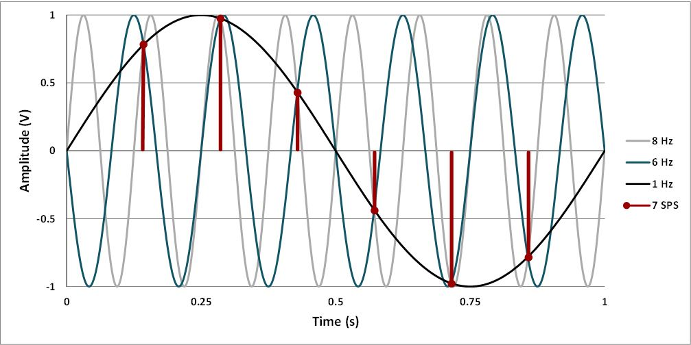
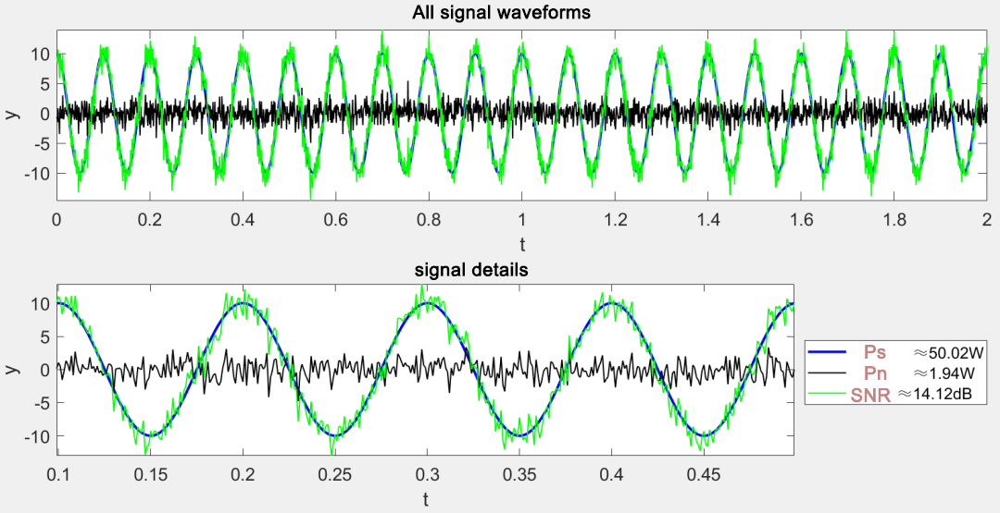
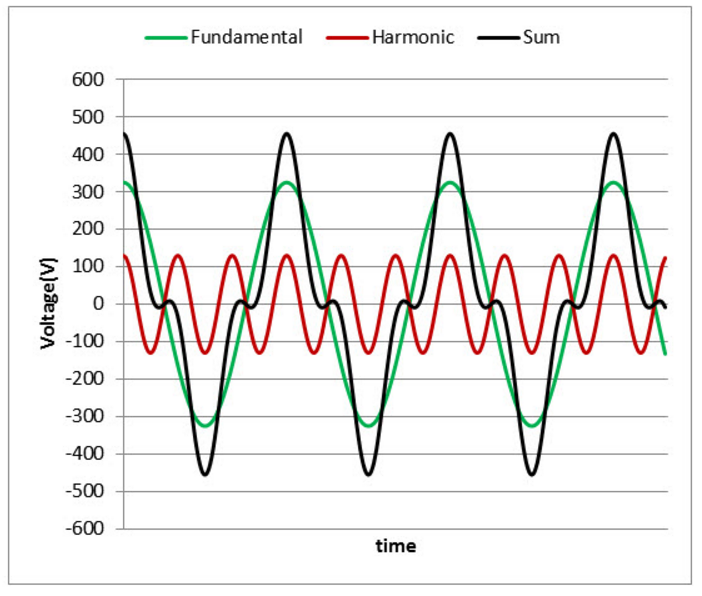
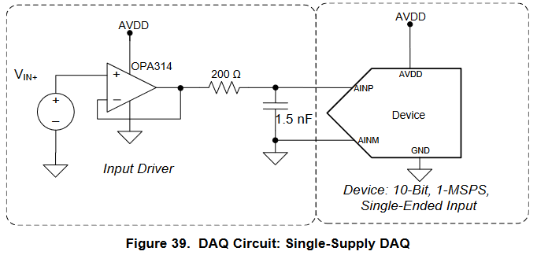

# ADC — Analog-to-Digital Converter

## 1. Introduction

The analog-to-digital converter lets you read voltages as numbers. In embedded systems it is used for sensing temperature, current, position, or basic audio. This topic combines sampling and quantization theory with the practical use of the RP2350's built-in ADC on the Pico 2.

## 2. Fundamental concepts

### 2.1 Resolution, LSB, range, and VREF

{width="60%" align="center"}

* Resolution: the ADC's number of bits N. For 12 bits there are \(2^{12}\) levels.
* Vref: the reference against which the ADC compares the input. It can be internal or external depending on the board.
* LSB: the size of the quantization step.
    $$
    \mathrm{LSB}=\frac{V_{\mathrm{ref}}}{2^{N}}
    $$
    For example, for a 12-bit ADC with Vref = 3.3 V:
    $$
    \mathrm{LSB}=\frac{3.3 V}{2^{12}}= 0.806 mV
    $$


* Range: 0 to Vref for single-ended inputs (as on the RP2350) and Vref1 to Vref2 for differential ones.


### 2.2 Sampling and Nyquist

* Sampling frequency Fs. The number of samples per second the ADC takes from a continuous signal. Expressed in Hz or samples/s.
* Aliasing: the phenomenon whereby frequency components above Fn "fold" into low frequencies in the sampled spectrum, showing up as false signals.

{width="80%" align="center"}

* Nyquist theorem. To avoid aliasing, Fs must be at least 2 times the highest useful frequency in the signal.
    $$
    F_{s} \geq 2 \cdot F_{max}
    $$
    where \(F_{max}\) is the highest frequency present in the analog signal.
* Acquisition time. The time during which the ADC's sample-and-hold circuit is connected to the input to charge its internal capacitance to within a maximum allowed error before starting the conversion.

### 2.3 Quantization, noise, and ENOB

* Quantization. When an ADC measures a continuous signal, it can only report values on a grid of equal steps. This process of "snapping" the signal to the nearest step is called quantization.
* Quantization noise. The error that arises from rounding to the grid. If the signal is sufficiently "rich" and the ADC is working well, that error can be modeled as a small noise varying between −LSB/2 and +LSB/2. The smaller the LSB, the smaller this noise.
* SNR (Signal to Noise Ratio). The ratio between signal power and noise power. Expressed in decibels. A large SNR means the signal clearly stands out above the noise.

{width="60%" align="center"}

* THD (Total Harmonic Distortion). Measures how much energy appears in harmonics of the fundamental signal due to non-linearities. Low THD means little distortion.

{width="60%" align="center"}

* SINAD (Signal to Noise And Distortion). Like SNR, but it counts both noise and distortion. That's why SINAD is usually lower than the pure quantization SNR. It is widely used to characterize an ADC's overall quality.
* ENOB (Effective Number Of Bits). A way of expressing "how many useful bits" you get, considering real noise and distortion. It's computed from SINAD:
$$
ENOB = (SINAD − 1.76) / 6.02.
$$
Example
If you measure SINAD = 62 dB, then ENOB ≈ (62 − 1.76) / 6.02 ≈ 10 bits.

## 3. ADC architectures

### 3.1 SAR

{width="60%" align="center"}

**Operation**

1. Sampling. A sample-and-hold circuit captures the input voltage over a brief window and holds it constant.
1. Successive approximations. A SAR register controls an internal DAC. Starting from the most significant bit, the DAC generates a trial value and a comparator decides whether the input is above or below it.
1. Binary search. On each cycle one bit is fixed according to the comparator's result and the DAC is updated. After N cycles on an N-bit ADC, the final code is obtained.
1. Timing. The conversion requires an acquisition time plus N comparison cycles. Many SARs in MCUs allow adjusting the acquisition time to ensure the sample-and-hold charges properly when the source has high impedance.
1. Multiple channels. A multiplexer selects the channel before sampling. When switching channels, the internal capacitance must settle again, so acquisition time is critical.

**Typical use**
General sensors in MCUs, current measurement with shunts, control and automation where low latency and moderate power consumption matter.

### 3.2 Sigma-Delta

**Operation**

1. Closed-loop modulator. The input goes through an integrator and a 1-bit (or few-bit) quantizer. The digital output feeds an internal DAC that closes the loop with feedback.
1. Noise shaping. The loop pushes quantization noise toward high frequencies, outside the band of interest.
1. Oversampling. The modulator operates at a frequency far above the useful band. The 1-bit stream contains the signal plus shaped noise.
1. Digital filtering and decimation. A digital low-pass filter (often cascaded CIC and FIR) removes out-of-band noise and reduces the data rate to the desired output frequency.
1. Order and SNR gain. A first-order modulator improves SNR by roughly 9 dB for every doubling of the oversampling ratio. Second-order, about 15 dB per doubling.
1. Latency. The output suffers the digital filter's group delay, so latency is higher than in a SAR.

***Typical use***
Precision scales, slow instrumentation, high-fidelity audio, high-resolution temperature and pressure measurements.

### 3.3 Flash

{width="60%" align="center"}

**Operation**

1. Cascaded stages. Each stage performs a coarse m-bit conversion using a fast sub-ADC.
1. Sub-DAC and residue. The stage reconstructs the value of those m bits with a sub-DAC and subtracts it from the input signal to generate a residue.
1. Residue amplification. The residue is typically amplified by 2^m and passed to the next stage, where the process repeats.
1. Alignment and digital correction. The bits from all stages are time-aligned and small errors are corrected through redundant digital logic.
1. Latency. Total latency is the number of stages, measured in clock cycles. In exchange you get high speed with medium-to-high resolutions.

**Typical use**
Software-defined radio systems, intermediate-frequency digitizers, medium-to-high-bandwidth data acquisition, and embedded vision.

### 3.4 Choosing an architecture

* Slow, precise signals. Sigma-Delta.
* General sensors in MCUs. SAR.
* High speeds. Pipeline or Flash.

| ADC Type                       | Pros                                                        | Cons                                   | Max Resolution | Max Sample Rate | Main Applications                              |
| ------------------------------ | ----------------------------------------------------------- | -------------------------------------- | -------------- | --------------- | ---------------------------------------------- |
| Successive Approximation (SAR) | Good speed/resolution ratio                                 | No intrinsic anti-aliasing protection  | 18 bits        | 10 MHz          | Data acquisition                               |
| Delta-sigma (ΔΣ)               | High dynamic performance, intrinsic anti-aliasing protection | Hysteresis on non-natural signals     | 32 bits        | 1 MHz           | Data acquisition, noise and vibration, audio   |
| Dual Slope                     | Accurate, inexpensive                                       | Low speed                              | 20 bits        | 100 Hz          | Voltmeters                                     |
| Pipelined                      | Very fast                                                   | Limited resolution                     | 16 bits        | 1 GHz           | Oscilloscopes                                  |
| Flash                          | The fastest                                                 | Low bit resolution                     | 12 bits        | 10 GHz          | Oscilloscopes                                  |


#### 3.5 Input topologies

This is not a conversion architecture. It describes how the signal is applied to the ADC.

**Single-ended**
Measures the voltage on one pin with respect to a common reference. It's simple and uses fewer pins. It requires clean returns and good layout to prevent ground noise from degrading the measurement.

**Differential**
Measures the difference between two nodes that share a common mode. Internally the ADC samples both inputs and subtracts them, which improves common-mode noise rejection. It requires a compatible front-end and ADC, and the allowed common-mode range must be respected.

| Topology | How it measures | Advantages | Precautions | Typical uses |
|---|---|---|---|---|
| Single-ended | Against a common reference | Simplicity, fewer pins | Sensitive to ground noise and return loops | MCUs, general sensors, potentiometers |
| Differential | Difference between two nodes | High common-mode rejection, better noise immunity | Requires differential ADC and front-end, respect common mode | Bridge sensors, pro audio, RF, instrumentation |

## 4. Minimal front-end and anti-alias

### 4.1 Input RC filter

A circuit with a resistor (R) and a capacitor (C) that acts as a low-pass filter, letting low-frequency signals through and attenuating high-frequency ones such as noise.

{width="40%" align="center"}

$$ f_c = \frac{1}{2\pi RC} $$

Suggested cutoff frequency for slow signals: fc ≈ 0.4 to 0.5 of the useful Fs, or as defined by the bandwidth requirements.


### 4.2 Op-amp buffer

{width="40%" align="center"}

* A low-impedance voltage follower helps charge the sampling capacitance.
* Use a rail-to-rail op-amp with adequate GBW and good PSRR at 3.3 V.

### 4.3 Protection

* A small series resistor to limit input currents.
* Clamping diodes or ESD protection depending on the environment.

## 5. ADC on the RP2350

**Feature summary**

* 12-bit SAR-type ADC.
* Representative speed on the order of hundreds of kSps depending on clock and configuration.
* Multiplexed single-ended channels. The number of external inputs depends on the silicon package and the board.
    * ADC0 – GPIO26
    * ADC1 – GPIO27
    * ADC2 – GPIO28
    * ADC3 – GPIO29 (exists but is not connected to a pin)
    * ADC4 – Internal temperature sensor
* Vref is taken from the 3.3 V rail or from the VREF pin if available on the board.
* No differential mode is exposed. Avoid sharing analog lines with noisy digital loads. Separate return paths whenever possible.

### 5.1 Function glossary (Pico SDK)

| Function                                     | Description                                    | Example                                             |
| -------------------------------------------- | ---------------------------------------------- | --------------------------------------------------- |
| `adc_init()`                                 | Enables the ADC peripheral                     | `adc_init();`                                       |
| `adc_gpio_init(pin)`                         | Configures the GPIO as an ADC input            | `adc_gpio_init(26);`                                |
| `adc_select_input(n)`                        | Selects ADC channel n                          | `adc_select_input(0);`                              |
| `adc_read()`                                 | Performs one conversion and returns 12 bits    | `uint16_t v = adc_read();`                          |
| `adc_set_clkdiv(div)`                        | Sets the ADC clock divider                     | `adc_set_clkdiv(479.0f);`                           |
| `adc_fifo_setup(en, dreq, thr, err, shift)`  | Configures the FIFO, DREQ for DMA, and threshold | `adc_fifo_setup(true, true, 1, false, false);`    |
| `adc_run(run)`                               | Starts or stops free-running conversions       | `adc_run(true);`                                    |
| `adc_set_round_robin(mask)`                  | Enables automatic channel scanning             | `adc_set_round_robin(0b00001111);`                  |
| `adc_set_temp_sensor_enabled(en)`            | Enables the internal temperature sensor        | `adc_set_temp_sensor_enabled(true);`                |
| `adc_fifo_drain()`                           | Empties the ADC FIFO before starting           | `adc_fifo_drain();`                                 |
| `adc_fifo_get_level()`                       | Reads how many entries are in the FIFO         | `uint lvl = adc_fifo_get_level();`                  |
| `irq_set_exclusive_handler(ADC_IRQ_FIFO, h)` | Registers an ISR for the ADC IRQ               | `irq_set_exclusive_handler(ADC_IRQ_FIFO, adc_isr);` |
| `irq_set_enabled(ADC_IRQ_FIFO, en)`          | Enables or disables the ADC IRQ                | `irq_set_enabled(ADC_IRQ_FIFO, true);`              |
| `adc_irq_set_enabled(en)`                    | Enables IRQ generation from the FIFO           | `adc_irq_set_enabled(true);`                        |
| `DREQ_ADC`                                   | DREQ selection for DMA from the ADC FIFO       | `channel_config_set_dreq(&cfg, DREQ_ADC);`          |

### 5.2 Basic ADC examples

1. Initialize the ADC subsystem.
2. Configure the pin as an ADC input.
3. Select the channel.
4. Read with a single conversion and store the value.

```c title="Basic ADC read example"
#include <stdio.h>
#include "pico/stdlib.h"
#include "hardware/adc.h"

// Configure the ADC channel to use
#define ADC_INPUT 0 // channel 0

int main() {
    stdio_init_all();
    adc_init();
    // Configure the corresponding GPIO pin as an ADC input
    adc_gpio_init(26); // GPIO26 usually maps to ADC0 on the Pico 2
    // Select the channel
    adc_select_input(ADC_INPUT);

    // Optional: adjust the clock divider if you need to limit Fs
    // adc_set_clkdiv(div);

    while (true) {
        uint16_t adc = adc_read(); // 12 bits aligned to 0..4095
        // float v = (adc * VREF) / 4095.0f;
        printf("%u\n", adc);
        sleep_ms(10);
    }
}
```

## 6. Improving measurements in software

### 6.1 Averaging and median

* Moving average and exponential average to reject spikes.

```c title="Moving Average example"
#include <stdio.h>
#include "pico/stdlib.h"
#include "hardware/adc.h"

// Configure the ADC channel to use
#define ADC_INPUT 0 // channel 0
// number of samples to average
#define N_SAMPLES 16

int main() {
    stdio_init_all();
    adc_init();
    // Configure the corresponding GPIO pin as an ADC input
    adc_gpio_init(26); // GPIO26 usually maps to ADC0 on the Pico 2
    // Select the channel
    adc_select_input(ADC_INPUT);

    // -- Variables --
    uint16_t buffer[N_SAMPLES];
    uint32_t sum = 0;
    uint8_t  index = 0;              // next position to overwrite
    uint8_t  count = 0;              // number of filled samples, up to N_SAMPLES

    while (true) {
        uint16_t adc = adc_read(); // 12 bits aligned to 0..4095
        if (count < N_SAMPLES) {
            // fill the buffer initially
            buffer[index] = adc;
            sum += adc;
            count++;
            index++;
        } else {
            // buffer full, proceed with the moving average
            sum -= buffer[index];         // subtract the old value
            buffer[index] = adc;          // add the new value to the buffer
            sum += adc;                   // add the new value to the total
            // Advance through the circular buffer
            index++;
            if (index >= N_SAMPLES) index = 0;
            // compute the average
            uint16_t average = sum / N_SAMPLES;

            printf("%u\n", average);
            sleep_ms(10);
        }

    }
}
```

* Exponential average for fast smoothing with less lag; it uses a recursive formula to smooth out noise. Formula:
  $$
  y(n) = alpha \cdot x(n) + (1 - alpha) \cdot y(n-1)
  $$
  where:
  y(n) is the smoothed output at sample n,
  x(n) is the current input at sample n,
  y(n-1) is the smoothed output at the previous sample,
  alpha is the smoothing factor (0 < alpha ≤ 1).

```c title="Exponential Average example"
#include <stdio.h>
#include "pico/stdlib.h"
#include "hardware/adc.h"

#define ADC_INPUT 0          // channel 0 -> GPIO26
const float alpha = 0.0625f; // 0<alpha<=1 (0.0625 = 1/16)

int main() {
    stdio_init_all();
    adc_init();
    adc_gpio_init(26);        // GPIO26 = ADC0
    adc_select_input(ADC_INPUT);

    bool   y_init = false;
    float  y = 0.0f;

    while (true) {
        uint16_t x = adc_read();   // 0..4095 (12 bits)

        if (!y_init) {
            y = (float)x;          // initialize with the first reading
            y_init = true;
        } else {
            y = alpha * (float)x + (1.0f - alpha) * y;  // y(n) = αx + (1-α)y
        }

        // If you prefer an integer for printing/outputs:
        uint16_t y_u16 = (uint16_t)(y + 0.5f);

        printf("raw=%u ema=%u\n", x, y_u16);
        sleep_ms(10);
    }
}

```

### 6.2 Oversampling and decimation

* Increase the sampling rate M times and average to gain effective bits. Rule of thumb: every 4× oversampling adds 1 bit, provided there is enough noise for dithering.

### 6.3 IIR and FIR filters

* First-order IIR for fast smoothing. FIR for linear phase.

### 6.4 Linearization and two-point calibration

* Measure the output at 0 V and at a known reference point close to Vref. Compute offset and gain and correct in software.

<iframe width="560" height="315" src="https://www.youtube.com/embed/hIRZeYgcG5E?si=uIy8H0GFnar9grEK" title="YouTube video player" frameborder="0" allow="accelerometer; autoplay; clipboard-write; encrypted-media; gyroscope; picture-in-picture; web-share" referrerpolicy="strict-origin-when-cross-origin" allowfullscreen></iframe>
