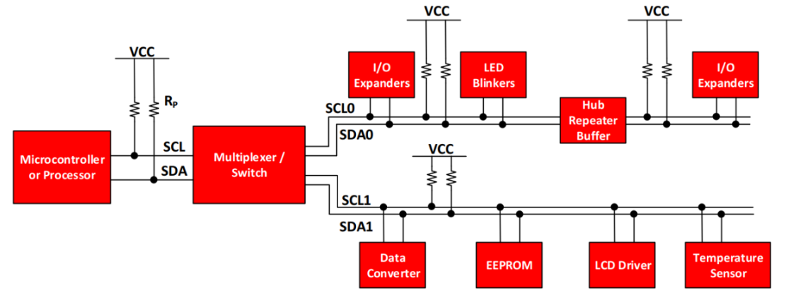
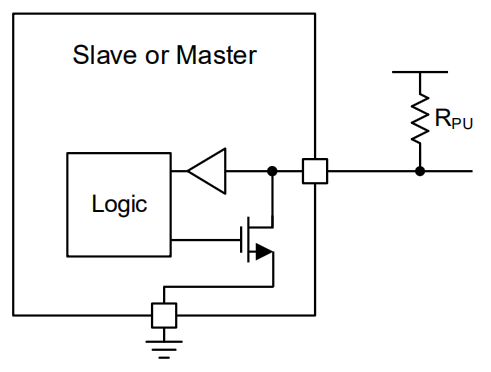
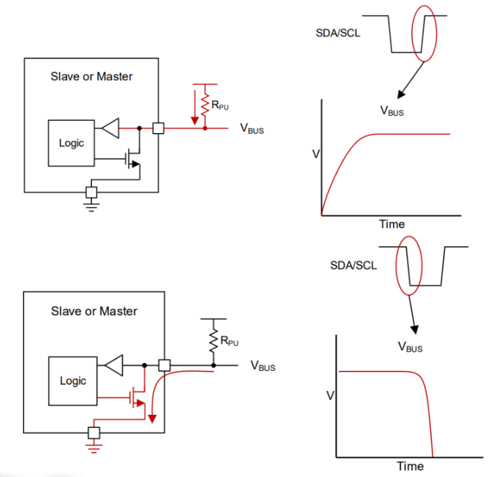
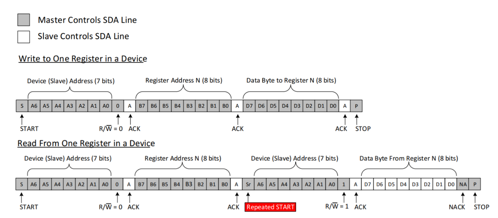

# I2C (Inter-Integrated Circuit)

## Introduction

### What is I2C?

- Two-line synchronous serial bus:
    - SCL (clock) and SDA (data).
- Multi-device architecture over the same pair of wires.
- Master ↔ slave communication (in practice: controller ↔ target).
- Each target has an address (7 or 10 bits) on the bus.

### When is I²C a good choice?

- Connecting many peripherals with few pins.
- Typical devices: sensors (temperature, IMU), ADC/DAC, GPIO expanders, displays (OLED), EEPROM.
- Modest speeds: 100 kbps (Standard), 400 kbps (Fast), 1 Mbps (Fm+), 3.4 Mbps (Hs).
(For higher throughput or point-to-point links, SPI is usually better; for text/terminals, UART.)

## Hardware





$$
R_p(min)= \frac{V_{cc}-V_{oL}(max)}{I_{oL}}
$$

Where $V_{oL}(max)$ is the maximum voltage the device guarantees at LOW (usually 0.4 V) and $I_{oL}$ is the current the device can sink at LOW (usually 3 mA).
$$
R_p(min)= \frac{3.3V-0.4V}{3mA}=966.67 \Omega
$$



$$
R_p(max)= \frac{t_r}{0.8473 \cdot C_b}
$$
Where $t_r$ is the maximum allowed rise time (1000 ns for 100 kHz, 300 ns for 400 kHz, 120 ns for 1 MHz) and $C_b$ is the total bus capacitance (including wires, PCB, and devices).

We typically use the following values:

- 100 kHz: 4.7 kΩ, and up to 10 kΩ can work.
- 400 kHz: 2.2–4.7 kΩ.
- 1 MHz (Fm+): 1–2.2 kΩ.

### I2C pins on the Raspberry Pi Pico 2

**I2C0**
- SDA pins: GP0, GP4, GP8, GP12, GP16, GP20
- SCL pins: GP1, GP5, GP9, GP13, GP17, GP21

**I2C1**
- SDA pins: GP2, GP6, GP10, GP14, GP18, GP26
- SCL pins: GP3, GP7, GP11, GP15, GP19, GP27

## Protocol

### Message format


- `START`: SDA falls (HIGH→LOW) while SCL is HIGH; beginning of the transaction (master).
- `Address + R/W`: Byte with the address (7 bits) + R/W bit; selects the slave and direction (master).
- `ACK/NACK`: Acknowledge bit after each byte; given by the receiver (slave on write, master on read).
- `DATA`: Bytes MSB→LSB; on write the master sends them, on read the slave sends them.
- `REPEATED START (Sr)`: A new START without a prior STOP; chains operations without releasing the bus (master).
- `STOP`: SDA rises (LOW→HIGH) while SCL is HIGH; end of the transaction, releases the bus (master).

### Common sequences




## I2C API in the Raspberry Pi Pico SDK

- `i2c_init(i2c, baudrate)` initializes the I²C peripheral and sets the speed, where:
    - `i2c` is the pointer to the instance (`i2c0` or `i2c1`).
    - `baudrate` is the target speed in Hz (e.g., `100000`, `400000`).
    - Returns: `uint` with the speed actually applied.
- `i2c_deinit(i2c)` shuts down/disables the I²C peripheral, where:
    - `i2c` is the instance (`i2c0` or `i2c1`).
    - Returns: nothing.
- `i2c_set_baudrate(i2c, baudrate)` changes the speed on the fly, where:
    - `i2c` is the instance.
    - `baudrate` is the new speed in Hz.
    - Returns: `uint` with the speed actually applied.
- `i2c_write_blocking(i2c, addr, src, len, nostop)` sends bytes to the slave (blocking), where:
    - `i2c` is the instance.
    - `addr` is the slave's 7-bit address (e.g., `0x8A`).
    - `src` is a pointer to the memory holding the data to transmit.
    - `len` is the number of bytes to send from `src`.
    - `nostop` if `true` does not issue **STOP** (prepares a **REPEATED START**); if `false` it does issue **STOP**.
    - Returns: `int` with bytes written (should be `len`) or <0 on error (NACK/timeout).
- `i2c_read_blocking(i2c, addr, dst, len, nostop)` reads bytes from the slave (blocking), where:
    - `i2c` is the instance.
    - `addr` is the slave's 7-bit address.
    - `dst` is a pointer to the destination memory for the read data.
    - `len` is the number of bytes to read into `dst`.
    - `nostop` if `true` does not issue **STOP** at the end; if `false` it issues **STOP** (the hardware NACKs the last byte).
    - Returns: `int` with bytes read (should be `len`) or <0 on error.
- `i2c_write_timeout_us(i2c, addr, src, len, nostop, timeout_us)` same as `i2c_write_blocking` but with a timeout, where:
    - `timeout_us` is the maximum time in microseconds.
    - Returns: bytes written, `PICO_ERROR_TIMEOUT` if it expires, or <0 on other errors.
- `i2c_read_timeout_us(i2c, addr, dst, len, nostop, timeout_us)` same as `i2c_read_blocking` but with a timeout, where:
    - `timeout_us` is the maximum time in microseconds.
    - Returns: bytes read, `PICO_ERROR_TIMEOUT` if it expires, or <0 on other errors.

### CMakeLists.txt


To use I2C you must add the hardware_i2c library to your project's CMakeLists.txt:
```cmake

target_link_libraries(i2c_demo
    pico_stdlib
    hardware_i2c          # <-- ADD this line
)

```

### Basic write example

Following this transaction:

1. `START` beginning of communication
1. `Address + W → ACK (slave)` I indicate who I'm going to talk to
1. `Data (register) → ACK (slave)` I indicate where I want to write the value
1. `Data (value) → ACK (slave)` I indicate which value I want to write
1. `STOP` end of communication

```c title="i2c_write"
#include <stdio.h>
#include "pico/stdlib.h"
#include "hardware/i2c.h"

#define I2C_PORT    i2c0
#define SDA_PIN     4
#define SCL_PIN     5
#define ADDR 0x8A // 7-bit address of the slave device

int main(void) {
    stdio_init_all();
    // Initialize i2c at a speed of 100 kHz
    i2c_init(I2C_PORT, 100000);
    // Configure the pins to work as i2c
    gpio_set_function(SDA_PIN, GPIO_FUNC_I2C);
    gpio_set_function(SCL_PIN, GPIO_FUNC_I2C);
    // Enable internal pull-ups on the pins
    gpio_pull_up(SDA_PIN);
    gpio_pull_up(SCL_PIN);

    sleep_ms(500);
    uint8_t reg = 0x00; // Register to write
    uint8_t value = 0x67; // Value to write
    uint8_t value2 = 0x42; // Value to write
    uint8_t memory[3];
    while (true) {
        memory[0] = reg;
        memory[1] = value;
        memory[2] = value2;

        /*OPTION 1: ALL AT ONCE*/
        // START + addr|W + WRITE(reg) + ACK
        int w = i2c_write_blocking(I2C_PORT, ADDR, memory, sizeof(memory), /*nostop=*/false);
        if (w < 0) {
        printf("I2C error (ret=%d)\n", w);
        } else if (w != (int)sizeof(memory)) {
            printf("Partial write: %d/%d bytes\n", w, (int)sizeof(memory));
        } else {
            printf("Written successfully\n");
        }
        sleep_ms(1000);
    }
    return 0;
}
```
### Basic read example


1. `START` beginning of communication
1. `Address + W → ACK (slave)` I indicate who I'm going to talk to, in write mode
1. `Data (register) → ACK (slave)` I write where I want to read from
1. `REPEATED START` I restart the communication
1. `Address + R → ACK (slave)` I indicate who I'm going to talk to, but in read mode
1. `Data byte(s) → ACK (master)` I read the requested byte(s)
1. `Last Data → NACK (master)` I signal that this is the last byte I'm going to read
1. `STOP`

```c title="i2c_read"
#include <stdio.h>
#include "pico/stdlib.h"
#include "hardware/i2c.h"

#define I2C_PORT    i2c0
#define SDA_PIN     4
#define SCL_PIN     5
#define ADDR 0x2A // 7-bit address of the slave device

int main(void) {
    stdio_init_all();
    // Initialize i2c at a speed of 100 kHz
    i2c_init(I2C_PORT, 100000);
    // Configure the pins to work as i2c
    gpio_set_function(SDA_PIN, GPIO_FUNC_I2C);
    gpio_set_function(SCL_PIN, GPIO_FUNC_I2C);
    // Enable internal pull-ups on the pins
    gpio_pull_up(SDA_PIN);
    gpio_pull_up(SCL_PIN);

    sleep_ms(500);
    uint8_t reg = 0x00; // Register to read
    uint8_t memory[3]; // We'll read 3 bytes
    while (true) {
        // START + addr|W + WRITE(reg) + ACK  + NoStop
        int w = i2c_write_blocking(I2C_PORT, ADDR, &reg, 1, /*nostop=*/true);
        if (w < 0) {
            printf("I2C error (ret=%d)\n", w);
            goto next;
        } else if (w != 1) {
            printf("Partial write: %d/1 bytes\n", w);
            goto next;
        } else {
            printf("Written successfully\n");
        }
        // REPEATED START + addr|R + READ(data) + NACK + STOP
        int r = i2c_read_blocking(I2C_PORT, ADDR, memory, sizeof(memory), /*nostop=*/false);
        if (r < 0) {
            printf("I2C error (ret=%d)\n", r);
        } else if (r != (int)sizeof(memory)) {
            printf("Partial read: %d/%d bytes\n", r, (int)sizeof(memory));
            printf("Data read: ");
            for (int i = 0; i < r; i++) {
                printf("0x%02X ", memory[i]);
            }
        } else {
            printf("Read successfully\n");
            printf("Data read: \n");
            for (int i = 0; i < (int)sizeof(memory); i++) {
                printf("0x%02X \n", memory[i]);
            }
        }
        next:
            sleep_ms(1000);
    }
    return 0;
}
```
